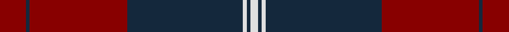

In pattern [RBRBWBW](/stripes/rbrbwbw/).

This was sourced from tartans-authority.  It is a [7 stripe tartan](/stripes/stripes7/).

Original link http://www.tartansauthority.com/tartan-ferret/display/6429/

## Thread count
DR/14 DN2 DR52 DN62 LN2 DN2 LN/4

## Palette
Each colour and the base-6 reference it is a variant of.

| Colour | Shade | Base |
|---|---|---|
| DN | <code style="background-color:#14283C;">#14283C</code> `oklch(27.1% 0.046 249.9)` <small>#14283C</small> | B <code style="background-color:#2A418A;">#2A418A</code> |
| DR | <code style="background-color:#880000;">#880000</code> `oklch(39.4% 0.162 29.2)` <small>#880000</small> | R <code style="background-color:#CC0000;">#CC0000</code> |
| LN | <code style="background-color:#E0E0E0;">#E0E0E0</code> `oklch(90.7% 0.000 89.9)` <small>#E0E0E0</small> | W <code style="background-color:#F7F7F7;">#F7F7F7</code> |

# Sample pattern

## Nearest tartans

The nearest existing variants by ΔTartan distance.

1. [Greater Victoria Police PB](/setts/s12/r7dt1r26dt31w1dt1w2~x2/) — ΔT 1.19
1. [Maciver of Strathendry Castle Dress (Personal)](/setts/s9/w1k3r3k24r3k3r24k3ly1~x2/) — ΔT 1.30
1. [Fraser, Isabella](/setts/s7/g2r21db60r48db2r3g2~x2/) — ΔT 1.33
1. [Wcwm 9275 5471-1](/setts/s6/r4k2dg28r38k1ly4~x2/) — ΔT 1.40
1. [Rosser of Wales](/setts/s6/dg16k57r36k2r4dg2/) — ΔT 1.43
1. [St. Mildreds Check (School)](/setts/s7/db4r1db18r18db1r1w1~x2/) — ΔT 1.46
1. [MacAlister of Skye (Clan?)](/setts/s9/r4k5lo1r26lb1k30lo1k1lo4~x2/) — ΔT 1.46
1. [Bell's](/setts/s11/ly3dt4r12dt27ly2r65ly2dt27r12dt4ly3~x2/) — ΔT 1.52
1. [Hungerford RFC](/setts/s6/k50dt3ly3r50~x2/) — ΔT 1.62
1. [Rosser (Welsh Name)](/setts/s6/r16k57r36k2r4r2/) — ΔT 1.62

## Neighbour map

Every grey dot is one of 14299 variants placed by the first two principal components of the ΔTartan feature space (44% of its variance). Red is this tartan; blue dots are its nearest — click one to open its page.

<svg viewBox="0 0 640 380" role="img" style="max-width:100%;height:auto;border:1px solid #e0e0e0;border-radius:4px;display:block" xmlns="http://www.w3.org/2000/svg"><image href="/nn/cloud.v1.png" width="640" height="380"/><a href="/setts/s12/r7dt1r26dt31w1dt1w2~x2/"><circle cx="423.1" cy="154.7" r="4" fill="#3465a4"><title>Greater Victoria Police PB</title></circle></a><a href="/setts/s9/w1k3r3k24r3k3r24k3ly1~x2/"><circle cx="386.2" cy="147.2" r="4" fill="#3465a4"><title>Maciver of Strathendry Castle Dress (Personal)</title></circle></a><a href="/setts/s7/g2r21db60r48db2r3g2~x2/"><circle cx="410.6" cy="154.9" r="4" fill="#3465a4"><title>Fraser, Isabella</title></circle></a><a href="/setts/s6/r4k2dg28r38k1ly4~x2/"><circle cx="413.6" cy="158.3" r="4" fill="#3465a4"><title>Wcwm 9275 5471-1</title></circle></a><a href="/setts/s6/dg16k57r36k2r4dg2/"><circle cx="359.1" cy="173.0" r="4" fill="#3465a4"><title>Rosser of Wales</title></circle></a><a href="/setts/s7/db4r1db18r18db1r1w1~x2/"><circle cx="422.8" cy="195.4" r="4" fill="#3465a4"><title>St. Mildreds Check (School)</title></circle></a><a href="/setts/s9/r4k5lo1r26lb1k30lo1k1lo4~x2/"><circle cx="365.0" cy="127.2" r="4" fill="#3465a4"><title>MacAlister of Skye (Clan?)</title></circle></a><a href="/setts/s11/ly3dt4r12dt27ly2r65ly2dt27r12dt4ly3~x2/"><circle cx="449.8" cy="150.7" r="4" fill="#3465a4"><title>Bell's</title></circle></a><a href="/setts/s6/k50dt3ly3r50~x2/"><circle cx="328.8" cy="175.0" r="4" fill="#3465a4"><title>Hungerford RFC</title></circle></a><a href="/setts/s6/r16k57r36k2r4r2/"><circle cx="362.5" cy="166.3" r="4" fill="#3465a4"><title>Rosser (Welsh Name)</title></circle></a><circle cx="410.8" cy="168.3" r="5" fill="#c00000"/></svg>

ID: /setts/s7/r7dt1r26dt31w1dt1w2~x2/
