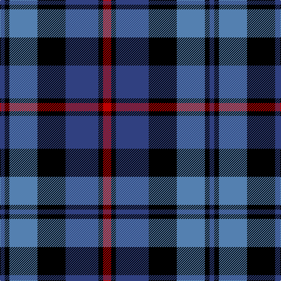

This page is one **sett** — a single exact thread-count. It belongs to the [tartan](/tartans/r7k4db28k24t24k4db4/)
(the same proportion at any scale), whose colour order is pattern [BKBKBKR](/stripes/bkbkbkr/).

Sourced from weddslist.  It is a [7 stripe tartan](/stripes/stripes7/).

Original link http://www.weddslist.com/cgi-bin/tartans/pg.pl?source=sts

2 attestations — the source records this cloth was collapsed from (oldest owns this page)

<ul>
<li>undated — MacCorquodale (weddslist, <a href="http://www.weddslist.com/cgi-bin/tartans/pg.pl?source=sts">record</a>)</li>
<li>undated — MacCorquodale Clan Tartan Tartan Number: 283. Earliest known date: 1981 Sample in the Tartans Society collection given to them in 1981 by Kinloch Anderson of Edinburgh. probably woven by DC. Dalgliesh. See also 2079 the Argyll District tartan with black guards on the red and green in place of the azure (the lighter blue shade). The MacCorquodales lands north of Loch Awe border on the Campbell territory centered on Inveraray. See products available Copyright © Blair Urquhart, Comrie, 2015 (house-of-tartan, <a href="http://www.house-of-tartan.scotland.net/house/TartanViewjs.asp?colr=Def&tnam=283">record</a>)</li>
</ul>

## Thread count
R/14 K8 B56 K48 Ba48 K8 B/8

## Palette

Palette: <strong>Ingles Buchan</strong> <small style="color:#888">(1 of 4 colours)</small>
<table><thead><tr><th>Colour</th><th>Threads</th><th>Shade</th><th>Base</th><th>OKLCh</th></tr></thead><tbody><tr><td>R/</td><td style="text-align:right;font-variant-numeric:tabular-nums">14</td><td><code style="background-color:#C00000;">#C00000</code> <small style="color:#888">#C00000</small></td><td>R <code style="background-color:#CC0000;">#CC0000</code></td><td><small style="color:#888">oklch(50.7% 0.208 29.2)</small></td></tr><tr><td>K</td><td style="text-align:right;font-variant-numeric:tabular-nums">8</td><td><code style="background-color:#000000;">#000000</code> <small style="color:#888">#000000</small></td><td>K <code style="background-color:#000000;">#000000</code></td><td><small style="color:#888">oklch(0.0% 0.000 0.0)</small></td></tr><tr><td>B</td><td style="text-align:right;font-variant-numeric:tabular-nums">56</td><td><code style="background-color:#304080;">#304080</code> <small style="color:#888">#304080</small></td><td>B <code style="background-color:#2A418A;">#2A418A</code></td><td><small style="color:#888">oklch(39.4% 0.109 270.2)</small></td></tr><tr><td>K</td><td style="text-align:right;font-variant-numeric:tabular-nums">48</td><td><code style="background-color:#000000;">#000000</code> <small style="color:#888">#000000</small></td><td>K <code style="background-color:#000000;">#000000</code></td><td><small style="color:#888">oklch(0.0% 0.000 0.0)</small></td></tr><tr><td>Ba</td><td style="text-align:right;font-variant-numeric:tabular-nums">48</td><td><code style="background-color:#5480B0;">#5480B0</code> <small style="color:#888">#5480B0</small></td><td>B <code style="background-color:#2A418A;">#2A418A</code></td><td><small style="color:#888">oklch(58.8% 0.089 251.5)</small></td></tr><tr><td>K</td><td style="text-align:right;font-variant-numeric:tabular-nums">8</td><td><code style="background-color:#000000;">#000000</code> <small style="color:#888">#000000</small></td><td>K <code style="background-color:#000000;">#000000</code></td><td><small style="color:#888">oklch(0.0% 0.000 0.0)</small></td></tr><tr><td>B/</td><td style="text-align:right;font-variant-numeric:tabular-nums">8</td><td><code style="background-color:#304080;">#304080</code> <small style="color:#888">#304080</small></td><td>B <code style="background-color:#2A418A;">#2A418A</code></td><td><small style="color:#888">oklch(39.4% 0.109 270.2)</small></td></tr></tbody></table>

# Sample pattern

## Nearest tartans

The nearest existing variants by ΔTartan distance, with this tartan at the top so the swatches line up against it.

ΔTartan

Tartan

Sett

—

<a href="/ttd/edit/#slug=r7k4db28k24t24k4db4~x2">MacCorquodale</a> <a class="nn-out" href="/setts/s7/r7k4db28k24t24k4db4~x2/" title="open its dictionary page">↗</a>

0.89

<a href="/ttd/edit/#slug=dp3k1dp8k6dg8k1w2~x2">Baillie (Highland Society)</a> <a class="nn-out" href="/setts/s7/dp3k1dp8k6dg8k1w2~x2/" title="open its dictionary page">↗</a>

0.96

<a href="/ttd/edit/#slug=db3k2db8k8g8p1g1p3~x2">Baird</a> <a class="nn-out" href="/setts/s8/db3k2db8k8g8p1g1p3~x2/" title="open its dictionary page">↗</a>

1.00

<a href="/ttd/edit/#slug=db28k3db6k3db6k20o28k3w6~x2">Forbes</a> <a class="nn-out" href="/setts/s9/db28k3db6k3db6k20o28k3w6~x2/" title="open its dictionary page">↗</a>

1.06

<a href="/ttd/edit/#slug=ly6dg3ly3dg22k23dp23k4~x2">Gordon of Esslemont</a> <a class="nn-out" href="/setts/s7/ly6dg3ly3dg22k23dp23k4~x2/" title="open its dictionary page">↗</a>

1.09

<a href="/ttd/edit/#slug=db9k7o5r1o5k1o2~x4">Greyhound Grenadiers (Corporate)</a> <a class="nn-out" href="/setts/s7/db9k7o5r1o5k1o2~x4/" title="open its dictionary page">↗</a>

1.10

<a href="/ttd/edit/#slug=ly5dbi24k8db18ly6o3">CALA Homes</a> <a class="nn-out" href="/setts/s6/ly5dbi24k8db18ly6o3/" title="open its dictionary page">↗</a>

1.11

<a href="/ttd/edit/#slug=g1k9t4db9t1~x6">Wallace Blue Dress Tartan Tartan Number: 6569. Earliest known date: See products available Copyright © Blair Urquhart, Comrie, 2015</a> <a class="nn-out" href="/setts/s5/g1k9t4db9t1~x6/" title="open its dictionary page">↗</a>

1.14

<a href="/ttd/edit/#slug=k18lr8k8lr8r5lr18k5lr5k12db36r5~x2">Merchiston Castle School</a> <a class="nn-out" href="/setts/s11/k18lr8k8lr8r5lr18k5lr5k12db36r5~x2/" title="open its dictionary page">↗</a>

1.14

<a href="/ttd/edit/#slug=k18lr8k8lr8r5lr18k5lr5k12db36r5">Merchiston Castle School</a> <a class="nn-out" href="/setts/s11/k18lr8k8lr8r5lr18k5lr5k12db36r5/" title="open its dictionary page">↗</a>

1.15

<a href="/ttd/edit/#slug=oi4db19oi3k20o24db3~x2">Edinburgh International Conference Centre</a> <a class="nn-out" href="/setts/s6/oi4db19oi3k20o24db3~x2/" title="open its dictionary page">↗</a>

## Neighbour map

Every grey dot is one of 14359 variants placed by the first two principal components of the ΔTartan feature space (44% of its variance). Red is this tartan; blue dots are its nearest — click one to open its page.

<svg viewBox="0 0 640 380" role="img" style="max-width:100%;height:auto;border:1px solid #e0e0e0;border-radius:4px;display:block" xmlns="http://www.w3.org/2000/svg"><image href="/nn/cloud.v1.png" width="640" height="380"/><a href="/setts/s7/dp3k1dp8k6dg8k1w2~x2/"><circle cx="177.0" cy="227.1" r="4" fill="#3465a4"><title>Baillie (Highland Society)</title></circle></a><a href="/setts/s8/db3k2db8k8g8p1g1p3~x2/"><circle cx="129.6" cy="218.2" r="4" fill="#3465a4"><title>Baird</title></circle></a><a href="/setts/s9/db28k3db6k3db6k20o28k3w6~x2/"><circle cx="179.5" cy="186.5" r="4" fill="#3465a4"><title>Forbes</title></circle></a><a href="/setts/s7/ly6dg3ly3dg22k23dp23k4~x2/"><circle cx="148.6" cy="218.4" r="4" fill="#3465a4"><title>Gordon of Esslemont</title></circle></a><a href="/setts/s7/db9k7o5r1o5k1o2~x4/"><circle cx="185.3" cy="222.1" r="4" fill="#3465a4"><title>Greyhound Grenadiers (Corporate)</title></circle></a><a href="/setts/s6/ly5dbi24k8db18ly6o3/"><circle cx="123.0" cy="206.0" r="4" fill="#3465a4"><title>CALA Homes</title></circle></a><a href="/setts/s5/g1k9t4db9t1~x6/"><circle cx="183.9" cy="234.4" r="4" fill="#3465a4"><title>Wallace Blue Dress Tartan Tartan Number: 6569. Earliest known date: See products available Copyright © Blair Urquhart, Comrie, 2015</title></circle></a><a href="/setts/s11/k18lr8k8lr8r5lr18k5lr5k12db36r5~x2/"><circle cx="120.1" cy="190.6" r="4" fill="#3465a4"><title>Merchiston Castle School</title></circle></a><a href="/setts/s11/k18lr8k8lr8r5lr18k5lr5k12db36r5/"><circle cx="120.1" cy="190.6" r="4" fill="#3465a4"><title>Merchiston Castle School</title></circle></a><a href="/setts/s6/oi4db19oi3k20o24db3~x2/"><circle cx="153.2" cy="224.2" r="4" fill="#3465a4"><title>Edinburgh International Conference Centre</title></circle></a><circle cx="144.1" cy="220.6" r="5" fill="#c00000"/></svg>

ID: /setts/s7/r7k4db28k24t24k4db4~x2/
