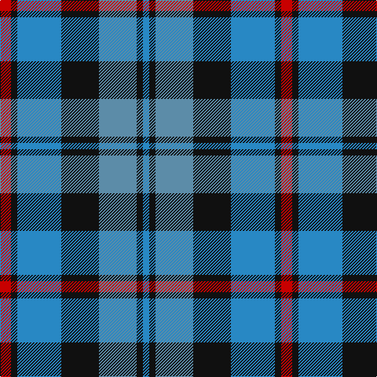

In pattern [BKBKBKR](/stripes/bkbkbkr/).

This was sourced from register-of-tartans.  It is a [7 stripe tartan](/stripes/stripes7/).

Original link https://www.tartanregister.gov.uk/tartanDetails.aspx?ref=2326

## Attestations

This cloth appears in 2 source records; the oldest owns this page.

- 01/01/1981 — MacCorquodale (register-of-tartans, [record](https://www.tartanregister.gov.uk/tartanDetails.aspx?ref=2326))
- 1981 — MacCorquodale (Clan?) (tartans-authority, [record](http://www.tartansauthority.com/tartan-ferret/display/283/))

## Register references

External register numbers recorded for this tartan.

- Scottish Register of Tartans: [2326](https://www.tartanregister.gov.uk/tartanDetails.aspx?ref=2326)
- Scottish Tartans Authority (ITI): 283
- Scottish Tartans World Register: 283

## Thread count
R/14 K8 Ba56 K48 B48 K8 Ba/8

## Palette
Each colour and its ΔE from the base-6 reference it is a variant of.

| Colour | Shade | Base | ΔE (OKLab) |
|---|---|---|---|
| B | <code style="background-color:#5C8CA8;">#5C8CA8</code> `#5C8CA8` | B <code style="background-color:#2A418A;">#2A418A</code> | 0.23 |
| Ba | <code style="background-color:#2888C4;">#2888C4</code> `#2888C4` | B <code style="background-color:#2A418A;">#2A418A</code> | 0.21 |
| K | <code style="background-color:#101010;">#101010</code> `#101010` | K <code style="background-color:#000000;">#000000</code> | 0.17 |
| R | <code style="background-color:#C80000;">#C80000</code> `#C80000` | R <code style="background-color:#CC0000;">#CC0000</code> | 0.01 |

# Sample pattern

## Nearest tartans

The nearest existing variants by ΔTartan distance.

1. [Oceanic (Corporate?)](/setts/s7/ly8k4o39k37dt36k6dt7/) — ΔT 0.93
1. [Unidentified No 26](/setts/s6/w4db4dg22k20db20w3/) — ΔT 0.96
1. [Herd/Hurd](/setts/s6/db3g12k13w2db13w3~x2/) — ΔT 0.97
1. [Over Mountain](/setts/s7/r2b1db8b8o8b1o1~x2/) — ΔT 1.06
1. [Loch Leven Check Trade Tartan Tartan Number: 108. Earliest known date: 1976 Sample presented by Clan Crest Textiles Ltd in 1976. See products available Copyright © Blair Urquhart, Comrie, 2015](/setts/s6/db2g13db11t4w9db2~x2/) — ΔT 1.08
1. [Edinburgh Tattoo 50th (Commemorative](/setts/s5/k1db8r6g8k1~x4/) — ΔT 1.11
1. [Greyhound Grenadiers (Corporate)](/setts/s7/db9k7o5r1o5k1o2~x4/) — ΔT 1.12
1. [Over Mountain](/setts/s7/r2lb1db8lb8y8lb1y1~x2/) — ΔT 1.17
1. [Cahonas Scotland](/setts/s9/k5b3k3b23n4k25n23lb3n5~x2/) — ΔT 1.19
1. [Gordon of Esslemont](/setts/s7/ly6dg3ly3dg22k23dp23k4~x2/) — ΔT 1.20

## Neighbour map

Every grey dot is one of 14299 variants placed by the first two principal components of the ΔTartan feature space (44% of its variance). Red is this tartan; blue dots are its nearest — click one to open its page.

<svg viewBox="0 0 640 380" role="img" style="max-width:100%;height:auto;border:1px solid #e0e0e0;border-radius:4px;display:block" xmlns="http://www.w3.org/2000/svg"><image href="/nn/cloud.v1.png" width="640" height="380"/><a href="/setts/s7/ly8k4o39k37dt36k6dt7/"><circle cx="173.1" cy="209.2" r="4" fill="#3465a4"><title>Oceanic (Corporate?)</title></circle></a><a href="/setts/s6/w4db4dg22k20db20w3/"><circle cx="150.1" cy="239.6" r="4" fill="#3465a4"><title>Unidentified No 26</title></circle></a><a href="/setts/s6/db3g12k13w2db13w3~x2/"><circle cx="126.3" cy="236.3" r="4" fill="#3465a4"><title>Herd/Hurd</title></circle></a><a href="/setts/s7/r2b1db8b8o8b1o1~x2/"><circle cx="171.2" cy="206.4" r="4" fill="#3465a4"><title>Over Mountain</title></circle></a><a href="/setts/s6/db2g13db11t4w9db2~x2/"><circle cx="131.3" cy="232.4" r="4" fill="#3465a4"><title>Loch Leven Check Trade Tartan Tartan Number: 108. Earliest known date: 1976 Sample presented by Clan Crest Textiles Ltd in 1976. See products available Copyright © Blair Urquhart, Comrie, 2015</title></circle></a><a href="/setts/s5/k1db8r6g8k1~x4/"><circle cx="142.5" cy="232.3" r="4" fill="#3465a4"><title>Edinburgh Tattoo 50th (Commemorative</title></circle></a><a href="/setts/s7/db9k7o5r1o5k1o2~x4/"><circle cx="185.6" cy="220.7" r="4" fill="#3465a4"><title>Greyhound Grenadiers (Corporate)</title></circle></a><a href="/setts/s7/r2lb1db8lb8y8lb1y1~x2/"><circle cx="158.8" cy="198.2" r="4" fill="#3465a4"><title>Over Mountain</title></circle></a><a href="/setts/s9/k5b3k3b23n4k25n23lb3n5~x2/"><circle cx="198.7" cy="206.5" r="4" fill="#3465a4"><title>Cahonas Scotland</title></circle></a><a href="/setts/s7/ly6dg3ly3dg22k23dp23k4~x2/"><circle cx="148.7" cy="217.0" r="4" fill="#3465a4"><title>Gordon of Esslemont</title></circle></a><circle cx="150.1" cy="220.7" r="5" fill="#c00000"/></svg>

ID: /setts/s7/r7k4t28k24t24k4t4~x2/
