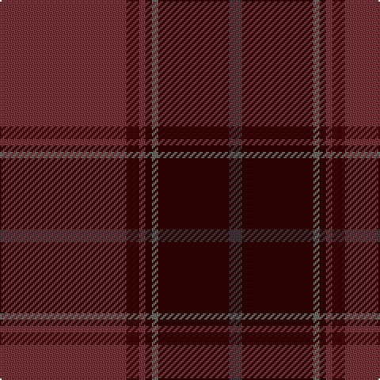

In pattern [BKGKRBR](/patterns/bkgkrbr/).

This was sourced from register-of-tartans.  It is a [7 stripes tartan](/stripes/stripes7/).

Original link https://www.tartanregister.gov.uk/tartanDetails.aspx?ref=10330

## Thread count
DR/80 DRa8 DR4 DRb4 N4 DRb45 Na/8

## Palette
Each colour and its ΔE from the base-6 reference it is a variant of.

| Colour | Shade | Base | ΔE (OKLab) |
|---|---|---|---|
| DR | <code style="background-color:#76333A;">#76333A</code> `#76333A` | R <code style="background-color:#C80000;">#C80000</code> | 0.17 |
| DRa | <code style="background-color:#430506;">#430506</code> `#430506` | B <code style="background-color:#2C4084;">#2C4084</code> | 0.23 |
| DRb | <code style="background-color:#2F0200;">#2F0200</code> `#2F0200` | K <code style="background-color:#000000;">#000000</code> | 0.21 |
| N | <code style="background-color:#6C6964;">#6C6964</code> `#6C6964` | G <code style="background-color:#006400;">#006400</code> | 0.17 |
| Na | <code style="background-color:#42333A;">#42333A</code> `#42333A` | B <code style="background-color:#2C4084;">#2C4084</code> | 0.13 |

# Sample pattern

## Nearest tartans

The nearest existing variants by ΔTartan distance.

1. [Wanstall](/setts/s10/b24g8b16ba6g6ba6g16ba24b76y4-b680028-ba14283c-g003820-ybc8c00/) — ΔT 1.44
1. [Jack, John (Fife) (Personal)](/setts/s6/g8b104k40ba18g4y2-b5d1913-ba4b2e24-g70714d-k120d0d-yef8f06/) — ΔT 1.55
1. [Rikaco Red](/setts/s10/b10ba10b4r94b36ra4b10g18ba14ra6-b16211d-ba4f5054-g352c0d-r840925-ra92825e/) — ΔT 1.61
1. [Glen Clova #2 (Fashion)](/setts/s12/b78g8ba12y4ba4w4ba4g24b12ba4b12y4-b603030-ba480800-g604000-we0e0e0-ya08858/) — ΔT 1.74
1. [Wasko (Personal)](/setts/s7/r16y4ra60g24ra6g24ra6-g003c20-r9c0000-ra640000-yb0b0b0/) — ΔT 1.74
1. [Tyrone](/setts/s12/r100ra12b14g4b4w4b4ra32r16b4r18g6-b401000-g008000-r802040-ra806050-we0e0e0/) — ΔT 1.76
1. [Isaia (Fashion)](/setts/s7/r80ra8r4g4y4g45b8-b5c5c5c-g604000-rac6c64-ra904c40-ya0a0a0/) — ΔT 1.77
1. [Bell, John](/setts/s10/b14r8b8r50ba2g64ba8g4w4g10-b401000-ba800080-g505020-r802040-we0e0e0/) — ΔT 1.82
1. [MacNab WI 1](/setts/s5/b48g2ba2g4r48-b59110d-ba4367ae-g11450d-raa0000/) — ΔT 1.86
1. [Mead (Tennessee) Hunting (Personal)](/setts/s10/g72k6r12k6b20r10b6y8k2g4-b4b2e24-g4e3d20-k120a01-ra5422f-yc5831b/) — ΔT 1.87

## Neighbour map

Every grey dot is one of 15726 variants placed by the first two principal components of the ΔTartan feature space (44% of its variance). Red is this tartan; blue dots are its nearest — click one to open its page.

<svg viewBox="0 0 640 380" role="img" style="max-width:100%;height:auto;border:1px solid #e0e0e0;border-radius:4px;display:block" xmlns="http://www.w3.org/2000/svg"><image href="/nn/cloud.v1.png" width="640" height="380"/><a href="/setts/s10/b24g8b16ba6g6ba6g16ba24b76y4-b680028-ba14283c-g003820-ybc8c00/"><circle cx="484.0" cy="197.2" r="4" fill="#3465a4"><title>Wanstall</title></circle></a><a href="/setts/s6/g8b104k40ba18g4y2-b5d1913-ba4b2e24-g70714d-k120d0d-yef8f06/"><circle cx="488.2" cy="159.9" r="4" fill="#3465a4"><title>Jack, John (Fife) (Personal)</title></circle></a><a href="/setts/s10/b10ba10b4r94b36ra4b10g18ba14ra6-b16211d-ba4f5054-g352c0d-r840925-ra92825e/"><circle cx="349.2" cy="145.8" r="4" fill="#3465a4"><title>Rikaco Red</title></circle></a><a href="/setts/s12/b78g8ba12y4ba4w4ba4g24b12ba4b12y4-b603030-ba480800-g604000-we0e0e0-ya08858/"><circle cx="459.8" cy="156.1" r="4" fill="#3465a4"><title>Glen Clova #2 (Fashion)</title></circle></a><a href="/setts/s7/r16y4ra60g24ra6g24ra6-g003c20-r9c0000-ra640000-yb0b0b0/"><circle cx="384.1" cy="219.1" r="4" fill="#3465a4"><title>Wasko (Personal)</title></circle></a><a href="/setts/s12/r100ra12b14g4b4w4b4ra32r16b4r18g6-b401000-g008000-r802040-ra806050-we0e0e0/"><circle cx="453.1" cy="124.6" r="4" fill="#3465a4"><title>Tyrone</title></circle></a><a href="/setts/s7/r80ra8r4g4y4g45b8-b5c5c5c-g604000-rac6c64-ra904c40-ya0a0a0/"><circle cx="440.1" cy="175.5" r="4" fill="#3465a4"><title>Isaia (Fashion)</title></circle></a><a href="/setts/s10/b14r8b8r50ba2g64ba8g4w4g10-b401000-ba800080-g505020-r802040-we0e0e0/"><circle cx="360.0" cy="138.3" r="4" fill="#3465a4"><title>Bell, John</title></circle></a><a href="/setts/s5/b48g2ba2g4r48-b59110d-ba4367ae-g11450d-raa0000/"><circle cx="447.5" cy="207.2" r="4" fill="#3465a4"><title>MacNab WI 1</title></circle></a><a href="/setts/s10/g72k6r12k6b20r10b6y8k2g4-b4b2e24-g4e3d20-k120a01-ra5422f-yc5831b/"><circle cx="408.6" cy="136.8" r="4" fill="#3465a4"><title>Mead (Tennessee) Hunting (Personal)</title></circle></a><circle cx="442.0" cy="180.4" r="5" fill="#c00000"/></svg>

ID: /setts/s7/r80b8r4k4g4k45ba8-b430506-ba42333a-g6c6964-k2f0200-r76333a/
