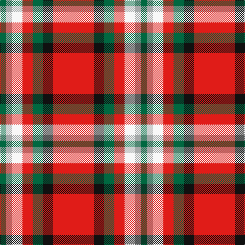

In pattern [GYWRGKR](/patterns/gywrgkr/).

This was sourced from house-of-tartan.  It is a [7 stripes tartan](/stripes/stripes7/).

Original link http://www.house-of-tartan.scotland.net/house/TartanViewjs.asp?colr=Def&tnam=10844

## Thread count
G/12 N12 W20 R20 G20 K20 R/80

## Palette
Each colour and its ΔE from the base-6 reference it is a variant of.

| Colour | Shade | Base | ΔE (OKLab) |
|---|---|---|---|
| G | <code style="background-color:#006840;">#006840</code> `#006840` | G <code style="background-color:#006400;">#006400</code> | 0.06 |
| K | <code style="background-color:#101010;">#101010</code> `#101010` | K <code style="background-color:#000000;">#000000</code> | 0.17 |
| N | <code style="background-color:#A4A8A8;">#A4A8A8</code> `#A4A8A8` | Y <code style="background-color:#E8C000;">#E8C000</code> | 0.19 |
| R | <code style="background-color:#E01C18;">#E01C18</code> `#E01C18` | R <code style="background-color:#C80000;">#C80000</code> | 0.06 |
| W | <code style="background-color:#F8F8F8;">#F8F8F8</code> `#F8F8F8` | W <code style="background-color:#F4F4F0;">#F4F4F0</code> | 0.01 |

# Sample pattern

ID: /setts/s7/r80k20g20r20w20y12g12-g006840-k101010-re01c18-wf8f8f8-ya4a8a8/
