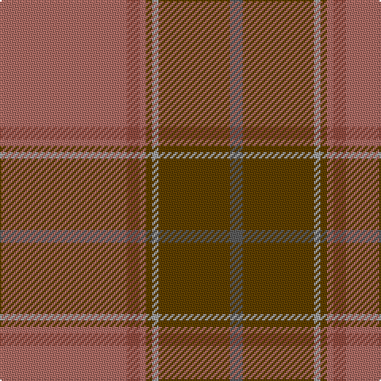

In pattern [BGYGRRR](/patterns/bgygrrr/).

This was sourced from tartans-authority.  It is a [7 stripes tartan](/stripes/stripes7/).

Original link http://www.tartansauthority.com/tartan-ferret/display/10330/

## Thread count
LTa/80 LT8 LTa4 T4 N4 T45 Na/8

## Palette
Each colour and its ΔE from the base-6 reference it is a variant of.

| Colour | Shade | Base | ΔE (OKLab) |
|---|---|---|---|
| LT | <code style="background-color:#904C40;">#904C40</code> `#904C40` | R <code style="background-color:#CC0000;">#CC0000</code> | 0.13 |
| LTa | <code style="background-color:#AC6C64;">#AC6C64</code> `#AC6C64` | R <code style="background-color:#CC0000;">#CC0000</code> | 0.15 |
| N | <code style="background-color:#A0A0A0;">#A0A0A0</code> `#A0A0A0` | Y <code style="background-color:#F2BF00;">#F2BF00</code> | 0.21 |
| Na | <code style="background-color:#5C5C5C;">#5C5C5C</code> `#5C5C5C` | B <code style="background-color:#2A418A;">#2A418A</code> | 0.15 |
| T | <code style="background-color:#604000;">#604000</code> `#604000` | G <code style="background-color:#006100;">#006100</code> | 0.14 |

# Sample pattern

## Nearest tartans

The nearest existing variants by ΔTartan distance.

1. [MacByrd (Personal)](/setts/s8/g50k1r12w1ga12r14w1r2~g8c7038-ga5c6428-k101010-r880000-wc0c0c0~x4/) — ΔT 1.69
1. [Haddrell (2013)](/setts/s7/r2b4g18ba2g2ba41w2~b1870a4-ba505050-g808080-rc80000-we0e0e0~x2/) — ΔT 1.74
1. [Down](/setts/s9/r65b9ra11r5ba2y2g5r2y13~b401000-ba5480b0-g808080-r806050-rac00000-yd09060~x2/) — ΔT 1.77
1. [Isaia](/setts/s7/r80b8r4k4g4k45ba8~b430506-ba42333a-g6c6964-k2f0200-r76333a/) — ΔT 1.78
1. [McBrayer Htg (Personal)](/setts/s8/r50k1ra14w1g14ra14w1ra2~g285800-k101010-r98481c-ra880000-wc0c0c0~x4/) — ΔT 1.80
1. [Unidentified Lindley #6](/setts/s14/r4ra3g2ra38ga30g3ga3g3ga3g3ga30ra38g2ra3~g604000-ga789484-rc80000-ra98481c~x2/) — ΔT 1.82
1. [Rikaco Eve (Fashion)](/setts/s10/g4b4g2y36b14y2ba4g7r5y3~b5c5c5c-ba2888c4-g006818-rc80000-ya08858~x2/) — ΔT 1.84
1. [Glen Clova #2 (Fashion)](/setts/s12/b39g4ba6y2ba2w2ba2g12b6ba2b6y2~b603030-ba480800-g604000-we0e0e0-ya08858~x2/) — ΔT 1.93
1. [Ulster (Peat) (District](/setts/s10/g28k2g28k2g2k2ga29k2r2k2~g7c5428-ga604000-k101010-rc80000~x2/) — ΔT 1.95
1. [Mead (Tennessee) Hunting (Personal)](/setts/s10/g36k3r6k3b10r5b3y4k1g2~b4b2e24-g4e3d20-k120a01-ra5422f-yc5831b~x2/) — ΔT 1.99

## Neighbour map

Every grey dot is one of 15726 variants placed by the first two principal components of the ΔTartan feature space (44% of its variance). Red is this tartan; blue dots are its nearest — click one to open its page.

<svg viewBox="0 0 640 380" role="img" style="max-width:100%;height:auto;border:1px solid #e0e0e0;border-radius:4px;display:block" xmlns="http://www.w3.org/2000/svg"><image href="/nn/cloud.v1.png" width="640" height="380"/><a href="/setts/s8/g50k1r12w1ga12r14w1r2~g8c7038-ga5c6428-k101010-r880000-wc0c0c0~x4/"><circle cx="451.4" cy="124.7" r="4" fill="#3465a4"><title>MacByrd (Personal)</title></circle></a><a href="/setts/s7/r2b4g18ba2g2ba41w2~b1870a4-ba505050-g808080-rc80000-we0e0e0~x2/"><circle cx="459.3" cy="170.9" r="4" fill="#3465a4"><title>Haddrell (2013)</title></circle></a><a href="/setts/s9/r65b9ra11r5ba2y2g5r2y13~b401000-ba5480b0-g808080-r806050-rac00000-yd09060~x2/"><circle cx="460.5" cy="108.8" r="4" fill="#3465a4"><title>Down</title></circle></a><a href="/setts/s7/r80b8r4k4g4k45ba8~b430506-ba42333a-g6c6964-k2f0200-r76333a/"><circle cx="445.0" cy="179.1" r="4" fill="#3465a4"><title>Isaia</title></circle></a><a href="/setts/s8/r50k1ra14w1g14ra14w1ra2~g285800-k101010-r98481c-ra880000-wc0c0c0~x4/"><circle cx="461.5" cy="134.7" r="4" fill="#3465a4"><title>McBrayer Htg (Personal)</title></circle></a><a href="/setts/s14/r4ra3g2ra38ga30g3ga3g3ga3g3ga30ra38g2ra3~g604000-ga789484-rc80000-ra98481c~x2/"><circle cx="411.3" cy="159.0" r="4" fill="#3465a4"><title>Unidentified Lindley #6</title></circle></a><a href="/setts/s10/g4b4g2y36b14y2ba4g7r5y3~b5c5c5c-ba2888c4-g006818-rc80000-ya08858~x2/"><circle cx="355.5" cy="154.0" r="4" fill="#3465a4"><title>Rikaco Eve (Fashion)</title></circle></a><a href="/setts/s12/b39g4ba6y2ba2w2ba2g12b6ba2b6y2~b603030-ba480800-g604000-we0e0e0-ya08858~x2/"><circle cx="463.8" cy="153.7" r="4" fill="#3465a4"><title>Glen Clova #2 (Fashion)</title></circle></a><a href="/setts/s10/g28k2g28k2g2k2ga29k2r2k2~g7c5428-ga604000-k101010-rc80000~x2/"><circle cx="481.6" cy="205.8" r="4" fill="#3465a4"><title>Ulster (Peat) (District</title></circle></a><a href="/setts/s10/g36k3r6k3b10r5b3y4k1g2~b4b2e24-g4e3d20-k120a01-ra5422f-yc5831b~x2/"><circle cx="412.8" cy="134.3" r="4" fill="#3465a4"><title>Mead (Tennessee) Hunting (Personal)</title></circle></a><circle cx="443.0" cy="173.4" r="5" fill="#c00000"/></svg>

ID: /setts/s7/r80ra8r4g4y4g45b8~b5c5c5c-g604000-rac6c64-ra904c40-ya0a0a0/
