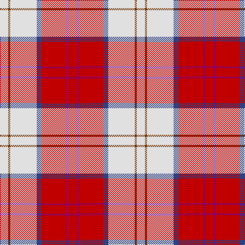

In pattern [RBRBWRW](/patterns/rbrbwrw/).

This was sourced from weddslist.  It is a [7 stripes tartan](/stripes/stripes7/).

Original link http://www.weddslist.com/cgi-bin/tartans/pg.pl?source=sts

## Thread count
LN/16 T4 LN52 B10 R48 P4 R/16

## Palette
Each colour and its ΔE from the base-6 reference it is a variant of.

| Colour | Shade | Base | ΔE (OKLab) |
|---|---|---|---|
| B | <code style="background-color:#304080;">#304080</code> `#304080` | B <code style="background-color:#2A418A;">#2A418A</code> | 0.02 |
| LN | <code style="background-color:#E0E0E0;">#E0E0E0</code> `#E0E0E0` | W <code style="background-color:#F7F7F7;">#F7F7F7</code> | 0.07 |
| P | <code style="background-color:#800080;">#800080</code> `#800080` | B <code style="background-color:#2A418A;">#2A418A</code> | 0.17 |
| R | <code style="background-color:#C00000;">#C00000</code> `#C00000` | R <code style="background-color:#CC0000;">#CC0000</code> | 0.03 |
| T | <code style="background-color:#703000;">#703000</code> `#703000` | R <code style="background-color:#CC0000;">#CC0000</code> | 0.19 |

# Sample pattern

## Nearest tartans

The nearest existing variants by ΔTartan distance.

1. [Lennox Dress](/setts/s7/r8b2r24ba5w26g2w8~b5a008c-ba2c4084-g482800-rdc0000-we0e0e0~x2/) — ΔT 0.22
1. [Shiel, Claret (Dance)](/setts/s7/w8r5b10ra24w30r2ba2~b500050-ba1c0070-r880000-raa40000-wf0e0c8~x2/) — ΔT 0.79
1. [Lennox, dress](/setts/s7/r8b2r24b5w25ra2w8~b800080-rc00000-ra806050-we0e0e0~x2/) — ΔT 0.88
1. [MacGiboney (Personal)](/setts/s7/r8b2r24b5w25g2w8~b5a008c-g503c14-rdc0000-we0e0e0~x2/) — ΔT 0.91
1. [Lennox Dress District Tartan Tartan Number: 1649. Earliest known date: 1986 Families with the surname 'Lennox' are usually considered related to Clans Stewart or MacFarlane. Some of this surname also choose to wear the distinctive and ancient 'Lennox' tartan. D W Stewart reproduced the sett from a 'lost' portrait of the Countess of Lennox dating from the 16th century. See products available Copyright © Blair Urquhart, Comrie, 2015](/setts/s7/r8ra2r24ra5w25g2w8~g604000-rc80000-raa00048-we0e0e0~x2/) — ΔT 0.97
1. [Lennox Dress #2](/setts/s7/r2ra1r10ra2w10b1w2~b2c2c80-rc80000-ra880000-we0e0e0~x4/) — ΔT 1.06
1. [MacPherson, Burgundy dress](/setts/s7/w4k2w25r21w3r8y3~k000000-rc00000-we0e0e0-yf0c000~x2/) — ΔT 1.06
1. [MacPherson Dress Burgandy Clan Tartan Tartan Number: 1832. Earliest known date: pre 2003 Examined by D.C.S. 1947 See products available Copyright © Blair Urquhart, Comrie, 2015](/setts/s7/w4k2w25r21w3r8y3~k101010-rc80000-we0e0e0-ye8c000~x2/) — ΔT 1.08
1. [MacPherson, dress red](/setts/s7/w4r2w25ra21w3ra8y3~r800000-rac00000-we0e0e0-yf0c000~x2/) — ΔT 1.10
1. [MacPherson Dress Burgundy (Dance)](/setts/s7/w4k2w25r21w3r8y3~k101010-r880000-we0e0e0-ye8c000~x2/) — ΔT 1.16

## Neighbour map

Every grey dot is one of 15726 variants placed by the first two principal components of the ΔTartan feature space (44% of its variance). Red is this tartan; blue dots are its nearest — click one to open its page.

<svg viewBox="0 0 640 380" role="img" style="max-width:100%;height:auto;border:1px solid #e0e0e0;border-radius:4px;display:block" xmlns="http://www.w3.org/2000/svg"><image href="/nn/cloud.v1.png" width="640" height="380"/><a href="/setts/s7/r8b2r24ba5w26g2w8~b5a008c-ba2c4084-g482800-rdc0000-we0e0e0~x2/"><circle cx="234.0" cy="145.2" r="4" fill="#3465a4"><title>Lennox Dress</title></circle></a><a href="/setts/s7/w8r5b10ra24w30r2ba2~b500050-ba1c0070-r880000-raa40000-wf0e0c8~x2/"><circle cx="210.9" cy="136.4" r="4" fill="#3465a4"><title>Shiel, Claret (Dance)</title></circle></a><a href="/setts/s7/r8b2r24b5w25ra2w8~b800080-rc00000-ra806050-we0e0e0~x2/"><circle cx="249.6" cy="164.3" r="4" fill="#3465a4"><title>Lennox, dress</title></circle></a><a href="/setts/s7/r8b2r24b5w25g2w8~b5a008c-g503c14-rdc0000-we0e0e0~x2/"><circle cx="248.2" cy="162.6" r="4" fill="#3465a4"><title>MacGiboney (Personal)</title></circle></a><a href="/setts/s7/r8ra2r24ra5w25g2w8~g604000-rc80000-raa00048-we0e0e0~x2/"><circle cx="253.8" cy="164.6" r="4" fill="#3465a4"><title>Lennox Dress District Tartan Tartan Number: 1649. Earliest known date: 1986 Families with the surname 'Lennox' are usually considered related to Clans Stewart or MacFarlane. Some of this surname also choose to wear the distinctive and ancient 'Lennox' tartan. D W Stewart reproduced the sett from a 'lost' portrait of the Countess of Lennox dating from the 16th century. See products available Copyright © Blair Urquhart, Comrie, 2015</title></circle></a><a href="/setts/s7/r2ra1r10ra2w10b1w2~b2c2c80-rc80000-ra880000-we0e0e0~x4/"><circle cx="237.0" cy="163.9" r="4" fill="#3465a4"><title>Lennox Dress #2</title></circle></a><a href="/setts/s7/w4k2w25r21w3r8y3~k000000-rc00000-we0e0e0-yf0c000~x2/"><circle cx="272.1" cy="157.5" r="4" fill="#3465a4"><title>MacPherson, Burgundy dress</title></circle></a><a href="/setts/s7/w4k2w25r21w3r8y3~k101010-rc80000-we0e0e0-ye8c000~x2/"><circle cx="277.8" cy="158.7" r="4" fill="#3465a4"><title>MacPherson Dress Burgandy Clan Tartan Tartan Number: 1832. Earliest known date: pre 2003 Examined by D.C.S. 1947 See products available Copyright © Blair Urquhart, Comrie, 2015</title></circle></a><a href="/setts/s7/w4r2w25ra21w3ra8y3~r800000-rac00000-we0e0e0-yf0c000~x2/"><circle cx="281.2" cy="159.6" r="4" fill="#3465a4"><title>MacPherson, dress red</title></circle></a><a href="/setts/s7/w4k2w25r21w3r8y3~k101010-r880000-we0e0e0-ye8c000~x2/"><circle cx="264.2" cy="159.7" r="4" fill="#3465a4"><title>MacPherson Dress Burgundy (Dance)</title></circle></a><circle cx="232.5" cy="146.6" r="5" fill="#c00000"/></svg>

ID: /setts/s7/r8b2r24ba5w26ra2w8~b800080-ba304080-rc00000-ra703000-we0e0e0~x2/
