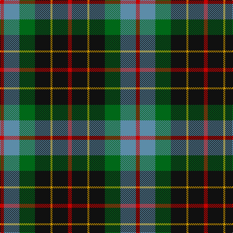

In pattern [RBGKYKR](/patterns/rbgkykr/).

This was sourced from register-of-tartans.  It is a [7 stripes tartan](/stripes/stripes7/).

Original link https://www.tartanregister.gov.uk/tartanDetails.aspx?ref=372

## Attestations

This cloth appears in 2 source records; the oldest owns this page.

- 01/01/1880 — Brodie Hunting (register-of-tartans, [record](https://www.tartanregister.gov.uk/tartanDetails.aspx?ref=372))
- 1880 — Brodie Hunting (Clan) (tartans-authority, [record](http://www.tartansauthority.com/tartan-ferret/display/1334/))

## Thread count
R/8 B32 G32 K32 DY4 K32 R/8

## Palette
Each colour and its ΔE from the base-6 reference it is a variant of.

| Colour | Shade | Base | ΔE (OKLab) |
|---|---|---|---|
| B | <code style="background-color:#5C8CA8;">#5C8CA8</code> `#5C8CA8` | B <code style="background-color:#2C4084;">#2C4084</code> | 0.23 |
| DY | <code style="background-color:#D09800;">#D09800</code> `#D09800` | Y <code style="background-color:#E8C000;">#E8C000</code> | 0.11 |
| G | <code style="background-color:#006818;">#006818</code> `#006818` | G <code style="background-color:#006400;">#006400</code> | 0.02 |
| K | <code style="background-color:#101010;">#101010</code> `#101010` | K <code style="background-color:#000000;">#000000</code> | 0.17 |
| R | <code style="background-color:#C80000;">#C80000</code> `#C80000` | R <code style="background-color:#C80000;">#C80000</code> | 0.00 |

# Sample pattern

## Nearest tartans

The nearest existing variants by ΔTartan distance.

1. [Brodie Hunting Clan Tartan Tartan Number: 1334. Earliest known date: 1891 The Hunting Brodie first appears in Whyte's first edition of 1891, published by W. and A.K. Johnston, at which time it seems to have been a recent design. D.W. Stewart remarks in his book, 'Old And Rare..'(1893), "of late a green tartan has been sold as undress or hunting Brodie..." See products available Copyright © Blair Urquhart, Comrie, 2015](/setts/s7/r4b16g16k16y2k16r4-b2c2c80-g006818-k101010-rc80000-ye8c000/) — ΔT 0.77
1. [Wilson's No.176](/setts/s8/k16b6g26ba24y4ba24g26b6-b5c8ca8-ba440044-g006818-k101010-ye8c000/) — ΔT 0.81
1. [MacLeish](/setts/s8/k36b24k10g8r12g24k4y8-b1c0070-g006818-k101010-rc80000-ybc8c00/) — ΔT 0.85
1. [Vosko Family Tartan Tartan Number: 373. Earliest known date: 1989 Designed for a wedding. See products available Copyright © Blair Urquhart, Comrie, 2015](/setts/s9/b50k24y8k18r12k18y8k24g50-b2c2c80-g006818-k101010-rc80000-ye8c000/) — ΔT 0.86
1. [Scottish Odyssey Commemorative Tartan Tartan Number: 4071. Earliest known date: 01/01/2002 The Scottish Odyssey tartan from Lochcarron is a 'celebration of the wonderful experiences to be gained' from a visit to Scotland and some of the most spectacularly contrasting landscapes to be seen in Europe. See products available Copyright © Blair Urquhart, Comrie, 2015](/setts/s7/k14b22k6b22g22ga44b6-b2c4084-g663300-ga008800-k000000/) — ΔT 0.88
1. [Soutar (Name)](/setts/s9/k40w6b40k6r6g40r20w6k40-b2888c4-g285800-k101010-rc80000-we0e0e0/) — ΔT 0.90
1. [Unidentified No 79](/setts/s6/r10g36y4k28b10k8-b3c82af-g005020-k101010-rdc0000-ye8c000/) — ΔT 0.90
1. [Brodie Hunting](/setts/s7/r2b8g8k8y1g8r2-b00004c-g004c00-k000000-rc80000-yffc800/) — ΔT 0.93
1. [Lanark](/setts/s6/g62y8g12k38b36ba18-b304080-ba5480b0-g004010-k000000-yf0c000/) — ΔT 0.96
1. [Wilson's No.124](/setts/s8/g28b22ga6k10ga6b22g28y4-b780078-g006818-ga789484-k101010-yd8b000/) — ΔT 0.98

## Neighbour map

Every grey dot is one of 15726 variants placed by the first two principal components of the ΔTartan feature space (44% of its variance). Red is this tartan; blue dots are its nearest — click one to open its page.

<svg viewBox="0 0 640 380" role="img" style="max-width:100%;height:auto;border:1px solid #e0e0e0;border-radius:4px;display:block" xmlns="http://www.w3.org/2000/svg"><image href="/nn/cloud.v1.png" width="640" height="380"/><a href="/setts/s7/r4b16g16k16y2k16r4-b2c2c80-g006818-k101010-rc80000-ye8c000/"><circle cx="168.7" cy="224.9" r="4" fill="#3465a4"><title>Brodie Hunting Clan Tartan Tartan Number: 1334. Earliest known date: 1891 The Hunting Brodie first appears in Whyte's first edition of 1891, published by W. and A.K. Johnston, at which time it seems to have been a recent design. D.W. Stewart remarks in his book, 'Old And Rare..'(1893), &quot;of late a green tartan has been sold as undress or hunting Brodie...&quot; See products available Copyright © Blair Urquhart, Comrie, 2015</title></circle></a><a href="/setts/s8/k16b6g26ba24y4ba24g26b6-b5c8ca8-ba440044-g006818-k101010-ye8c000/"><circle cx="147.6" cy="230.9" r="4" fill="#3465a4"><title>Wilson's No.176</title></circle></a><a href="/setts/s8/k36b24k10g8r12g24k4y8-b1c0070-g006818-k101010-rc80000-ybc8c00/"><circle cx="152.8" cy="207.1" r="4" fill="#3465a4"><title>MacLeish</title></circle></a><a href="/setts/s9/b50k24y8k18r12k18y8k24g50-b2c2c80-g006818-k101010-rc80000-ye8c000/"><circle cx="128.5" cy="212.5" r="4" fill="#3465a4"><title>Vosko Family Tartan Tartan Number: 373. Earliest known date: 1989 Designed for a wedding. See products available Copyright © Blair Urquhart, Comrie, 2015</title></circle></a><a href="/setts/s7/k14b22k6b22g22ga44b6-b2c4084-g663300-ga008800-k000000/"><circle cx="124.2" cy="221.5" r="4" fill="#3465a4"><title>Scottish Odyssey Commemorative Tartan Tartan Number: 4071. Earliest known date: 01/01/2002 The Scottish Odyssey tartan from Lochcarron is a 'celebration of the wonderful experiences to be gained' from a visit to Scotland and some of the most spectacularly contrasting landscapes to be seen in Europe. See products available Copyright © Blair Urquhart, Comrie, 2015</title></circle></a><a href="/setts/s9/k40w6b40k6r6g40r20w6k40-b2888c4-g285800-k101010-rc80000-we0e0e0/"><circle cx="131.7" cy="194.8" r="4" fill="#3465a4"><title>Soutar (Name)</title></circle></a><a href="/setts/s6/r10g36y4k28b10k8-b3c82af-g005020-k101010-rdc0000-ye8c000/"><circle cx="167.7" cy="210.7" r="4" fill="#3465a4"><title>Unidentified No 79</title></circle></a><a href="/setts/s7/r2b8g8k8y1g8r2-b00004c-g004c00-k000000-rc80000-yffc800/"><circle cx="150.8" cy="222.3" r="4" fill="#3465a4"><title>Brodie Hunting</title></circle></a><a href="/setts/s6/g62y8g12k38b36ba18-b304080-ba5480b0-g004010-k000000-yf0c000/"><circle cx="150.5" cy="225.7" r="4" fill="#3465a4"><title>Lanark</title></circle></a><a href="/setts/s8/g28b22ga6k10ga6b22g28y4-b780078-g006818-ga789484-k101010-yd8b000/"><circle cx="182.6" cy="218.6" r="4" fill="#3465a4"><title>Wilson's No.124</title></circle></a><circle cx="152.9" cy="216.7" r="5" fill="#c00000"/></svg>

ID: /setts/s7/r8b32g32k32y4k32r8-b5c8ca8-g006818-k101010-rc80000-yd09800/
