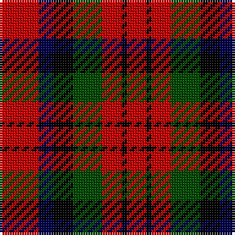

In pattern [RBKGRKR](/stripes/rbkgrkr/).

This was sourced from weddslist.  It is a [7 stripe tartan](/stripes/stripes7/).

Original link http://www.weddslist.com/cgi-bin/tartans/pg.pl?source=rb

## Attestations

This cloth appears in 3 source records; the oldest owns this page.

- undated — MacDuff (weddslist, [record](http://www.weddslist.com/cgi-bin/tartans/pg.pl?source=rb))
- undated — MacDuff (weddslist, [record](http://www.weddslist.com/cgi-bin/tartans/pg.pl?source=tinsel))
- undated — MacDuff (weddslist, [record](http://www.weddslist.com/cgi-bin/tartans/pg.pl?source=x))

## Thread count
R/16 DB6 K8 G12 R8 K2 R/8

## Palette
Each colour and the base-6 reference it is a variant of.

| Colour | Shade | Base |
|---|---|---|
| DB | <code style="background-color:#00004C;">#00004C</code> `oklch(18.8% 0.130 264.1)` <small>#00004C</small> | B <code style="background-color:#2A418A;">#2A418A</code> |
| G | <code style="background-color:#004C00;">#004C00</code> `oklch(36.1% 0.123 142.5)` <small>#004C00</small> | G <code style="background-color:#006100;">#006100</code> |
| K | <code style="background-color:#000000;">#000000</code> `oklch(0.0% 0.000 0.0)` <small>#000000</small> | K <code style="background-color:#000000;">#000000</code> |
| R | <code style="background-color:#C80000;">#C80000</code> `oklch(52.3% 0.215 29.2)` <small>#C80000</small> | R <code style="background-color:#CC0000;">#CC0000</code> |

# Sample pattern

## Nearest tartans

The nearest existing variants by ΔTartan distance.

1. [MacDuff](/setts/s7/r8t3k4g6r4k1r4~x2/) — ΔT 0.64
1. [MacDuff #5](/setts/s7/r8t3k4dg6r4k1r4~x2/) — ΔT 0.95
1. [MacDuff Clan Tartan Tartan Number: 2141. Earliest known date: 1831 According to D.C.Stewart, "It will be observed that the MacDuff tartan is substantially the Royal Stuart with the white and yellow lines removed. Whether this indicates it as a source of the Stuart, or the association of the Earls of Fife with the Crown, remains to be determined." James Logan published this sett in his book, 'The Scottish Gael' in 1831. See products available Copyright © Blair Urquhart, Comrie, 2015](/setts/s7/r8db3k4g6r4k1r4~x4/) — ΔT 0.96
1. [MacDuff](/setts/s7/r22t8k9g14r10t2r10~x2/) — ΔT 1.02
1. [Unidentified item](/setts/s5/dg9w1r9k9r9~x8/) — ΔT 1.04
1. [Connel](/setts/s6/r8k8ly1k8r8w1~x4/) — ΔT 1.12
1. [Unidentified, item](/setts/s5/r9k9r9w1g9~x8/) — ΔT 1.14
1. [Skinner](/setts/s6/r8k8lo1k8r8db1~x4/) — ΔT 1.19
1. [Alexander](/setts/s9/r12db2r4db4k15g4r4g2r12~x2/) — ΔT 1.22
1. [MacDuff #2](/setts/s7/r22t8k9dg14r10t2r10~x2/) — ΔT 1.33

## Neighbour map

Every grey dot is one of 14299 variants placed by the first two principal components of the ΔTartan feature space (44% of its variance). Red is this tartan; blue dots are its nearest — click one to open its page.

<svg viewBox="0 0 640 380" role="img" style="max-width:100%;height:auto;border:1px solid #e0e0e0;border-radius:4px;display:block" xmlns="http://www.w3.org/2000/svg"><image href="/nn/cloud.v1.png" width="640" height="380"/><a href="/setts/s7/r8t3k4g6r4k1r4~x2/"><circle cx="214.6" cy="228.7" r="4" fill="#3465a4"><title>MacDuff</title></circle></a><a href="/setts/s7/r8t3k4dg6r4k1r4~x2/"><circle cx="231.8" cy="232.8" r="4" fill="#3465a4"><title>MacDuff #5</title></circle></a><a href="/setts/s7/r8db3k4g6r4k1r4~x4/"><circle cx="239.9" cy="239.5" r="4" fill="#3465a4"><title>MacDuff Clan Tartan Tartan Number: 2141. Earliest known date: 1831 According to D.C.Stewart, &quot;It will be observed that the MacDuff tartan is substantially the Royal Stuart with the white and yellow lines removed. Whether this indicates it as a source of the Stuart, or the association of the Earls of Fife with the Crown, remains to be determined.&quot; James Logan published this sett in his book, 'The Scottish Gael' in 1831. See products available Copyright © Blair Urquhart, Comrie, 2015</title></circle></a><a href="/setts/s7/r22t8k9g14r10t2r10~x2/"><circle cx="254.4" cy="212.9" r="4" fill="#3465a4"><title>MacDuff</title></circle></a><a href="/setts/s5/dg9w1r9k9r9~x8/"><circle cx="212.4" cy="247.6" r="4" fill="#3465a4"><title>Unidentified item</title></circle></a><a href="/setts/s6/r8k8ly1k8r8w1~x4/"><circle cx="246.1" cy="226.6" r="4" fill="#3465a4"><title>Connel</title></circle></a><a href="/setts/s5/r9k9r9w1g9~x8/"><circle cx="193.4" cy="243.3" r="4" fill="#3465a4"><title>Unidentified, item</title></circle></a><a href="/setts/s6/r8k8lo1k8r8db1~x4/"><circle cx="258.9" cy="233.7" r="4" fill="#3465a4"><title>Skinner</title></circle></a><a href="/setts/s9/r12db2r4db4k15g4r4g2r12~x2/"><circle cx="243.1" cy="195.0" r="4" fill="#3465a4"><title>Alexander</title></circle></a><a href="/setts/s7/r22t8k9dg14r10t2r10~x2/"><circle cx="268.5" cy="215.7" r="4" fill="#3465a4"><title>MacDuff #2</title></circle></a><circle cx="219.4" cy="231.8" r="5" fill="#c00000"/></svg>

ID: /setts/s7/r8db3k4dg6r4k1r4~x2/
