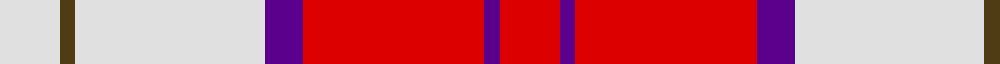

**Bands:** [RBRBWGW](/stripes/rbrbwgw/) · **Stripes:** [R DP R DP W DY W](/stripes/stripes7/) R DP R DP W DY W

This was sourced from register-of-tartans.  It is a [7 band tartan](/bands/bands7/).

Original link https://www.tartanregister.gov.uk/tartanDetails.aspx?ref=5369

## Register references

External register numbers recorded for this tartan.

- Scottish Register of Tartans: [5369](https://www.tartanregister.gov.uk/tartanDetails.aspx?ref=5369)
- Scottish Tartans World Register: 3007

## Thread count
LN/16 T4 LN50 P10 R48 P4 R/16

## Palette
Each colour and its ΔE from the base-6 reference it is a variant of.

| Colour | Shade | Base | ΔE (OKLab) |
|---|---|---|---|
| LN | <code style="background-color:#E0E0E0;">#E0E0E0</code> `#E0E0E0` | W <code style="background-color:#F7F7F7;">#F7F7F7</code> | 0.07 |
| P | <code style="background-color:#5A008C;">#5A008C</code> `#5A008C` | B <code style="background-color:#2A418A;">#2A418A</code> | 0.13 |
| R | <code style="background-color:#DC0000;">#DC0000</code> `#DC0000` | R <code style="background-color:#CC0000;">#CC0000</code> | 0.03 |
| T | <code style="background-color:#503C14;">#503C14</code> `#503C14` | G <code style="background-color:#006100;">#006100</code> | 0.14 |

# Sample pattern

## Nearest tartans

The nearest existing variants by ΔTartan distance.

1. [Lennox, dress](/setts/s7/r8p2r24p5w25o2w8~x2/) — ΔT 0.15
1. [Lennox Dress District Tartan Tartan Number: 1649. Earliest known date: 1986 Families with the surname 'Lennox' are usually considered related to Clans Stewart or MacFarlane. Some of this surname also choose to wear the distinctive and ancient 'Lennox' tartan. D W Stewart reproduced the sett from a 'lost' portrait of the Countess of Lennox dating from the 16th century. See products available Copyright © Blair Urquhart, Comrie, 2015](/setts/s7/r8m2r24m5w25dy2w8~x2/) — ΔT 0.33
1. [Lennox Dress #2](/setts/s7/r2r1r10r2w10db1w2~x4/) — ΔT 0.60
1. [Lennox Dress](/setts/s7/r8dp2r24db5w26dy2w8~x2/) — ΔT 0.87
1. [MacPherson, Red](/setts/s7/w5p3w26r20w3r8ly3~x2/) — ΔT 0.88
1. [Arduaine, Red (Dance)](/setts/s7/w5k2w30r24w3r8dt3~x2/) — ΔT 0.89
1. [MacPherson Dress Red (Dance)](/setts/s7/w5dp3w26r20w3r8ly3~x2/) — ΔT 0.89
1. [MacPherson Dress Red](/setts/s7/w4r2w25r21w3r8ly3~x2/) — ΔT 0.90
1. [Lennox, dress](/setts/s7/r8p2r24db5w26o2w8~x2/) — ΔT 0.91
1. [MacPherson Dress Burgundy (Dance)](/setts/s7/w4k2w25r21w3r8ly3~x2/) — ΔT 1.08

## Neighbour map

Every grey dot is one of 14313 variants placed by the first two principal components of the ΔTartan feature space (44% of its variance). Red is this tartan; blue dots are its nearest — click one to open its page.

<svg viewBox="0 0 640 380" role="img" style="max-width:100%;height:auto;border:1px solid #e0e0e0;border-radius:4px;display:block" xmlns="http://www.w3.org/2000/svg"><image href="/nn/cloud.v1.png" width="640" height="380"/><a href="/setts/s7/r8p2r24p5w25o2w8~x2/"><circle cx="250.3" cy="158.6" r="4" fill="#3465a4"><title>Lennox, dress</title></circle></a><a href="/setts/s7/r8m2r24m5w25dy2w8~x2/"><circle cx="254.2" cy="159.0" r="4" fill="#3465a4"><title>Lennox Dress District Tartan Tartan Number: 1649. Earliest known date: 1986 Families with the surname 'Lennox' are usually considered related to Clans Stewart or MacFarlane. Some of this surname also choose to wear the distinctive and ancient 'Lennox' tartan. D W Stewart reproduced the sett from a 'lost' portrait of the Countess of Lennox dating from the 16th century. See products available Copyright © Blair Urquhart, Comrie, 2015</title></circle></a><a href="/setts/s7/r2r1r10r2w10db1w2~x4/"><circle cx="237.7" cy="158.2" r="4" fill="#3465a4"><title>Lennox Dress #2</title></circle></a><a href="/setts/s7/r8dp2r24db5w26dy2w8~x2/"><circle cx="234.7" cy="140.0" r="4" fill="#3465a4"><title>Lennox Dress</title></circle></a><a href="/setts/s7/w5p3w26r20w3r8ly3~x2/"><circle cx="265.7" cy="168.8" r="4" fill="#3465a4"><title>MacPherson, Red</title></circle></a><a href="/setts/s7/w5k2w30r24w3r8dt3~x2/"><circle cx="297.3" cy="141.1" r="4" fill="#3465a4"><title>Arduaine, Red (Dance)</title></circle></a><a href="/setts/s7/w5dp3w26r20w3r8ly3~x2/"><circle cx="267.2" cy="169.0" r="4" fill="#3465a4"><title>MacPherson Dress Red (Dance)</title></circle></a><a href="/setts/s7/w4r2w25r21w3r8ly3~x2/"><circle cx="289.9" cy="154.5" r="4" fill="#3465a4"><title>MacPherson Dress Red</title></circle></a><a href="/setts/s7/r8p2r24db5w26o2w8~x2/"><circle cx="233.4" cy="141.4" r="4" fill="#3465a4"><title>Lennox, dress</title></circle></a><a href="/setts/s7/w4k2w25r21w3r8ly3~x2/"><circle cx="265.4" cy="152.9" r="4" fill="#3465a4"><title>MacPherson Dress Burgundy (Dance)</title></circle></a><circle cx="248.8" cy="156.6" r="5" fill="#c00000"/></svg>

ID: /setts/s7/r8dp2r24dp5w25dy2w8~x2/
