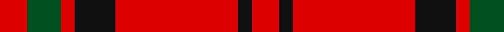
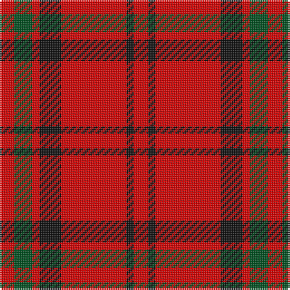

In pattern [RGRKRKR](/patterns/rgrkrkr/).

This was sourced from register-of-tartans.  It is a [7 stripes tartan](/stripes/stripes7/).

Original link https://www.tartanregister.gov.uk/tartanDetails.aspx?ref=2734

## Thread count
R/8 G10 R4 K12 R36 K4 R/8

## Palette
Each colour and its ΔE from the base-6 reference it is a variant of.

| Colour | Shade | Base | ΔE (OKLab) |
|---|---|---|---|
| G | <code style="background-color:#005020;">#005020</code> `#005020` | G <code style="background-color:#006100;">#006100</code> | 0.07 |
| K | <code style="background-color:#101010;">#101010</code> `#101010` | K <code style="background-color:#000000;">#000000</code> | 0.17 |
| R | <code style="background-color:#DC0000;">#DC0000</code> `#DC0000` | R <code style="background-color:#CC0000;">#CC0000</code> | 0.03 |

# Sample pattern

## Nearest tartans

The nearest existing variants by ΔTartan distance.

1. [MacQuarrie 5](/setts/s7/r8g10r4k12r36k4r8-g008000-k000000-rc00000/) — ΔT 0.86
1. [Macan, of Lurgyvallan (Hose)](/setts/s6/r20k2r8g12r8k2-g008000-k000000-rc00000/) — ΔT 1.03
1. [MacDonell of Keppach](/setts/s11/r18g8r12k4r8k4r16g28r48k4r8-g005020-k101010-rdc0000/) — ΔT 1.16
1. [MacKeane](/setts/s5/r8k16r24k2y2-k101010-rc80000-ye8c000/) — ΔT 1.17
1. [Auld Reekie](/setts/s6/b8r6b6r44g16r4-b000050-g003000-rc00000/) — ΔT 1.22
1. [Auld Lang Syne (red) Tartan Tartan Number: 2402. Earliest known date: Threadcount and colours aren't 100% original. Generated manually. See products available Copyright © Blair Urquhart, Comrie, 2015](/setts/s7/r8g28r10k12r48g4r8-g006818-k101010-rc80000/) — ΔT 1.27
1. [MacDonell of Keppach](/setts/s11/r18g8r12k4r8k4r16g28r48k4r8-g008000-k000000-rc00000/) — ΔT 1.27
1. [Loch Morar](/setts/s5/r76w18r6b18w6-b401000-rc00000-we0e0e0/) — ΔT 1.30
1. [Auld Reekie](/setts/s6/b8r6b6r44g16r4-b2c2c80-g006818-rc80000/) — ΔT 1.33
1. [Loch Morar Trade Tartan Tartan Number: 1701. Earliest known date: pre 2003 Nothing See products available Copyright © Blair Urquhart, Comrie, 2015](/setts/s5/r76w18r6b18w6-b441800-rc80000-we0e0e0/) — ΔT 1.35

## Neighbour map

Every grey dot is one of 15726 variants placed by the first two principal components of the ΔTartan feature space (44% of its variance). Red is this tartan; blue dots are its nearest — click one to open its page.

<svg viewBox="0 0 640 380" role="img" style="max-width:100%;height:auto;border:1px solid #e0e0e0;border-radius:4px;display:block" xmlns="http://www.w3.org/2000/svg"><image href="/nn/cloud.v1.png" width="640" height="380"/><a href="/setts/s7/r8g10r4k12r36k4r8-g008000-k000000-rc00000/"><circle cx="392.6" cy="204.4" r="4" fill="#3465a4"><title>MacQuarrie 5</title></circle></a><a href="/setts/s6/r20k2r8g12r8k2-g008000-k000000-rc00000/"><circle cx="411.3" cy="227.7" r="4" fill="#3465a4"><title>Macan, of Lurgyvallan (Hose)</title></circle></a><a href="/setts/s11/r18g8r12k4r8k4r16g28r48k4r8-g005020-k101010-rdc0000/"><circle cx="436.0" cy="181.5" r="4" fill="#3465a4"><title>MacDonell of Keppach</title></circle></a><a href="/setts/s5/r8k16r24k2y2-k101010-rc80000-ye8c000/"><circle cx="387.3" cy="215.9" r="4" fill="#3465a4"><title>MacKeane</title></circle></a><a href="/setts/s6/b8r6b6r44g16r4-b000050-g003000-rc00000/"><circle cx="401.5" cy="203.4" r="4" fill="#3465a4"><title>Auld Reekie</title></circle></a><a href="/setts/s7/r8g28r10k12r48g4r8-g006818-k101010-rc80000/"><circle cx="396.5" cy="206.7" r="4" fill="#3465a4"><title>Auld Lang Syne (red) Tartan Tartan Number: 2402. Earliest known date: Threadcount and colours aren't 100% original. Generated manually. See products available Copyright © Blair Urquhart, Comrie, 2015</title></circle></a><a href="/setts/s11/r18g8r12k4r8k4r16g28r48k4r8-g008000-k000000-rc00000/"><circle cx="422.6" cy="180.8" r="4" fill="#3465a4"><title>MacDonell of Keppach</title></circle></a><a href="/setts/s5/r76w18r6b18w6-b401000-rc00000-we0e0e0/"><circle cx="415.5" cy="186.4" r="4" fill="#3465a4"><title>Loch Morar</title></circle></a><a href="/setts/s6/b8r6b6r44g16r4-b2c2c80-g006818-rc80000/"><circle cx="419.1" cy="207.7" r="4" fill="#3465a4"><title>Auld Reekie</title></circle></a><a href="/setts/s5/r76w18r6b18w6-b441800-rc80000-we0e0e0/"><circle cx="417.5" cy="186.1" r="4" fill="#3465a4"><title>Loch Morar Trade Tartan Tartan Number: 1701. Earliest known date: pre 2003 Nothing See products available Copyright © Blair Urquhart, Comrie, 2015</title></circle></a><circle cx="411.2" cy="206.5" r="5" fill="#c00000"/></svg>

ID: /setts/s7/r8g10r4k12r36k4r8-g005020-k101010-rdc0000/
