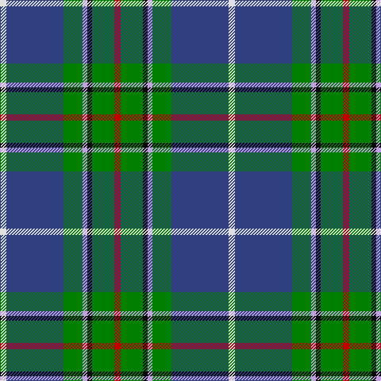

In pattern [RGKWGBW](/patterns/rgkwgbw/).

This was sourced from weddslist.  It is a [7 stripes tartan](/stripes/stripes7/).

Original link http://www.weddslist.com/cgi-bin/tartans/pg.pl?source=sts

## Thread count
LN/8 B72 G24 LP6 K6 G28 R/8

## Palette
Each colour and its ΔE from the base-6 reference it is a variant of.

| Colour | Shade | Base | ΔE (OKLab) |
|---|---|---|---|
| B | <code style="background-color:#304080;">#304080</code> `#304080` | B <code style="background-color:#2A418A;">#2A418A</code> | 0.02 |
| G | <code style="background-color:#008000;">#008000</code> `#008000` | G <code style="background-color:#006100;">#006100</code> | 0.10 |
| K | <code style="background-color:#000000;">#000000</code> `#000000` | K <code style="background-color:#000000;">#000000</code> | 0.00 |
| LN | <code style="background-color:#E0E0E0;">#E0E0E0</code> `#E0E0E0` | W <code style="background-color:#F7F7F7;">#F7F7F7</code> | 0.07 |
| LP | <code style="background-color:#C0A0E0;">#C0A0E0</code> `#C0A0E0` | W <code style="background-color:#F7F7F7;">#F7F7F7</code> | 0.24 |
| R | <code style="background-color:#C00000;">#C00000</code> `#C00000` | R <code style="background-color:#CC0000;">#CC0000</code> | 0.03 |

# Sample pattern

## Nearest tartans

The nearest existing variants by ΔTartan distance.

1. [Vipont Family Tartan Tartan Number: 1479. Earliest known date: 1983 This count comes from a sample at the Scottish Tartans Society, in the MacGregor Hastie collection. He in turn procured it from J.Wright of Edinburgh. A contradictory note in the files says, "It was apparently designed and woven by them (J.Wright) for the family of Vipont c.1930. It is rarely if ever used today." The Scottish Viponts are an ancient family, who formerly possessed lands in Aberdour, Fife. See products available Copyright © Blair Urquhart, Comrie, 2015](/setts/s7/r8g28k6w6g24b72wa8-b2c2c80-g006818-k101010-rc80000-wc49cd8-wae0e0e0/) — ΔT 0.68
1. [Shawlands International (Commem.)](/setts/s6/k6g88b54y12r20w6-b1c0070-g006818-k101010-rc80000-we0e0e0-yfccc00/) — ΔT 0.90
1. [Wishart Hunting Family Tartan Tartan Number: 2104. Earliest known date: 1990 The Wisharts of Pittarrow and Logie Wishart were a lowland family dating from around the 12th Century. The family's origins are unknown, but the name Guiscard, Wiscard, Wishart, meaning 'cunning' is Norman-French. We have also sought to associate the Wishart tartan with that of another family by virtue of the marriage of a Sir John Wishart to Jean, daughter of William Douglas, 9th Earl of Angus in the 16th Century. The Wishart tartan combines the Wallace and Douglas tartans, in an original new sett which was designed by Dr David Wishart with the assistance of the Scottish College of Textiles in Galashiels. (D. Wishart, 1990) See products available Copyright © Blair Urquhart, Comrie, 2015](/setts/s7/k4b4g32ba4y2ba26w4-b2c2c80-ba202060-g006818-k101010-we0e0e0-ye8c000/) — ΔT 0.90
1. [Canadian Centennial](/setts/s8/r6w12r4g64b72k4b8y4-b304080-g008000-k000000-rc00000-we0e0e0-yf0c000/) — ΔT 0.91
1. [Kleto, Susan (Personal)](/setts/s9/w2b32y2r6y2g12ga4g12w2-b2c2c80-g006818-ga289c18-ra00000-wfcfcfc-yfccc00/) — ΔT 0.94
1. [Canadian Centennial District Tartan Tartan Number: 1704. Earliest known date: 1966 This tartan was approved by the Centennial Commission. The six colours represent the wealth of Canada in her people and her natural resources. See products available Copyright © Blair Urquhart, Comrie, 2015](/setts/s8/r6w12r4g64b72k4b8y4-b2c2c80-g006818-k101010-rc80000-we0e0e0-ye8c000/) — ΔT 0.95
1. [Royal British Legion (Corporate)](/setts/s7/r6w4g40k6b16ga4w4-b2c2c80-g006818-ga289c18-k101010-rc80000-w98c8e8/) — ΔT 0.97
1. [Ayrshire (District)](/setts/s8/b8r4b40w4g16ga32y4ga8-b1c0070-g785000-ga30ac38-r880000-we0e0e0-ybc8c00/) — ΔT 0.99
1. [MX-5 Owners' Club](/setts/s7/r12b54ba4g4ba4g60w8-b2c2c80-ba2888c4-g006818-rc80000-wfcfcfc/) — ΔT 1.00
1. [Snodgrass](/setts/s8/k6r2y2b22g26b10r2y2-b304080-g008000-k000000-rc00000-yf0c000/) — ΔT 1.04

## Neighbour map

Every grey dot is one of 15726 variants placed by the first two principal components of the ΔTartan feature space (44% of its variance). Red is this tartan; blue dots are its nearest — click one to open its page.

<svg viewBox="0 0 640 380" role="img" style="max-width:100%;height:auto;border:1px solid #e0e0e0;border-radius:4px;display:block" xmlns="http://www.w3.org/2000/svg"><image href="/nn/cloud.v1.png" width="640" height="380"/><a href="/setts/s7/r8g28k6w6g24b72wa8-b2c2c80-g006818-k101010-rc80000-wc49cd8-wae0e0e0/"><circle cx="225.6" cy="155.5" r="4" fill="#3465a4"><title>Vipont Family Tartan Tartan Number: 1479. Earliest known date: 1983 This count comes from a sample at the Scottish Tartans Society, in the MacGregor Hastie collection. He in turn procured it from J.Wright of Edinburgh. A contradictory note in the files says, &quot;It was apparently designed and woven by them (J.Wright) for the family of Vipont c.1930. It is rarely if ever used today.&quot; The Scottish Viponts are an ancient family, who formerly possessed lands in Aberdour, Fife. See products available Copyright © Blair Urquhart, Comrie, 2015</title></circle></a><a href="/setts/s6/k6g88b54y12r20w6-b1c0070-g006818-k101010-rc80000-we0e0e0-yfccc00/"><circle cx="207.1" cy="149.2" r="4" fill="#3465a4"><title>Shawlands International (Commem.)</title></circle></a><a href="/setts/s7/k4b4g32ba4y2ba26w4-b2c2c80-ba202060-g006818-k101010-we0e0e0-ye8c000/"><circle cx="218.6" cy="146.4" r="4" fill="#3465a4"><title>Wishart Hunting Family Tartan Tartan Number: 2104. Earliest known date: 1990 The Wisharts of Pittarrow and Logie Wishart were a lowland family dating from around the 12th Century. The family's origins are unknown, but the name Guiscard, Wiscard, Wishart, meaning 'cunning' is Norman-French. We have also sought to associate the Wishart tartan with that of another family by virtue of the marriage of a Sir John Wishart to Jean, daughter of William Douglas, 9th Earl of Angus in the 16th Century. The Wishart tartan combines the Wallace and Douglas tartans, in an original new sett which was designed by Dr David Wishart with the assistance of the Scottish College of Textiles in Galashiels. (D. Wishart, 1990) See products available Copyright © Blair Urquhart, Comrie, 2015</title></circle></a><a href="/setts/s8/r6w12r4g64b72k4b8y4-b304080-g008000-k000000-rc00000-we0e0e0-yf0c000/"><circle cx="238.1" cy="118.1" r="4" fill="#3465a4"><title>Canadian Centennial</title></circle></a><a href="/setts/s9/w2b32y2r6y2g12ga4g12w2-b2c2c80-g006818-ga289c18-ra00000-wfcfcfc-yfccc00/"><circle cx="193.4" cy="118.9" r="4" fill="#3465a4"><title>Kleto, Susan (Personal)</title></circle></a><a href="/setts/s8/r6w12r4g64b72k4b8y4-b2c2c80-g006818-k101010-rc80000-we0e0e0-ye8c000/"><circle cx="242.8" cy="120.1" r="4" fill="#3465a4"><title>Canadian Centennial District Tartan Tartan Number: 1704. Earliest known date: 1966 This tartan was approved by the Centennial Commission. The six colours represent the wealth of Canada in her people and her natural resources. See products available Copyright © Blair Urquhart, Comrie, 2015</title></circle></a><a href="/setts/s7/r6w4g40k6b16ga4w4-b2c2c80-g006818-ga289c18-k101010-rc80000-w98c8e8/"><circle cx="214.8" cy="157.8" r="4" fill="#3465a4"><title>Royal British Legion (Corporate)</title></circle></a><a href="/setts/s8/b8r4b40w4g16ga32y4ga8-b1c0070-g785000-ga30ac38-r880000-we0e0e0-ybc8c00/"><circle cx="148.2" cy="152.3" r="4" fill="#3465a4"><title>Ayrshire (District)</title></circle></a><a href="/setts/s7/r12b54ba4g4ba4g60w8-b2c2c80-ba2888c4-g006818-rc80000-wfcfcfc/"><circle cx="238.3" cy="155.9" r="4" fill="#3465a4"><title>MX-5 Owners' Club</title></circle></a><a href="/setts/s8/k6r2y2b22g26b10r2y2-b304080-g008000-k000000-rc00000-yf0c000/"><circle cx="217.7" cy="159.1" r="4" fill="#3465a4"><title>Snodgrass</title></circle></a><circle cx="216.7" cy="151.9" r="5" fill="#c00000"/></svg>

ID: /setts/s7/r8g28k6w6g24b72wa8-b304080-g008000-k000000-rc00000-wc0a0e0-wae0e0e0/
