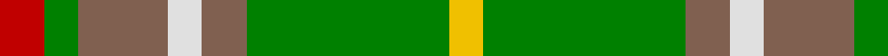
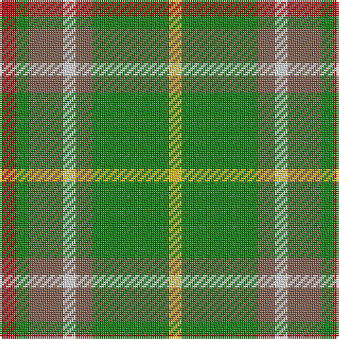

In pattern [RGRWRGY](/patterns/rgrwrgy/).

This was sourced from weddslist.  It is a [7 stripes tartan](/stripes/stripes7/).

Original link http://www.weddslist.com/cgi-bin/tartans/pg.pl?source=sts

## Thread count
R/8 G6 LT16 LN6 LT8 G36 Y/6

## Palette
Each colour and its ΔE from the base-6 reference it is a variant of.

| Colour | Shade | Base | ΔE (OKLab) |
|---|---|---|---|
| G | <code style="background-color:#008000;">#008000</code> `#008000` | G <code style="background-color:#006100;">#006100</code> | 0.10 |
| LN | <code style="background-color:#E0E0E0;">#E0E0E0</code> `#E0E0E0` | W <code style="background-color:#F7F7F7;">#F7F7F7</code> | 0.07 |
| LT | <code style="background-color:#806050;">#806050</code> `#806050` | R <code style="background-color:#CC0000;">#CC0000</code> | 0.17 |
| R | <code style="background-color:#C00000;">#C00000</code> `#C00000` | R <code style="background-color:#CC0000;">#CC0000</code> | 0.03 |
| Y | <code style="background-color:#F0C000;">#F0C000</code> `#F0C000` | Y <code style="background-color:#F2BF00;">#F2BF00</code> | 0.00 |

# Sample pattern

## Nearest tartans

The nearest existing variants by ΔTartan distance.

1. [Newfoundland District Tartan Tartan Number: 1543. Earliest known date: 1972 The colours of the Newfoundland tartan are related to the 'Ode to Newfoundland', the second anthem of the province. Gold for the sun, green for the pine clad hill, white for the snow, brown for the minerals under the earth and red to denote her British origins. In 1972, the Minute of Provincial Affairs of the Province petitioned the Lord Lyon to record the tartan in the Writs section of the Lyon Court Books. This was done on the 3rd of September, 1973. See products available Copyright © Blair Urquhart, Comrie, 2015](/setts/s7/r8g6ga16w6ga8g36y6-g006818-ga604000-rc80000-we0e0e0-ye8c000/) — ΔT 0.66
1. [Wilson's, No 179](/setts/s5/g24y4r4b8r8-b5480b0-g008000-rc00000-yf0c000/) — ΔT 1.22
1. [Ellan Vannin](/setts/s6/b8g52w8ba16ga32g8-b3c78c8-ba780078-g146400-ga007800-wc8c8c8/) — ΔT 1.38
1. [Newfoundland](/setts/s7/r12g8b28w8b14g60y8-b441800-g006818-rc80000-we0e0e0-yd09800/) — ΔT 1.40
1. [Red Dirt Girl](/setts/s9/g42r4ga36r4ga36r4gb16w12g20-g604000-ga288028-gb003820-ra00000-wfcfcfc/) — ΔT 1.42
1. [McShane (Personal)](/setts/s8/g36w8g36k8ga56y16w8r8-g006818-ga604000-k101010-rc80000-wc0c0c0-ye8c000/) — ΔT 1.43
1. [Deeside](/setts/s7/w4g4b8g28ga4gb20y4-b800080-g808080-ga008000-gb30a010-we0e0e0-yf0c000/) — ΔT 1.46
1. [Manitoba](/setts/s8/b4g2b2g24r4g2ra12y4-b5480b0-g008000-rc00000-ra900030-yf0c000/) — ΔT 1.48
1. [New Mexico (Fashion)](/setts/s7/g10b42r5ga42g42y5g6-b780078-g289c18-ga006818-rc80000-yd8b000/) — ΔT 1.49
1. [O'Brien](/setts/s12/r26g12y4g6y4g12b6g4b6g24ra6g12-b5480b0-g008000-rf06030-rac00000-yf0c000/) — ΔT 1.50

## Neighbour map

Every grey dot is one of 15726 variants placed by the first two principal components of the ΔTartan feature space (44% of its variance). Red is this tartan; blue dots are its nearest — click one to open its page.

<svg viewBox="0 0 640 380" role="img" style="max-width:100%;height:auto;border:1px solid #e0e0e0;border-radius:4px;display:block" xmlns="http://www.w3.org/2000/svg"><image href="/nn/cloud.v1.png" width="640" height="380"/><a href="/setts/s7/r8g6ga16w6ga8g36y6-g006818-ga604000-rc80000-we0e0e0-ye8c000/"><circle cx="218.2" cy="211.3" r="4" fill="#3465a4"><title>Newfoundland District Tartan Tartan Number: 1543. Earliest known date: 1972 The colours of the Newfoundland tartan are related to the 'Ode to Newfoundland', the second anthem of the province. Gold for the sun, green for the pine clad hill, white for the snow, brown for the minerals under the earth and red to denote her British origins. In 1972, the Minute of Provincial Affairs of the Province petitioned the Lord Lyon to record the tartan in the Writs section of the Lyon Court Books. This was done on the 3rd of September, 1973. See products available Copyright © Blair Urquhart, Comrie, 2015</title></circle></a><a href="/setts/s5/g24y4r4b8r8-b5480b0-g008000-rc00000-yf0c000/"><circle cx="244.6" cy="241.9" r="4" fill="#3465a4"><title>Wilson's, No 179</title></circle></a><a href="/setts/s6/b8g52w8ba16ga32g8-b3c78c8-ba780078-g146400-ga007800-wc8c8c8/"><circle cx="231.2" cy="234.0" r="4" fill="#3465a4"><title>Ellan Vannin</title></circle></a><a href="/setts/s7/r12g8b28w8b14g60y8-b441800-g006818-rc80000-we0e0e0-yd09800/"><circle cx="230.8" cy="195.3" r="4" fill="#3465a4"><title>Newfoundland</title></circle></a><a href="/setts/s9/g42r4ga36r4ga36r4gb16w12g20-g604000-ga288028-gb003820-ra00000-wfcfcfc/"><circle cx="197.6" cy="192.0" r="4" fill="#3465a4"><title>Red Dirt Girl</title></circle></a><a href="/setts/s8/g36w8g36k8ga56y16w8r8-g006818-ga604000-k101010-rc80000-wc0c0c0-ye8c000/"><circle cx="153.3" cy="186.6" r="4" fill="#3465a4"><title>McShane (Personal)</title></circle></a><a href="/setts/s7/w4g4b8g28ga4gb20y4-b800080-g808080-ga008000-gb30a010-we0e0e0-yf0c000/"><circle cx="186.9" cy="184.7" r="4" fill="#3465a4"><title>Deeside</title></circle></a><a href="/setts/s8/b4g2b2g24r4g2ra12y4-b5480b0-g008000-rc00000-ra900030-yf0c000/"><circle cx="266.2" cy="159.6" r="4" fill="#3465a4"><title>Manitoba</title></circle></a><a href="/setts/s7/g10b42r5ga42g42y5g6-b780078-g289c18-ga006818-rc80000-yd8b000/"><circle cx="168.6" cy="195.8" r="4" fill="#3465a4"><title>New Mexico (Fashion)</title></circle></a><a href="/setts/s12/r26g12y4g6y4g12b6g4b6g24ra6g12-b5480b0-g008000-rf06030-rac00000-yf0c000/"><circle cx="250.8" cy="196.2" r="4" fill="#3465a4"><title>O'Brien</title></circle></a><circle cx="223.2" cy="211.9" r="5" fill="#c00000"/></svg>

ID: /setts/s7/r8g6ra16w6ra8g36y6-g008000-rc00000-ra806050-we0e0e0-yf0c000/
