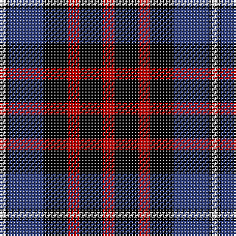

In pattern [RKRKBKW](/patterns/rkrkbkw/).

This was sourced from weddslist.  It is a [7 stripes tartan](/stripes/stripes7/).

Original link http://www.weddslist.com/cgi-bin/tartans/pg.pl?source=sts

## Thread count
LN/4 K2 B24 K16 R8 K16 R/8

## Palette
Each colour and its ΔE from the base-6 reference it is a variant of.

| Colour | Shade | Base | ΔE (OKLab) |
|---|---|---|---|
| B | <code style="background-color:#304080;">#304080</code> `#304080` | B <code style="background-color:#2C4084;">#2C4084</code> | 0.01 |
| K | <code style="background-color:#000000;">#000000</code> `#000000` | K <code style="background-color:#000000;">#000000</code> | 0.00 |
| LN | <code style="background-color:#E0E0E0;">#E0E0E0</code> `#E0E0E0` | W <code style="background-color:#F4F4F0;">#F4F4F0</code> | 0.06 |
| R | <code style="background-color:#C00000;">#C00000</code> `#C00000` | R <code style="background-color:#C80000;">#C80000</code> | 0.02 |

# Sample pattern

## Nearest tartans

The nearest existing variants by ΔTartan distance.

1. [Gipsy (Fashion)](/setts/s9/k8r8b32r8w4r8k32r8k8-b000088-k000000-rc80000-wfcfcfc/) — ΔT 1.05
1. [Gipsy](/setts/s9/k4r4b16r4w2r4k16r4k4-b000048-k000000-rc80000-wfcfcfc/) — ΔT 1.09
1. [Aitken](/setts/s8/y10b4k4b24k32r40k4r8-b00008c-k000000-r8c0000-yc88c00/) — ΔT 1.10
1. [Baillie](/setts/s7/b6k2b16k12g16k2w4-b800080-g008000-k000000-we0e0e0/) — ΔT 1.18
1. [Kilgour](/setts/s6/b28g42b8r42b28y4-b080848-g005020-rdc0000-ye8c000/) — ΔT 1.19
1. [MacTavish](/setts/s6/b4r24ba4b12k12b2-b4367ae-ba000052-k000000-raa0000/) — ΔT 1.24
1. [MacTavish](/setts/s6/b2r12ba2b6k6b1-b4367ae-ba000052-k000000-raa0000/) — ΔT 1.24
1. [Melville](/setts/s6/k5w2g18k17b16k3-b5a3094-g004c00-k000000-wd0d0d0/) — ΔT 1.24
1. [MacKean (Personal)](/setts/s7/r16k36r12k36b54k4w6-b1474b4-k101010-rc80000-wfcfcfc/) — ΔT 1.26
1. [Dutch (District)](/setts/s6/k8r38k38r4b44w8-b440044-k000000-rb84c00-wfcfcfc/) — ΔT 1.32

## Neighbour map

Every grey dot is one of 15726 variants placed by the first two principal components of the ΔTartan feature space (44% of its variance). Red is this tartan; blue dots are its nearest — click one to open its page.

<svg viewBox="0 0 640 380" role="img" style="max-width:100%;height:auto;border:1px solid #e0e0e0;border-radius:4px;display:block" xmlns="http://www.w3.org/2000/svg"><image href="/nn/cloud.v1.png" width="640" height="380"/><a href="/setts/s9/k8r8b32r8w4r8k32r8k8-b000088-k000000-rc80000-wfcfcfc/"><circle cx="176.6" cy="194.0" r="4" fill="#3465a4"><title>Gipsy (Fashion)</title></circle></a><a href="/setts/s9/k4r4b16r4w2r4k16r4k4-b000048-k000000-rc80000-wfcfcfc/"><circle cx="181.4" cy="196.2" r="4" fill="#3465a4"><title>Gipsy</title></circle></a><a href="/setts/s8/y10b4k4b24k32r40k4r8-b00008c-k000000-r8c0000-yc88c00/"><circle cx="185.4" cy="189.0" r="4" fill="#3465a4"><title>Aitken</title></circle></a><a href="/setts/s7/b6k2b16k12g16k2w4-b800080-g008000-k000000-we0e0e0/"><circle cx="145.7" cy="208.2" r="4" fill="#3465a4"><title>Baillie</title></circle></a><a href="/setts/s6/b28g42b8r42b28y4-b080848-g005020-rdc0000-ye8c000/"><circle cx="196.2" cy="226.7" r="4" fill="#3465a4"><title>Kilgour</title></circle></a><a href="/setts/s6/b4r24ba4b12k12b2-b4367ae-ba000052-k000000-raa0000/"><circle cx="208.6" cy="196.0" r="4" fill="#3465a4"><title>MacTavish</title></circle></a><a href="/setts/s6/b2r12ba2b6k6b1-b4367ae-ba000052-k000000-raa0000/"><circle cx="208.6" cy="196.0" r="4" fill="#3465a4"><title>MacTavish</title></circle></a><a href="/setts/s6/k5w2g18k17b16k3-b5a3094-g004c00-k000000-wd0d0d0/"><circle cx="184.3" cy="230.2" r="4" fill="#3465a4"><title>Melville</title></circle></a><a href="/setts/s7/r16k36r12k36b54k4w6-b1474b4-k101010-rc80000-wfcfcfc/"><circle cx="227.8" cy="194.2" r="4" fill="#3465a4"><title>MacKean (Personal)</title></circle></a><a href="/setts/s6/k8r38k38r4b44w8-b440044-k000000-rb84c00-wfcfcfc/"><circle cx="157.5" cy="200.7" r="4" fill="#3465a4"><title>Dutch (District)</title></circle></a><circle cx="193.1" cy="205.5" r="5" fill="#c00000"/></svg>

ID: /setts/s7/r8k16r8k16b24k2w4-b304080-k000000-rc00000-we0e0e0/
