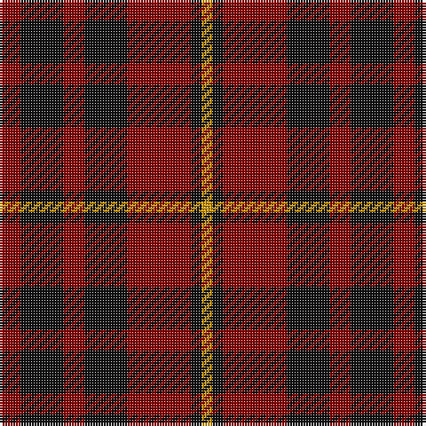

In pattern [RKRKRKY](/patterns/rkrkrky/).

This was sourced from register-of-tartans.  It is a [7 stripes tartan](/stripes/stripes7/).

Original link https://www.tartanregister.gov.uk/tartanDetails.aspx?ref=5214

## Thread count
DR/8 K16 DR8 K16 DR24 K4 DY/4

## Palette
Each colour and its ΔE from the base-6 reference it is a variant of.

| Colour | Shade | Base | ΔE (OKLab) |
|---|---|---|---|
| DR | <code style="background-color:#880000;">#880000</code> `#880000` | R <code style="background-color:#C80000;">#C80000</code> | 0.14 |
| DY | <code style="background-color:#D09800;">#D09800</code> `#D09800` | Y <code style="background-color:#E8C000;">#E8C000</code> | 0.11 |
| K | <code style="background-color:#101010;">#101010</code> `#101010` | K <code style="background-color:#000000;">#000000</code> | 0.17 |

# Sample pattern

## Nearest tartans

The nearest existing variants by ΔTartan distance.

1. [bodog.com Corporate Tartan Tartan Number: 6889. Earliest known date: 2006 Corporate brand name and colours, red, black and silver grey used to support brand identification. Company owner and executive is Scottish. First tartan to be name after a web site and first ever tartan for Costa Rica. See products available Copyright © Blair Urquhart, Comrie, 2015](/setts/s8/k50r50k20w6k20r50k50r6-k101010-rc80000-wc0c0c0/) — ΔT 1.43
1. [Lumsden Boghead](/setts/s9/b14r70b56r14g14r14g56r70g14-b14283c-g285800-rc80000/) — ΔT 1.50
1. [Wotherspoon](/setts/s5/r20g12r72b72g12-b1c1c50-g003820-rc80000/) — ΔT 1.51
1. [Unidentified #59](/setts/s7/r4g16r4y4r16g4r4-g004c00-r8c0000-yb0b0b0/) — ΔT 1.53
1. [Haig & Haig Whisky](/setts/s8/r52k36r14k8y8k8r14k36-k101010-rc80000-ye8c000/) — ΔT 1.54
1. [Clanton (Personal)](/setts/s9/b4k8r28ra16r8k16r28ra8b4-b780078-k101010-r880000-ra888888/) — ΔT 1.58
1. [MacDonald of Sleat](/setts/s5/g32r10g4r36k4-g11450d-k000000-raa0000/) — ΔT 1.59
1. [MacDonald of Sleat](/setts/s5/g16r5g2r18k2-g11450d-k000000-raa0000/) — ΔT 1.59
1. [Lumsden of Kintore (Clan?)](/setts/s9/b12r60b48r12g12r12g48r60g12-b14283c-g006818-rc80000/) — ΔT 1.59
1. [Rajput](/setts/s6/b12r78b20r20b42y10-b2c2c80-r880000-ye8c000/) — ΔT 1.60

## Neighbour map

Every grey dot is one of 15726 variants placed by the first two principal components of the ΔTartan feature space (44% of its variance). Red is this tartan; blue dots are its nearest — click one to open its page.

<svg viewBox="0 0 640 380" role="img" style="max-width:100%;height:auto;border:1px solid #e0e0e0;border-radius:4px;display:block" xmlns="http://www.w3.org/2000/svg"><image href="/nn/cloud.v1.png" width="640" height="380"/><a href="/setts/s8/k50r50k20w6k20r50k50r6-k101010-rc80000-wc0c0c0/"><circle cx="315.7" cy="237.6" r="4" fill="#3465a4"><title>bodog.com Corporate Tartan Tartan Number: 6889. Earliest known date: 2006 Corporate brand name and colours, red, black and silver grey used to support brand identification. Company owner and executive is Scottish. First tartan to be name after a web site and first ever tartan for Costa Rica. See products available Copyright © Blair Urquhart, Comrie, 2015</title></circle></a><a href="/setts/s9/b14r70b56r14g14r14g56r70g14-b14283c-g285800-rc80000/"><circle cx="280.8" cy="245.8" r="4" fill="#3465a4"><title>Lumsden Boghead</title></circle></a><a href="/setts/s5/r20g12r72b72g12-b1c1c50-g003820-rc80000/"><circle cx="291.2" cy="256.0" r="4" fill="#3465a4"><title>Wotherspoon</title></circle></a><a href="/setts/s7/r4g16r4y4r16g4r4-g004c00-r8c0000-yb0b0b0/"><circle cx="317.3" cy="272.9" r="4" fill="#3465a4"><title>Unidentified #59</title></circle></a><a href="/setts/s8/r52k36r14k8y8k8r14k36-k101010-rc80000-ye8c000/"><circle cx="284.9" cy="229.5" r="4" fill="#3465a4"><title>Haig &amp; Haig Whisky</title></circle></a><a href="/setts/s9/b4k8r28ra16r8k16r28ra8b4-b780078-k101010-r880000-ra888888/"><circle cx="274.5" cy="224.0" r="4" fill="#3465a4"><title>Clanton (Personal)</title></circle></a><a href="/setts/s5/g32r10g4r36k4-g11450d-k000000-raa0000/"><circle cx="364.2" cy="248.5" r="4" fill="#3465a4"><title>MacDonald of Sleat</title></circle></a><a href="/setts/s5/g16r5g2r18k2-g11450d-k000000-raa0000/"><circle cx="364.2" cy="248.5" r="4" fill="#3465a4"><title>MacDonald of Sleat</title></circle></a><a href="/setts/s9/b12r60b48r12g12r12g48r60g12-b14283c-g006818-rc80000/"><circle cx="273.7" cy="243.4" r="4" fill="#3465a4"><title>Lumsden of Kintore (Clan?)</title></circle></a><a href="/setts/s6/b12r78b20r20b42y10-b2c2c80-r880000-ye8c000/"><circle cx="349.4" cy="246.1" r="4" fill="#3465a4"><title>Rajput</title></circle></a><circle cx="310.5" cy="271.2" r="5" fill="#c00000"/></svg>

ID: /setts/s7/r8k16r8k16r24k4y4-k101010-r880000-yd09800/
