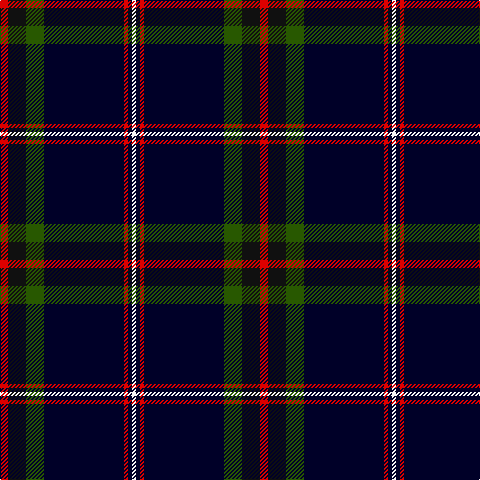

In pattern [RKGKRKW](/patterns/rkgkrkw/).

This was sourced from register-of-tartans.  It is a [7 stripes tartan](/stripes/stripes7/).

Original link https://www.tartanregister.gov.uk/tartanDetails.aspx?ref=10218

## Thread count
R/8 K18 G18 DB80 R4 DB4 W/4

## Palette
Each colour and its ΔE from the base-6 reference it is a variant of.

| Colour | Shade | Base | ΔE (OKLab) |
|---|---|---|---|
| DB | <code style="background-color:#000028;">#000028</code> `#000028` | K <code style="background-color:#000000;">#000000</code> | 0.15 |
| G | <code style="background-color:#285800;">#285800</code> `#285800` | G <code style="background-color:#006400;">#006400</code> | 0.04 |
| K | <code style="background-color:#101010;">#101010</code> `#101010` | K <code style="background-color:#000000;">#000000</code> | 0.17 |
| R | <code style="background-color:#DC0000;">#DC0000</code> `#DC0000` | R <code style="background-color:#C80000;">#C80000</code> | 0.04 |
| W | <code style="background-color:#F8F8F8;">#F8F8F8</code> `#F8F8F8` | W <code style="background-color:#F4F4F0;">#F4F4F0</code> | 0.01 |

# Sample pattern

## Nearest tartans

The nearest existing variants by ΔTartan distance.

1. [State Seal of Massachusetts Fash)](/setts/s10/k124b8k14ba58k6y8k6w8k22b32-b1474b4-ba2c2c80-k101010-we8ccb8-ybc8c00/) — ΔT 1.05
1. [Round Table of Britain and Ireland, RtbI.](/setts/s6/b94g28ba10r4ra6g14-b000050-ba401000-g008000-r806050-rac00000/) — ΔT 1.16
1. [City of Rome Pipe Band (Corporate)](/setts/s7/r12y6k88b45k6b6ya6-b2c2c80-k101010-r901c38-yd87c00-yae8c000/) — ΔT 1.16
1. [Chestico](/setts/s7/b40g2b2g2ga16k2w6-b202060-g603800-ga003820-k101010-wfcfcfc/) — ΔT 1.18
1. [Hope-Weir / Weir](/setts/s8/k16y2k2b56k24g4k2ba4-b304080-ba5480b0-g008000-k000000-yf0c000/) — ΔT 1.18
1. [Mount Dora](/setts/s10/k84b8k32g20ka4r12ka4g20ka6w8-b5a008c-g003c14-k000028-ka101010-rdc0000-we0e0e0/) — ΔT 1.26
1. [Tartan Day SA](/setts/s8/w4k80g44y6g4r6g4w4-g004600-k000037-rbd0000-wffffff-yffa000/) — ΔT 1.26
1. [Mensa](/setts/s7/w6k38b48r4b4y4b4-b1c1c50-k000000-rc82828-w98c8e8-yfcc000/) — ΔT 1.29
1. [Home, or Hume](/setts/s8/k56r2k4r2k16b48g4b6-b304080-g008000-k000000-rc00000/) — ΔT 1.32
1. [Caledonian Mist](/setts/s7/b108k20ba8bb4ba4w4ba20-b1c1c1c-ba6c0070-bb5c5c5c-k000000-wfcfcfc/) — ΔT 1.35

## Neighbour map

Every grey dot is one of 15726 variants placed by the first two principal components of the ΔTartan feature space (44% of its variance). Red is this tartan; blue dots are its nearest — click one to open its page.

<svg viewBox="0 0 640 380" role="img" style="max-width:100%;height:auto;border:1px solid #e0e0e0;border-radius:4px;display:block" xmlns="http://www.w3.org/2000/svg"><image href="/nn/cloud.v1.png" width="640" height="380"/><a href="/setts/s10/k124b8k14ba58k6y8k6w8k22b32-b1474b4-ba2c2c80-k101010-we8ccb8-ybc8c00/"><circle cx="349.4" cy="134.4" r="4" fill="#3465a4"><title>State Seal of Massachusetts Fash)</title></circle></a><a href="/setts/s6/b94g28ba10r4ra6g14-b000050-ba401000-g008000-r806050-rac00000/"><circle cx="355.5" cy="151.8" r="4" fill="#3465a4"><title>Round Table of Britain and Ireland, RtbI.</title></circle></a><a href="/setts/s7/r12y6k88b45k6b6ya6-b2c2c80-k101010-r901c38-yd87c00-yae8c000/"><circle cx="332.8" cy="163.5" r="4" fill="#3465a4"><title>City of Rome Pipe Band (Corporate)</title></circle></a><a href="/setts/s7/b40g2b2g2ga16k2w6-b202060-g603800-ga003820-k101010-wfcfcfc/"><circle cx="348.7" cy="141.5" r="4" fill="#3465a4"><title>Chestico</title></circle></a><a href="/setts/s8/k16y2k2b56k24g4k2ba4-b304080-ba5480b0-g008000-k000000-yf0c000/"><circle cx="315.2" cy="123.1" r="4" fill="#3465a4"><title>Hope-Weir / Weir</title></circle></a><a href="/setts/s10/k84b8k32g20ka4r12ka4g20ka6w8-b5a008c-g003c14-k000028-ka101010-rdc0000-we0e0e0/"><circle cx="307.7" cy="122.8" r="4" fill="#3465a4"><title>Mount Dora</title></circle></a><a href="/setts/s8/w4k80g44y6g4r6g4w4-g004600-k000037-rbd0000-wffffff-yffa000/"><circle cx="297.5" cy="126.2" r="4" fill="#3465a4"><title>Tartan Day SA</title></circle></a><a href="/setts/s7/w6k38b48r4b4y4b4-b1c1c50-k000000-rc82828-w98c8e8-yfcc000/"><circle cx="273.7" cy="163.7" r="4" fill="#3465a4"><title>Mensa</title></circle></a><a href="/setts/s8/k56r2k4r2k16b48g4b6-b304080-g008000-k000000-rc00000/"><circle cx="364.1" cy="149.9" r="4" fill="#3465a4"><title>Home, or Hume</title></circle></a><a href="/setts/s7/b108k20ba8bb4ba4w4ba20-b1c1c1c-ba6c0070-bb5c5c5c-k000000-wfcfcfc/"><circle cx="427.4" cy="135.4" r="4" fill="#3465a4"><title>Caledonian Mist</title></circle></a><circle cx="354.2" cy="143.9" r="5" fill="#c00000"/></svg>

ID: /setts/s7/r8k18g18ka80r4ka4w4-g285800-k101010-ka000028-rdc0000-wf8f8f8/
