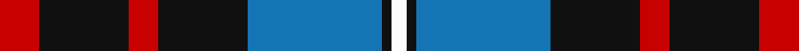

This page is one **sett** — a single exact thread-count. It belongs to the [tartan](/tartans/r8k18r6k18b27k2w3/)
(the same proportion at any scale), whose colour order is pattern [RKRKBKW](/stripes/rkrkbkw/).

Sourced from register-of-tartans.  It is a [7 stripe tartan](/stripes/stripes7/).

Original link https://www.tartanregister.gov.uk/tartanDetails.aspx?ref=2508

## Register references

External register numbers recorded for this tartan.

- Scottish Register of Tartans: [2508](https://www.tartanregister.gov.uk/tartanDetails.aspx?ref=2508)
- Scottish Tartans Authority (ITI): 1442
- Scottish Tartans World Register: 1442

## Thread count
R/16 K36 R12 K36 B54 K4 W/6

## Palette
Each colour and the base-6 reference it is a variant of.

| Colour | Shade | Base |
|---|---|---|
| B | <code style="background-color:#1474B4;">#1474B4</code> `oklch(54.0% 0.129 245.1)` <small>#1474B4</small> | B <code style="background-color:#2A418A;">#2A418A</code> |
| K | <code style="background-color:#101010;">#101010</code> `oklch(17.3% 0.000 89.9)` <small>#101010</small> | K <code style="background-color:#000000;">#000000</code> |
| R | <code style="background-color:#C80000;">#C80000</code> `oklch(52.3% 0.215 29.2)` <small>#C80000</small> | R <code style="background-color:#CC0000;">#CC0000</code> |
| W | <code style="background-color:#FCFCFC;">#FCFCFC</code> `oklch(99.1% 0.000 89.9)` <small>#FCFCFC</small> | W <code style="background-color:#F7F7F7;">#F7F7F7</code> |

# Sample pattern

## Nearest tartans

The nearest existing variants by ΔTartan distance, with this tartan at the top so the swatches line up against it.

ΔTartan

Tartan

Sett

—

<a href="/ttd/edit/#slug=r8k18r6k18b27k2w3~x2">MacKean (Personal)</a> <a class="nn-out" href="/setts/s7/r8k18r6k18b27k2w3~x2/" title="open its dictionary page">↗</a>

0.95

<a href="/ttd/edit/#slug=t3o26g4t13k13t2~x2">MacTavish / Thom(p)son, hunting</a> <a class="nn-out" href="/setts/s6/t3o26g4t13k13t2~x2/" title="open its dictionary page">↗</a>

0.96

<a href="/ttd/edit/#slug=r12k3w14dt10k2dt24r2~x2">Yusra Personal Tartan Tartan Number: 10455. Earliest known date: 6th April 2011 The colours used in the design are based on the colours of the Malaysian flag (blue/navy, red, yellow and white/cream) to represent the country of origin of part of the Yusra family. A woven sample of this tartan has been received by the Scottish Register of Tartans for permanent preservation in the National Archives of Scotland. See products available Copyright © Blair Urquhart, Comrie, 2015</a> <a class="nn-out" href="/setts/s7/r12k3w14dt10k2dt24r2~x2/" title="open its dictionary page">↗</a>

1.01

<a href="/ttd/edit/#slug=r25g10db30w4db30g10r25w2~x2">Highland Spring Dress (2004)</a> <a class="nn-out" href="/setts/s8/r25g10db30w4db30g10r25w2~x2/" title="open its dictionary page">↗</a>

1.04

<a href="/ttd/edit/#slug=k21o2k8w2o16n6k2n8~x2">Ardmore (Fashion)</a> <a class="nn-out" href="/setts/s8/k21o2k8w2o16n6k2n8~x2/" title="open its dictionary page">↗</a>

1.04

<a href="/ttd/edit/#slug=r12db3g5db16ly2g2~x2">Dunbog Primary (School)</a> <a class="nn-out" href="/setts/s6/r12db3g5db16ly2g2~x2/" title="open its dictionary page">↗</a>

1.07

<a href="/ttd/edit/#slug=db14g21db4r21db14ly2~x2">Kilgour</a> <a class="nn-out" href="/setts/s6/db14g21db4r21db14ly2~x2/" title="open its dictionary page">↗</a>

1.09

<a href="/ttd/edit/#slug=db9k7o5r1o5k1o2~x4">Greyhound Grenadiers (Corporate)</a> <a class="nn-out" href="/setts/s7/db9k7o5r1o5k1o2~x4/" title="open its dictionary page">↗</a>

1.10

<a href="/ttd/edit/#slug=lo32db10k52db10w5k24db16w10k11lo15">Cavan County Crest (Fashion)</a> <a class="nn-out" href="/setts/s10/lo32db10k52db10w5k24db16w10k11lo15/" title="open its dictionary page">↗</a>

1.13

<a href="/ttd/edit/#slug=k3lb3k3n10r1~x6">Greystone (Burberry Grey)</a> <a class="nn-out" href="/setts/s5/k3lb3k3n10r1~x6/" title="open its dictionary page">↗</a>

1.13

<a href="/ttd/edit/#slug=db14dg21db4r21db14ly2~x2">Kilgour</a> <a class="nn-out" href="/setts/s6/db14dg21db4r21db14ly2~x2/" title="open its dictionary page">↗</a>

## Neighbour map

Every grey dot is one of 14299 variants placed by the first two principal components of the ΔTartan feature space (44% of its variance). Red is this tartan; blue dots are its nearest — click one to open its page.

<svg viewBox="0 0 640 380" role="img" style="max-width:100%;height:auto;border:1px solid #e0e0e0;border-radius:4px;display:block" xmlns="http://www.w3.org/2000/svg"><image href="/nn/cloud.v1.png" width="640" height="380"/><a href="/setts/s6/t3o26g4t13k13t2~x2/"><circle cx="215.2" cy="195.4" r="4" fill="#3465a4"><title>MacTavish / Thom(p)son, hunting</title></circle></a><a href="/setts/s7/r12k3w14dt10k2dt24r2~x2/"><circle cx="228.1" cy="182.7" r="4" fill="#3465a4"><title>Yusra Personal Tartan Tartan Number: 10455. Earliest known date: 6th April 2011 The colours used in the design are based on the colours of the Malaysian flag (blue/navy, red, yellow and white/cream) to represent the country of origin of part of the Yusra family. A woven sample of this tartan has been received by the Scottish Register of Tartans for permanent preservation in the National Archives of Scotland. See products available Copyright © Blair Urquhart, Comrie, 2015</title></circle></a><a href="/setts/s8/r25g10db30w4db30g10r25w2~x2/"><circle cx="231.5" cy="197.0" r="4" fill="#3465a4"><title>Highland Spring Dress (2004)</title></circle></a><a href="/setts/s8/k21o2k8w2o16n6k2n8~x2/"><circle cx="239.6" cy="197.5" r="4" fill="#3465a4"><title>Ardmore (Fashion)</title></circle></a><a href="/setts/s6/r12db3g5db16ly2g2~x2/"><circle cx="223.9" cy="209.5" r="4" fill="#3465a4"><title>Dunbog Primary (School)</title></circle></a><a href="/setts/s6/db14g21db4r21db14ly2~x2/"><circle cx="185.6" cy="224.4" r="4" fill="#3465a4"><title>Kilgour</title></circle></a><a href="/setts/s7/db9k7o5r1o5k1o2~x4/"><circle cx="185.6" cy="220.7" r="4" fill="#3465a4"><title>Greyhound Grenadiers (Corporate)</title></circle></a><a href="/setts/s10/lo32db10k52db10w5k24db16w10k11lo15/"><circle cx="197.9" cy="182.5" r="4" fill="#3465a4"><title>Cavan County Crest (Fashion)</title></circle></a><a href="/setts/s5/k3lb3k3n10r1~x6/"><circle cx="231.0" cy="209.1" r="4" fill="#3465a4"><title>Greystone (Burberry Grey)</title></circle></a><a href="/setts/s6/db14dg21db4r21db14ly2~x2/"><circle cx="197.8" cy="227.0" r="4" fill="#3465a4"><title>Kilgour</title></circle></a><circle cx="230.3" cy="194.5" r="5" fill="#c00000"/></svg>

ID: /setts/s7/r8k18r6k18b27k2w3~x2/
