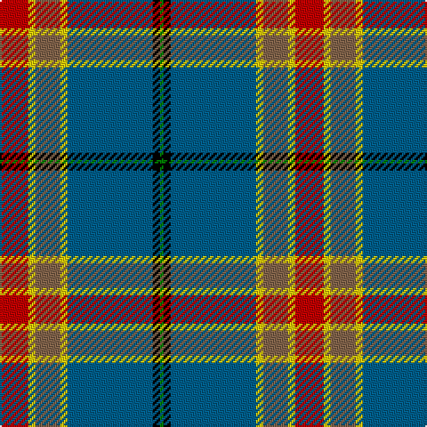

In pattern [GKBYRYR](/stripes/gkbyryr/).

This was sourced from weddslist.  It is a [7 stripe tartan](/stripes/stripes7/).

Original link http://www.weddslist.com/cgi-bin/tartans/pg.pl?source=misc

## Register references

External register numbers recorded for this tartan.

- Scottish Register of Tartans: [440](https://www.tartanregister.gov.uk/tartanDetails.aspx?ref=440)
- Scottish Tartans Authority (ITI): 1239
- Scottish Tartans World Register: 1239

## Thread count
R/16 Y4 LT14 Y4 B48 K4 G/2

## Palette
Each colour and its ΔE from the base-6 reference it is a variant of.

| Colour | Shade | Base | ΔE (OKLab) |
|---|---|---|---|
| B | <code style="background-color:#005F8C;">#005F8C</code> `#005F8C` | B <code style="background-color:#2A418A;">#2A418A</code> | 0.09 |
| G | <code style="background-color:#008000;">#008000</code> `#008000` | G <code style="background-color:#006100;">#006100</code> | 0.10 |
| K | <code style="background-color:#000000;">#000000</code> `#000000` | K <code style="background-color:#000000;">#000000</code> | 0.00 |
| LT | <code style="background-color:#82644B;">#82644B</code> `#82644B` | R <code style="background-color:#CC0000;">#CC0000</code> | 0.17 |
| R | <code style="background-color:#C10000;">#C10000</code> `#C10000` | R <code style="background-color:#CC0000;">#CC0000</code> | 0.02 |
| Y | <code style="background-color:#EFCC09;">#EFCC09</code> `#EFCC09` | Y <code style="background-color:#F2BF00;">#F2BF00</code> | 0.03 |

# Sample pattern

## Nearest tartans

The nearest existing variants by ΔTartan distance.

1. [Stone, Alan (Personal)](/setts/s6/r2w6k12n36o12ly1~x2/) — ΔT 0.91
1. [State Seal of West Virginia (Fash)](/setts/s8/o49lo3b13dy8k23b10o14r4~x2/) — ΔT 1.01
1. [Blue Blas Alba](/setts/s9/y4ly2y39dt10o4dt4r4dt25w3~x2/) — ΔT 1.07
1. [Caskie](/setts/s7/w3k1t25r7g12k1ly3~x2/) — ΔT 1.07
1. [Ascension Island Heritage Trust](/setts/s7/r8t45w1o4k11g6r4~x2/) — ΔT 1.17
1. [Tooth (Personal)](/setts/s8/y5lo1r2y25k14db19w2y4~x2/) — ΔT 1.17
1. [Yukon](/setts/s10/r4w4g4ly4db4ly1db2ly1db20p4~x2/) — ΔT 1.18
1. [Ascension Island Heritage Society](/setts/s7/r8t45w1y4k11g6r4~x2/) — ΔT 1.18
1. [Nickel Lodge Centennial Corporate Tartan Tartan Number: 920. Earliest known date: 1988 1989 See products available Copyright © Blair Urquhart, Comrie, 2015](/setts/s9/o18ly1o2ly1o2db6w4dy1g6~x2/) — ΔT 1.21
1. [Norwegian Migration Period](/setts/s8/o30ly4dt9lb2dt1o6dt8r8~x4/) — ΔT 1.22

## Neighbour map

Every grey dot is one of 14299 variants placed by the first two principal components of the ΔTartan feature space (44% of its variance). Red is this tartan; blue dots are its nearest — click one to open its page.

<svg viewBox="0 0 640 380" role="img" style="max-width:100%;height:auto;border:1px solid #e0e0e0;border-radius:4px;display:block" xmlns="http://www.w3.org/2000/svg"><image href="/nn/cloud.v1.png" width="640" height="380"/><a href="/setts/s6/r2w6k12n36o12ly1~x2/"><circle cx="286.2" cy="119.1" r="4" fill="#3465a4"><title>Stone, Alan (Personal)</title></circle></a><a href="/setts/s8/o49lo3b13dy8k23b10o14r4~x2/"><circle cx="243.7" cy="147.7" r="4" fill="#3465a4"><title>State Seal of West Virginia (Fash)</title></circle></a><a href="/setts/s9/y4ly2y39dt10o4dt4r4dt25w3~x2/"><circle cx="246.5" cy="114.9" r="4" fill="#3465a4"><title>Blue Blas Alba</title></circle></a><a href="/setts/s7/w3k1t25r7g12k1ly3~x2/"><circle cx="242.0" cy="119.1" r="4" fill="#3465a4"><title>Caskie</title></circle></a><a href="/setts/s7/r8t45w1o4k11g6r4~x2/"><circle cx="335.7" cy="91.9" r="4" fill="#3465a4"><title>Ascension Island Heritage Trust</title></circle></a><a href="/setts/s8/y5lo1r2y25k14db19w2y4~x2/"><circle cx="257.8" cy="137.5" r="4" fill="#3465a4"><title>Tooth (Personal)</title></circle></a><a href="/setts/s10/r4w4g4ly4db4ly1db2ly1db20p4~x2/"><circle cx="249.1" cy="103.3" r="4" fill="#3465a4"><title>Yukon</title></circle></a><a href="/setts/s7/r8t45w1y4k11g6r4~x2/"><circle cx="342.7" cy="93.2" r="4" fill="#3465a4"><title>Ascension Island Heritage Society</title></circle></a><a href="/setts/s9/o18ly1o2ly1o2db6w4dy1g6~x2/"><circle cx="271.9" cy="121.4" r="4" fill="#3465a4"><title>Nickel Lodge Centennial Corporate Tartan Tartan Number: 920. Earliest known date: 1988 1989 See products available Copyright © Blair Urquhart, Comrie, 2015</title></circle></a><a href="/setts/s8/o30ly4dt9lb2dt1o6dt8r8~x4/"><circle cx="228.7" cy="105.8" r="4" fill="#3465a4"><title>Norwegian Migration Period</title></circle></a><circle cx="276.4" cy="118.6" r="5" fill="#c00000"/></svg>

ID: /setts/s7/r8ly2o7ly2n24k2g1~x2/
