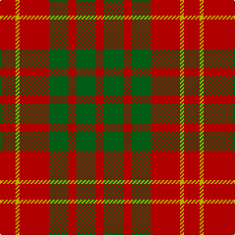

In pattern [RGRGRYR](/stripes/rgrgryr/).

This was sourced from tartans-authority.  It is a [7 stripe tartan](/stripes/stripes7/).

Original link http://www.tartansauthority.com/tartan-ferret/display/7802/

## Attestations

This cloth appears in 2 source records; the oldest owns this page.

- pre 2008 — Caspari (Corporate) (tartans-authority, [record](http://www.tartansauthority.com/tartan-ferret/display/7802/))
- undated — Caspari (register-of-tartans, [record](https://www.tartanregister.gov.uk/tartanDetails.aspx?ref=5764))

## Register references

External register numbers recorded for this tartan.

- Scottish Register of Tartans: [5764](https://www.tartanregister.gov.uk/tartanDetails.aspx?ref=5764)
- Scottish Tartans Authority (ITI): 7802

## Thread count
R/16 Y4 R30 G20 R8 G20 R/8

## Palette
Each colour and its ΔE from the base-6 reference it is a variant of.

| Colour | Shade | Base | ΔE (OKLab) |
|---|---|---|---|
| G | <code style="background-color:#006818;">#006818</code> `#006818` | G <code style="background-color:#006100;">#006100</code> | 0.02 |
| R | <code style="background-color:#C80000;">#C80000</code> `#C80000` | R <code style="background-color:#CC0000;">#CC0000</code> | 0.01 |
| Y | <code style="background-color:#E8C000;">#E8C000</code> `#E8C000` | Y <code style="background-color:#F2BF00;">#F2BF00</code> | 0.02 |

# Sample pattern

## Nearest tartans

The nearest existing variants by ΔTartan distance.

1. [Bruce](/setts/s10/r8dg2r2dg6r1dg6r2dg2r8ly1/) — ΔT 1.14
1. [Cameron](/setts/s6/r1g3r1g3r8ly1~x8/) — ΔT 1.31
1. [Unidentified #42](/setts/s7/ly1r3dg7r3dg7r3ly1~x4/) — ΔT 1.39
1. [MacDonald, Lord of The Isles (Artef)](/setts/s5/g16r5g2r18k2~x2/) — ΔT 1.42
1. [Menzies](/setts/s5/r22g17w2t6r13~x2/) — ΔT 1.42
1. [Menzies #2](/setts/s5/r22g17w2lg6r19~x2/) — ΔT 1.44
1. [MacDonald of Sleat](/setts/s5/dg7r3dg1r9k1~x2/) — ΔT 1.45
1. [MacDonald Lord of the Isles #2](/setts/s5/dg16r5dg2r18k2~x2/) — ΔT 1.51
1. [Makhtoum](/setts/s6/w11r40g13r5g12r5~x2/) — ΔT 1.55
1. [Murray, Lord George (Plaid)](/setts/s9/r5dg10r5dg10r20dg2r20dp10r5~x2/) — ΔT 1.58

## Neighbour map

Every grey dot is one of 14299 variants placed by the first two principal components of the ΔTartan feature space (44% of its variance). Red is this tartan; blue dots are its nearest — click one to open its page.

<svg viewBox="0 0 640 380" role="img" style="max-width:100%;height:auto;border:1px solid #e0e0e0;border-radius:4px;display:block" xmlns="http://www.w3.org/2000/svg"><image href="/nn/cloud.v1.png" width="640" height="380"/><a href="/setts/s10/r8dg2r2dg6r1dg6r2dg2r8ly1/"><circle cx="334.7" cy="221.2" r="4" fill="#3465a4"><title>Bruce</title></circle></a><a href="/setts/s6/r1g3r1g3r8ly1~x8/"><circle cx="370.7" cy="226.4" r="4" fill="#3465a4"><title>Cameron</title></circle></a><a href="/setts/s7/ly1r3dg7r3dg7r3ly1~x4/"><circle cx="301.1" cy="244.0" r="4" fill="#3465a4"><title>Unidentified #42</title></circle></a><a href="/setts/s5/g16r5g2r18k2~x2/"><circle cx="352.4" cy="240.2" r="4" fill="#3465a4"><title>MacDonald, Lord of The Isles (Artef)</title></circle></a><a href="/setts/s5/r22g17w2t6r13~x2/"><circle cx="322.5" cy="231.0" r="4" fill="#3465a4"><title>Menzies</title></circle></a><a href="/setts/s5/r22g17w2lg6r19~x2/"><circle cx="341.3" cy="228.8" r="4" fill="#3465a4"><title>Menzies #2</title></circle></a><a href="/setts/s5/dg7r3dg1r9k1~x2/"><circle cx="354.7" cy="237.0" r="4" fill="#3465a4"><title>MacDonald of Sleat</title></circle></a><a href="/setts/s5/dg16r5dg2r18k2~x2/"><circle cx="343.2" cy="232.8" r="4" fill="#3465a4"><title>MacDonald Lord of the Isles #2</title></circle></a><a href="/setts/s6/w11r40g13r5g12r5~x2/"><circle cx="328.7" cy="216.4" r="4" fill="#3465a4"><title>Makhtoum</title></circle></a><a href="/setts/s9/r5dg10r5dg10r20dg2r20dp10r5~x2/"><circle cx="369.4" cy="224.0" r="4" fill="#3465a4"><title>Murray, Lord George (Plaid)</title></circle></a><circle cx="341.4" cy="256.1" r="5" fill="#c00000"/></svg>

ID: /setts/s7/r8ly2r15g10r4g10r4~x2/
