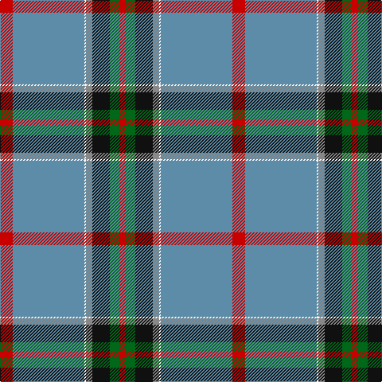

This page is one **sett** — a single exact thread-count. It belongs to the [tartan](/tartans/r8t45w1o4k11g6r4/)
(the same proportion at any scale), whose colour order is pattern [RBWRKGR](/stripes/rbwrkgr/).

Sourced from tartans-authority.  It is a [7 stripe tartan](/stripes/stripes7/).

Original link http://www.tartansauthority.com/tartan-ferret/display/11137/

## Thread count
R/16 B90 W2 N8 K22 G12 R/8

## Palette

Palette: <strong>Tartan Register</strong>
<table><thead><tr><th>Colour</th><th>Threads</th><th>Shade</th><th>Base</th><th>OKLCh</th></tr></thead><tbody><tr><td>R/</td><td style="text-align:right;font-variant-numeric:tabular-nums">16</td><td><code style="background-color:#C80000;">#C80000</code> <small style="color:#888">#C80000</small></td><td>R <code style="background-color:#CC0000;">#CC0000</code></td><td><small style="color:#888">oklch(52.3% 0.215 29.2)</small></td></tr><tr><td>B</td><td style="text-align:right;font-variant-numeric:tabular-nums">90</td><td><code style="background-color:#5C8CA8;">#5C8CA8</code> <small style="color:#888">#5C8CA8</small></td><td>B <code style="background-color:#2A418A;">#2A418A</code></td><td><small style="color:#888">oklch(61.7% 0.067 235.0)</small></td></tr><tr><td>W</td><td style="text-align:right;font-variant-numeric:tabular-nums">2</td><td><code style="background-color:#FCFCFC;">#FCFCFC</code> <small style="color:#888">#FCFCFC</small></td><td>W <code style="background-color:#F7F7F7;">#F7F7F7</code></td><td><small style="color:#888">oklch(99.1% 0.000 89.9)</small></td></tr><tr><td>N</td><td style="text-align:right;font-variant-numeric:tabular-nums">8</td><td><code style="background-color:#888888;">#888888</code> <small style="color:#888">#888888</small></td><td>R <code style="background-color:#CC0000;">#CC0000</code></td><td><small style="color:#888">oklch(62.7% 0.000 89.9)</small></td></tr><tr><td>K</td><td style="text-align:right;font-variant-numeric:tabular-nums">22</td><td><code style="background-color:#101010;">#101010</code> <small style="color:#888">#101010</small></td><td>K <code style="background-color:#000000;">#000000</code></td><td><small style="color:#888">oklch(17.3% 0.000 89.9)</small></td></tr><tr><td>G</td><td style="text-align:right;font-variant-numeric:tabular-nums">12</td><td><code style="background-color:#006818;">#006818</code> <small style="color:#888">#006818</small></td><td>G <code style="background-color:#006100;">#006100</code></td><td><small style="color:#888">oklch(45.0% 0.142 145.0)</small></td></tr><tr><td>R/</td><td style="text-align:right;font-variant-numeric:tabular-nums">8</td><td><code style="background-color:#C80000;">#C80000</code> <small style="color:#888">#C80000</small></td><td>R <code style="background-color:#CC0000;">#CC0000</code></td><td><small style="color:#888">oklch(52.3% 0.215 29.2)</small></td></tr></tbody></table>

# Sample pattern

## Nearest tartans

The nearest existing variants by ΔTartan distance, with this tartan at the top so the swatches line up against it.

ΔTartan

Tartan

Sett

—

<a href="/ttd/edit/#slug=r8t45w1o4k11g6r4~x2">Ascension Island Heritage Trust</a> <a class="nn-out" href="/setts/s7/r8t45w1o4k11g6r4~x2/" title="open its dictionary page">↗</a>

0.42

<a href="/ttd/edit/#slug=r8t45w1y4k11g6r4~x2">Ascension Island Heritage Society</a> <a class="nn-out" href="/setts/s7/r8t45w1y4k11g6r4~x2/" title="open its dictionary page">↗</a>

0.92

<a href="/ttd/edit/#slug=db52lo23g6dg5w1r1~x2">College of New Caledonia</a> <a class="nn-out" href="/setts/s6/db52lo23g6dg5w1r1~x2/" title="open its dictionary page">↗</a>

1.11

<a href="/ttd/edit/#slug=r2w6k12n36o12ly1~x2">Stone, Alan (Personal)</a> <a class="nn-out" href="/setts/s6/r2w6k12n36o12ly1~x2/" title="open its dictionary page">↗</a>

1.12

<a href="/ttd/edit/#slug=o36ly2o1ly2o4dt12w8dy2dg12~x2">Nickel Lodge Centennial (Corporate)</a> <a class="nn-out" href="/setts/s9/o36ly2o1ly2o4dt12w8dy2dg12~x2/" title="open its dictionary page">↗</a>

1.17

<a href="/ttd/edit/#slug=lb4r2lb7n30lb8n7r5k1w2~x2">Hebridean Fire</a> <a class="nn-out" href="/setts/s9/lb4r2lb7n30lb8n7r5k1w2~x2/" title="open its dictionary page">↗</a>

1.17

<a href="/ttd/edit/#slug=r8ly2o7ly2n24k2g1~x2">(4) Traill</a> <a class="nn-out" href="/setts/s7/r8ly2o7ly2n24k2g1~x2/" title="open its dictionary page">↗</a>

1.20

<a href="/setts/s8/t72r16k5ly2dt16~x2/">Thomas Jean Marc Personal Tartan Tartan Number: 6990. Earliest known date: 2005 A personal tartan for Jean Marc Thomas, Paris. See products available Copyright © Blair Urquhart, Comrie, 2015</a>

1.25

<a href="/ttd/edit/#slug=dt50g25ly3lb8r1w1r1~x2">Wells (2014)</a> <a class="nn-out" href="/setts/s7/dt50g25ly3lb8r1w1r1~x2/" title="open its dictionary page">↗</a>

1.34

<a href="/ttd/edit/#slug=o4g2o7dt30o8dt7lg5g1w2~x2">Inchforth (Personal)</a> <a class="nn-out" href="/setts/s9/o4g2o7dt30o8dt7lg5g1w2~x2/" title="open its dictionary page">↗</a>

1.36

<a href="/ttd/edit/#slug=k10db13k3lb7k1lo20lo3lb13r5lo47k3~x2">State Seal of Georgia (Fashion)</a> <a class="nn-out" href="/setts/s11/k10db13k3lb7k1lo20lo3lb13r5lo47k3~x2/" title="open its dictionary page">↗</a>

## Neighbour map

Every grey dot is one of 14299 variants placed by the first two principal components of the ΔTartan feature space (44% of its variance). Red is this tartan; blue dots are its nearest — click one to open its page.

<svg viewBox="0 0 640 380" role="img" style="max-width:100%;height:auto;border:1px solid #e0e0e0;border-radius:4px;display:block" xmlns="http://www.w3.org/2000/svg"><image href="/nn/cloud.v1.png" width="640" height="380"/><a href="/setts/s7/r8t45w1y4k11g6r4~x2/"><circle cx="342.7" cy="93.2" r="4" fill="#3465a4"><title>Ascension Island Heritage Society</title></circle></a><a href="/setts/s6/db52lo23g6dg5w1r1~x2/"><circle cx="358.3" cy="90.0" r="4" fill="#3465a4"><title>College of New Caledonia</title></circle></a><a href="/setts/s6/r2w6k12n36o12ly1~x2/"><circle cx="286.2" cy="119.1" r="4" fill="#3465a4"><title>Stone, Alan (Personal)</title></circle></a><a href="/setts/s9/o36ly2o1ly2o4dt12w8dy2dg12~x2/"><circle cx="290.8" cy="94.4" r="4" fill="#3465a4"><title>Nickel Lodge Centennial (Corporate)</title></circle></a><a href="/setts/s9/lb4r2lb7n30lb8n7r5k1w2~x2/"><circle cx="326.1" cy="100.0" r="4" fill="#3465a4"><title>Hebridean Fire</title></circle></a><a href="/setts/s7/r8ly2o7ly2n24k2g1~x2/"><circle cx="276.4" cy="118.6" r="4" fill="#3465a4"><title>(4) Traill</title></circle></a><a href="/setts/s8/t72r16k5ly2dt16~x2/"><circle cx="327.1" cy="104.0" r="4" fill="#3465a4"><title>Thomas Jean Marc Personal Tartan Tartan Number: 6990. Earliest known date: 2005 A personal tartan for Jean Marc Thomas, Paris. See products available Copyright © Blair Urquhart, Comrie, 2015</title></circle></a><a href="/setts/s7/dt50g25ly3lb8r1w1r1~x2/"><circle cx="345.7" cy="91.5" r="4" fill="#3465a4"><title>Wells (2014)</title></circle></a><a href="/setts/s9/o4g2o7dt30o8dt7lg5g1w2~x2/"><circle cx="333.9" cy="120.1" r="4" fill="#3465a4"><title>Inchforth (Personal)</title></circle></a><a href="/setts/s11/k10db13k3lb7k1lo20lo3lb13r5lo47k3~x2/"><circle cx="285.8" cy="68.3" r="4" fill="#3465a4"><title>State Seal of Georgia (Fashion)</title></circle></a><circle cx="335.7" cy="91.9" r="5" fill="#c00000"/></svg>

ID: /setts/s7/r8t45w1o4k11g6r4~x2/
