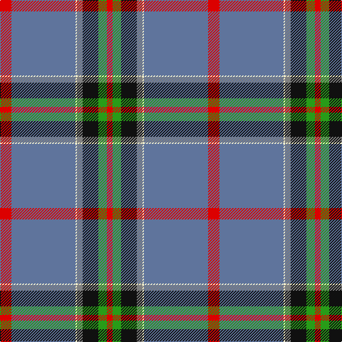

In pattern [RBWGKGR](/stripes/rbwgkgr/).

This was sourced from register-of-tartans.  It is a [7 stripe tartan](/stripes/stripes7/).

Original link https://www.tartanregister.gov.uk/tartanDetails.aspx?ref=11137

## Register references

External register numbers recorded for this tartan.

- Scottish Register of Tartans: [11137](https://www.tartanregister.gov.uk/tartanDetails.aspx?ref=11137)

## Thread count
R/16 B90 LY2 N8 K22 G12 R/8

## Palette
Each colour and the base-6 reference it is a variant of.

| Colour | Shade | Base |
|---|---|---|
| B | <code style="background-color:#5F749C;">#5F749C</code> `oklch(55.8% 0.067 262.9)` <small>#5F749C</small> | B <code style="background-color:#2A418A;">#2A418A</code> |
| G | <code style="background-color:#289C18;">#289C18</code> `oklch(60.6% 0.191 141.6)` <small>#289C18</small> | G <code style="background-color:#006100;">#006100</code> |
| K | <code style="background-color:#101010;">#101010</code> `oklch(17.3% 0.000 89.9)` <small>#101010</small> | K <code style="background-color:#000000;">#000000</code> |
| LY | <code style="background-color:#F8F4D0;">#F8F4D0</code> `oklch(96.1% 0.047 102.0)` <small>#F8F4D0</small> | W <code style="background-color:#F7F7F7;">#F7F7F7</code> |
| N | <code style="background-color:#808080;">#808080</code> `oklch(60.0% 0.000 89.9)` <small>#808080</small> | G <code style="background-color:#006100;">#006100</code> |
| R | <code style="background-color:#DC0000;">#DC0000</code> `oklch(56.2% 0.230 29.2)` <small>#DC0000</small> | R <code style="background-color:#CC0000;">#CC0000</code> |

# Sample pattern

## Nearest tartans

The nearest existing variants by ΔTartan distance, with this tartan at the top so the swatches line up against it.

ΔTartan

Tartan

Sett

—

<a href="/ttd/edit/#slug=r8t45w1y4k11g6r4~x2">Ascension Island Heritage Society</a> <a class="nn-out" href="/setts/s7/r8t45w1y4k11g6r4~x2/" title="open its dictionary page">↗</a>

0.42

<a href="/ttd/edit/#slug=r8t45w1o4k11g6r4~x2">Ascension Island Heritage Trust</a> <a class="nn-out" href="/setts/s7/r8t45w1o4k11g6r4~x2/" title="open its dictionary page">↗</a>

0.92

<a href="/ttd/edit/#slug=db52lo23g6dg5w1r1~x2">College of New Caledonia</a> <a class="nn-out" href="/setts/s6/db52lo23g6dg5w1r1~x2/" title="open its dictionary page">↗</a>

1.06

<a href="/ttd/edit/#slug=r2w6k12n36o12ly1~x2">Stone, Alan (Personal)</a> <a class="nn-out" href="/setts/s6/r2w6k12n36o12ly1~x2/" title="open its dictionary page">↗</a>

1.14

<a href="/ttd/edit/#slug=lb4r2lb7n30lb8n7r5k1w2~x2">Hebridean Fire</a> <a class="nn-out" href="/setts/s9/lb4r2lb7n30lb8n7r5k1w2~x2/" title="open its dictionary page">↗</a>

1.18

<a href="/ttd/edit/#slug=r8ly2o7ly2n24k2g1~x2">(4) Traill</a> <a class="nn-out" href="/setts/s7/r8ly2o7ly2n24k2g1~x2/" title="open its dictionary page">↗</a>

1.19

<a href="/setts/s8/t72r16k5ly2dt16~x2/">Thomas Jean Marc Personal Tartan Tartan Number: 6990. Earliest known date: 2005 A personal tartan for Jean Marc Thomas, Paris. See products available Copyright © Blair Urquhart, Comrie, 2015</a>

1.31

<a href="/ttd/edit/#slug=o36ly2o1ly2o4dt12w8dy2dg12~x2">Nickel Lodge Centennial (Corporate)</a> <a class="nn-out" href="/setts/s9/o36ly2o1ly2o4dt12w8dy2dg12~x2/" title="open its dictionary page">↗</a>

1.41

<a href="/ttd/edit/#slug=lp6w2lp1db6o30w1r3~x2">Kuehle (Personal)</a> <a class="nn-out" href="/setts/s7/lp6w2lp1db6o30w1r3~x2/" title="open its dictionary page">↗</a>

1.41

<a href="/ttd/edit/#slug=r2w1r5g5lo1g10db40ly2~x2">St. Andrew Quebec City (Corporate)</a> <a class="nn-out" href="/setts/s8/r2w1r5g5lo1g10db40ly2~x2/" title="open its dictionary page">↗</a>

1.43

<a href="/ttd/edit/#slug=w5n38o3db11o1db11o3n4w5lo1~x2">Ballarat</a> <a class="nn-out" href="/setts/s10/w5n38o3db11o1db11o3n4w5lo1~x2/" title="open its dictionary page">↗</a>

## Neighbour map

Every grey dot is one of 14299 variants placed by the first two principal components of the ΔTartan feature space (44% of its variance). Red is this tartan; blue dots are its nearest — click one to open its page.

<svg viewBox="0 0 640 380" role="img" style="max-width:100%;height:auto;border:1px solid #e0e0e0;border-radius:4px;display:block" xmlns="http://www.w3.org/2000/svg"><image href="/nn/cloud.v1.png" width="640" height="380"/><a href="/setts/s7/r8t45w1o4k11g6r4~x2/"><circle cx="335.7" cy="91.9" r="4" fill="#3465a4"><title>Ascension Island Heritage Trust</title></circle></a><a href="/setts/s6/db52lo23g6dg5w1r1~x2/"><circle cx="358.3" cy="90.0" r="4" fill="#3465a4"><title>College of New Caledonia</title></circle></a><a href="/setts/s6/r2w6k12n36o12ly1~x2/"><circle cx="286.2" cy="119.1" r="4" fill="#3465a4"><title>Stone, Alan (Personal)</title></circle></a><a href="/setts/s9/lb4r2lb7n30lb8n7r5k1w2~x2/"><circle cx="326.1" cy="100.0" r="4" fill="#3465a4"><title>Hebridean Fire</title></circle></a><a href="/setts/s7/r8ly2o7ly2n24k2g1~x2/"><circle cx="276.4" cy="118.6" r="4" fill="#3465a4"><title>(4) Traill</title></circle></a><a href="/setts/s8/t72r16k5ly2dt16~x2/"><circle cx="327.1" cy="104.0" r="4" fill="#3465a4"><title>Thomas Jean Marc Personal Tartan Tartan Number: 6990. Earliest known date: 2005 A personal tartan for Jean Marc Thomas, Paris. See products available Copyright © Blair Urquhart, Comrie, 2015</title></circle></a><a href="/setts/s9/o36ly2o1ly2o4dt12w8dy2dg12~x2/"><circle cx="290.8" cy="94.4" r="4" fill="#3465a4"><title>Nickel Lodge Centennial (Corporate)</title></circle></a><a href="/setts/s7/lp6w2lp1db6o30w1r3~x2/"><circle cx="377.8" cy="105.4" r="4" fill="#3465a4"><title>Kuehle (Personal)</title></circle></a><a href="/setts/s8/r2w1r5g5lo1g10db40ly2~x2/"><circle cx="381.3" cy="89.0" r="4" fill="#3465a4"><title>St. Andrew Quebec City (Corporate)</title></circle></a><a href="/setts/s10/w5n38o3db11o1db11o3n4w5lo1~x2/"><circle cx="304.6" cy="91.5" r="4" fill="#3465a4"><title>Ballarat</title></circle></a><circle cx="342.7" cy="93.2" r="5" fill="#c00000"/></svg>

ID: /setts/s7/r8t45w1y4k11g6r4~x2/
