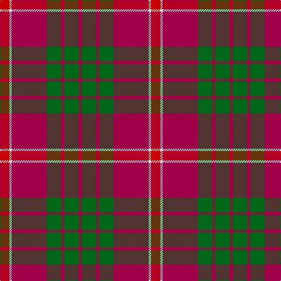

**Bands:** [RGRGRWR](/stripes/rgrgrwr/) · **Stripes:** [M G M G M W R](/stripes/stripes7/) M G M G M W R

This was sourced from register-of-tartans.  It is a [7 band tartan](/bands/bands7/).

Original link https://www.tartanregister.gov.uk/tartanDetails.aspx?ref=5407

## Register references

External register numbers recorded for this tartan.

- Scottish Register of Tartans: [5407](https://www.tartanregister.gov.uk/tartanDetails.aspx?ref=5407)
- Scottish Tartans Authority (ITI): 3908

## Thread count
R/16 LN4 Ra60 G24 Ra6 G24 Ra/6

## Palette
Each colour and its ΔE from the base-6 reference it is a variant of.

| Colour | Shade | Base | ΔE (OKLab) |
|---|---|---|---|
| G | <code style="background-color:#006818;">#006818</code> `#006818` | G <code style="background-color:#006100;">#006100</code> | 0.02 |
| LN | <code style="background-color:#E0E0E0;">#E0E0E0</code> `#E0E0E0` | W <code style="background-color:#F7F7F7;">#F7F7F7</code> | 0.07 |
| R | <code style="background-color:#C80000;">#C80000</code> `#C80000` | R <code style="background-color:#CC0000;">#CC0000</code> | 0.01 |
| Ra | <code style="background-color:#A00048;">#A00048</code> `#A00048` | R <code style="background-color:#CC0000;">#CC0000</code> | 0.12 |

# Sample pattern

## Nearest tartans

The nearest existing variants by ΔTartan distance.

1. [Carrick (Strathmore) District Tartan Tartan Number: 3216. Earliest known date: c.1999 Sales help Princess Diana Memorial Trust See products available Copyright © Blair Urquhart, Comrie, 2015](/setts/s7/r28db12r3dg20t2dg2r7~x2/) — ΔT 0.72
1. [MacNab (Crimson)](/setts/s7/dg28r7m7dg14m7r48k4~x2/) — ΔT 0.81
1. [Chisholm](/setts/s8/r12dp2lb1dp2r3dg8r3dp1/) — ΔT 0.86
1. [MacQuarrie #6](/setts/s7/r6dg16r4db12r16t1r2~x2/) — ΔT 0.88
1. [MacNab #3](/setts/s7/dg6r2r2dg4r2r12k1~x2/) — ΔT 0.89
1. [Chisholm, The](/setts/s8/r12db2w1db2r3g8r3db1~x2/) — ΔT 0.94
1. [MacQuarrie 2](/setts/s7/r6g16r4db12r16t1r2~x2/) — ΔT 0.96
1. [Chisholm, The](/setts/s8/r12b2w1b2r3g8r3b1~x4/) — ΔT 0.98
1. [MacKillop](/setts/s10/g3r2db2r13t1db4r2g7r2db2~x2/) — ΔT 1.00
1. [Plummer (Personal)](/setts/s6/r100k15g48db5r7db16~x2/) — ΔT 1.03

## Neighbour map

Every grey dot is one of 14299 variants placed by the first two principal components of the ΔTartan feature space (44% of its variance). Red is this tartan; blue dots are its nearest — click one to open its page.

<svg viewBox="0 0 640 380" role="img" style="max-width:100%;height:auto;border:1px solid #e0e0e0;border-radius:4px;display:block" xmlns="http://www.w3.org/2000/svg"><image href="/nn/cloud.v1.png" width="640" height="380"/><a href="/setts/s7/r28db12r3dg20t2dg2r7~x2/"><circle cx="308.9" cy="185.2" r="4" fill="#3465a4"><title>Carrick (Strathmore) District Tartan Tartan Number: 3216. Earliest known date: c.1999 Sales help Princess Diana Memorial Trust See products available Copyright © Blair Urquhart, Comrie, 2015</title></circle></a><a href="/setts/s7/dg28r7m7dg14m7r48k4~x2/"><circle cx="298.1" cy="187.8" r="4" fill="#3465a4"><title>MacNab (Crimson)</title></circle></a><a href="/setts/s8/r12dp2lb1dp2r3dg8r3dp1/"><circle cx="330.1" cy="178.1" r="4" fill="#3465a4"><title>Chisholm</title></circle></a><a href="/setts/s7/r6dg16r4db12r16t1r2~x2/"><circle cx="285.2" cy="190.3" r="4" fill="#3465a4"><title>MacQuarrie #6</title></circle></a><a href="/setts/s7/dg6r2r2dg4r2r12k1~x2/"><circle cx="297.8" cy="191.4" r="4" fill="#3465a4"><title>MacNab #3</title></circle></a><a href="/setts/s8/r12db2w1db2r3g8r3db1~x2/"><circle cx="324.2" cy="178.1" r="4" fill="#3465a4"><title>Chisholm, The</title></circle></a><a href="/setts/s7/r6g16r4db12r16t1r2~x2/"><circle cx="288.7" cy="195.2" r="4" fill="#3465a4"><title>MacQuarrie 2</title></circle></a><a href="/setts/s8/r12b2w1b2r3g8r3b1~x4/"><circle cx="321.2" cy="176.2" r="4" fill="#3465a4"><title>Chisholm, The</title></circle></a><a href="/setts/s10/g3r2db2r13t1db4r2g7r2db2~x2/"><circle cx="292.2" cy="172.3" r="4" fill="#3465a4"><title>MacKillop</title></circle></a><a href="/setts/s6/r100k15g48db5r7db16~x2/"><circle cx="356.2" cy="163.3" r="4" fill="#3465a4"><title>Plummer (Personal)</title></circle></a><circle cx="331.5" cy="186.3" r="5" fill="#c00000"/></svg>

ID: /setts/s7/r8w2m30g12m3g12m3~x2/
