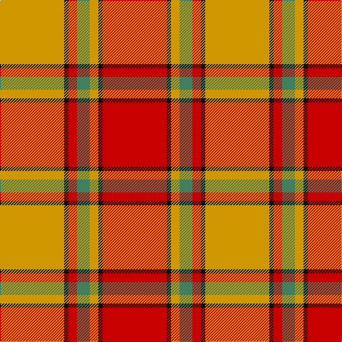

In pattern [RKYGRKY](/patterns/rkygrky/).

This was sourced from tartans-authority.  It is a [7 stripes tartan](/stripes/stripes7/).

Original link http://www.tartansauthority.com/tartan-ferret/display/1627/

## Thread count
DY/90 K6 R12 G18 DY12 K6 R/90

## Palette
Each colour and its ΔE from the base-6 reference it is a variant of.

| Colour | Shade | Base | ΔE (OKLab) |
|---|---|---|---|
| DY | <code style="background-color:#D09800;">#D09800</code> `#D09800` | Y <code style="background-color:#F2BF00;">#F2BF00</code> | 0.12 |
| G | <code style="background-color:#408060;">#408060</code> `#408060` | G <code style="background-color:#006100;">#006100</code> | 0.14 |
| K | <code style="background-color:#101010;">#101010</code> `#101010` | K <code style="background-color:#000000;">#000000</code> | 0.17 |
| R | <code style="background-color:#C80000;">#C80000</code> `#C80000` | R <code style="background-color:#CC0000;">#CC0000</code> | 0.01 |

# Sample pattern

## Nearest tartans

The nearest existing variants by ΔTartan distance.

1. [Scrymgeour](/setts/s7/g90k6r12b18g12k6r90-b304080-g908000-k000000-rc00000/) — ΔT 0.89
1. [Loch Rannoch #2](/setts/s8/g48ga4g10r28ga4r10y34g4-g604000-ga289c18-re86000-ydc943c/) — ΔT 1.35
1. [Scrymgeour](/setts/s12/r90k6y12g18r12k6y90k6r12g18y12k6-g408060-k101010-rc80000-yd09800/) — ΔT 1.40
1. [MacNab 5](/setts/s7/g12r4ra4g8ra4r24k2-g008000-k000000-rc00000-ra900030/) — ΔT 1.42
1. [MacNab 6](/setts/s7/g56r14ra14g28ra14r96k8-g008000-k000000-rc00000-ra802040/) — ΔT 1.46
1. [Lennox District Tartan Tartan Number: 935. Earliest known date: pre 1600 Families with the surname 'Lennox' are usually considered related to Clans Stewart or MacFarlane. Some of this surname also choose to wear the distinctive and ancient 'Lennox' tartan. D W Stewart reproduced the sett from a 'lost' portrait of the Countess of Lennox dating from the 16th century. See products available Copyright © Blair Urquhart, Comrie, 2015](/setts/s7/g4w2g20r4ra20r2ra4-g006818-r880000-rac80000-we0e0e0/) — ΔT 1.46
1. [Fernandes (Personal)](/setts/s7/g10y10g10y70r88ra6r6-g289c18-r880000-rac80000-ye8c000/) — ΔT 1.48
1. [Lennox](/setts/s7/g8y4g40r8ra40r4ra8-g006818-r880000-rac80000-yb8b8b8/) — ΔT 1.48
1. [MacNab #3](/setts/s7/g12r4ra4g8ra4r24k2-g005020-k101010-rdc0000-ra960028/) — ΔT 1.49
1. [MacNab VS](/setts/s7/g12r4ra4g8ra4r24k2-g004c00-k000000-rc80000-raff0000/) — ΔT 1.50

## Neighbour map

Every grey dot is one of 15726 variants placed by the first two principal components of the ΔTartan feature space (44% of its variance). Red is this tartan; blue dots are its nearest — click one to open its page.

<svg viewBox="0 0 640 380" role="img" style="max-width:100%;height:auto;border:1px solid #e0e0e0;border-radius:4px;display:block" xmlns="http://www.w3.org/2000/svg"><image href="/nn/cloud.v1.png" width="640" height="380"/><a href="/setts/s7/g90k6r12b18g12k6r90-b304080-g908000-k000000-rc00000/"><circle cx="305.0" cy="166.0" r="4" fill="#3465a4"><title>Scrymgeour</title></circle></a><a href="/setts/s8/g48ga4g10r28ga4r10y34g4-g604000-ga289c18-re86000-ydc943c/"><circle cx="268.1" cy="186.4" r="4" fill="#3465a4"><title>Loch Rannoch #2</title></circle></a><a href="/setts/s12/r90k6y12g18r12k6y90k6r12g18y12k6-g408060-k101010-rc80000-yd09800/"><circle cx="262.7" cy="124.2" r="4" fill="#3465a4"><title>Scrymgeour</title></circle></a><a href="/setts/s7/g12r4ra4g8ra4r24k2-g008000-k000000-rc00000-ra900030/"><circle cx="287.8" cy="190.2" r="4" fill="#3465a4"><title>MacNab 5</title></circle></a><a href="/setts/s7/g56r14ra14g28ra14r96k8-g008000-k000000-rc00000-ra802040/"><circle cx="288.9" cy="186.7" r="4" fill="#3465a4"><title>MacNab 6</title></circle></a><a href="/setts/s7/g4w2g20r4ra20r2ra4-g006818-r880000-rac80000-we0e0e0/"><circle cx="276.4" cy="193.0" r="4" fill="#3465a4"><title>Lennox District Tartan Tartan Number: 935. Earliest known date: pre 1600 Families with the surname 'Lennox' are usually considered related to Clans Stewart or MacFarlane. Some of this surname also choose to wear the distinctive and ancient 'Lennox' tartan. D W Stewart reproduced the sett from a 'lost' portrait of the Countess of Lennox dating from the 16th century. See products available Copyright © Blair Urquhart, Comrie, 2015</title></circle></a><a href="/setts/s7/g10y10g10y70r88ra6r6-g289c18-r880000-rac80000-ye8c000/"><circle cx="284.5" cy="145.9" r="4" fill="#3465a4"><title>Fernandes (Personal)</title></circle></a><a href="/setts/s7/g8y4g40r8ra40r4ra8-g006818-r880000-rac80000-yb8b8b8/"><circle cx="284.2" cy="196.5" r="4" fill="#3465a4"><title>Lennox</title></circle></a><a href="/setts/s7/g12r4ra4g8ra4r24k2-g005020-k101010-rdc0000-ra960028/"><circle cx="297.9" cy="191.0" r="4" fill="#3465a4"><title>MacNab #3</title></circle></a><a href="/setts/s7/g12r4ra4g8ra4r24k2-g004c00-k000000-rc80000-raff0000/"><circle cx="285.3" cy="185.1" r="4" fill="#3465a4"><title>MacNab VS</title></circle></a><circle cx="310.8" cy="161.5" r="5" fill="#c00000"/></svg>

ID: /setts/s7/r90k6y12g18r12k6y90-g408060-k101010-rc80000-yd09800/
