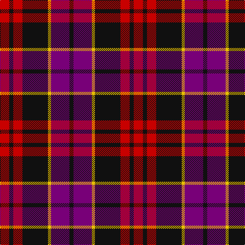

In pattern [KBYKRKR](/stripes/kbykrkr/).

This was sourced from tartans-authority.  It is a [7 stripe tartan](/stripes/stripes7/).

Original link http://www.tartansauthority.com/tartan-ferret/display/11215/

## Thread count
R/18 K8 R18 K50 Y6 P36 K/8

## Palette
Each colour and the base-6 reference it is a variant of.

| Colour | Shade | Base |
|---|---|---|
| K | <code style="background-color:#101010;">#101010</code> `oklch(17.3% 0.000 89.9)` <small>#101010</small> | K <code style="background-color:#000000;">#000000</code> |
| P | <code style="background-color:#780078;">#780078</code> `oklch(40.2% 0.185 328.4)` <small>#780078</small> | B <code style="background-color:#2A418A;">#2A418A</code> |
| R | <code style="background-color:#C80000;">#C80000</code> `oklch(52.3% 0.215 29.2)` <small>#C80000</small> | R <code style="background-color:#CC0000;">#CC0000</code> |
| Y | <code style="background-color:#E8C000;">#E8C000</code> `oklch(81.9% 0.168 93.7)` <small>#E8C000</small> | Y <code style="background-color:#F2BF00;">#F2BF00</code> |

# Sample pattern

## Nearest tartans

The nearest existing variants by ΔTartan distance.

1. [Graham of Menteith, (Red)](/setts/s6/r26t3r4k16db16k4~x2/) — ΔT 0.73
1. [Graham of Menteith (Red)](/setts/s6/r36lb3r5k21db24k3~x2/) — ΔT 0.82
1. [Wounded Warriors Canada](/setts/s7/r9k4r9k25o3dp18k4~x2/) — ΔT 0.96
1. [MacTavish](/setts/s6/b2r12db2b6k6b1~x2/) — ΔT 1.07
1. [MacTavish](/setts/s6/b2r12db2b6k6b1/) — ΔT 1.07
1. [Inder (Corporate)](/setts/s5/r2dp8k8w1r2~x2/) — ΔT 1.10
1. [Wcwm 759-2](/setts/s6/lb5r34k22r4o24r4~x2/) — ΔT 1.11
1. [Thompson/Thomson/MacTavish (Bonner)](/setts/s6/db4r30k6db13k13db3~x2/) — ΔT 1.12
1. [St George's School](/setts/s10/r10k4r4k6r28k10lo4db30k4db7~x2/) — ΔT 1.14
1. [Montrose](/setts/s9/b2k2r14dg15k8b7r14k2b2~x2/) — ΔT 1.20

## Neighbour map

Every grey dot is one of 14299 variants placed by the first two principal components of the ΔTartan feature space (44% of its variance). Red is this tartan; blue dots are its nearest — click one to open its page.

<svg viewBox="0 0 640 380" role="img" style="max-width:100%;height:auto;border:1px solid #e0e0e0;border-radius:4px;display:block" xmlns="http://www.w3.org/2000/svg"><image href="/nn/cloud.v1.png" width="640" height="380"/><a href="/setts/s6/r26t3r4k16db16k4~x2/"><circle cx="205.9" cy="207.4" r="4" fill="#3465a4"><title>Graham of Menteith, (Red)</title></circle></a><a href="/setts/s6/r36lb3r5k21db24k3~x2/"><circle cx="249.2" cy="194.7" r="4" fill="#3465a4"><title>Graham of Menteith (Red)</title></circle></a><a href="/setts/s7/r9k4r9k25o3dp18k4~x2/"><circle cx="256.2" cy="226.2" r="4" fill="#3465a4"><title>Wounded Warriors Canada</title></circle></a><a href="/setts/s6/b2r12db2b6k6b1~x2/"><circle cx="210.5" cy="195.6" r="4" fill="#3465a4"><title>MacTavish</title></circle></a><a href="/setts/s6/b2r12db2b6k6b1/"><circle cx="210.5" cy="195.6" r="4" fill="#3465a4"><title>MacTavish</title></circle></a><a href="/setts/s5/r2dp8k8w1r2~x2/"><circle cx="203.7" cy="221.9" r="4" fill="#3465a4"><title>Inder (Corporate)</title></circle></a><a href="/setts/s6/lb5r34k22r4o24r4~x2/"><circle cx="206.4" cy="202.6" r="4" fill="#3465a4"><title>Wcwm 759-2</title></circle></a><a href="/setts/s6/db4r30k6db13k13db3~x2/"><circle cx="255.9" cy="216.2" r="4" fill="#3465a4"><title>Thompson/Thomson/MacTavish (Bonner)</title></circle></a><a href="/setts/s10/r10k4r4k6r28k10lo4db30k4db7~x2/"><circle cx="207.8" cy="187.5" r="4" fill="#3465a4"><title>St George's School</title></circle></a><a href="/setts/s9/b2k2r14dg15k8b7r14k2b2~x2/"><circle cx="184.1" cy="203.1" r="4" fill="#3465a4"><title>Montrose</title></circle></a><circle cx="229.9" cy="209.8" r="5" fill="#c00000"/></svg>

ID: /setts/s7/r9k4r9k25ly3dp18k4~x2/
