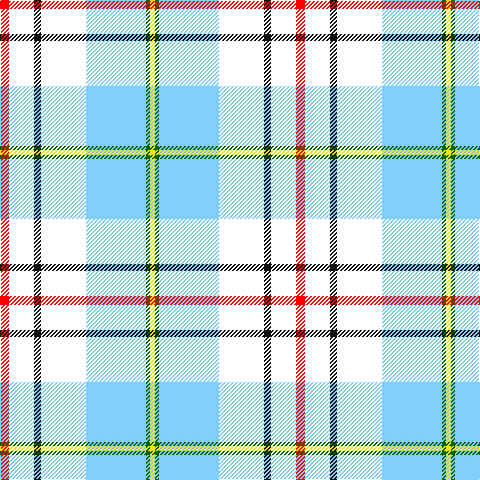

In pattern [RWKWWGY](/patterns/rwkwwgy/).

This was sourced from register-of-tartans.  It is a [7 stripes tartan](/stripes/stripes7/).

Original link https://www.tartanregister.gov.uk/tartanDetails.aspx?ref=10850

## Thread count
R/9 W25 K7 W45 LB60 G4 Y/5

## Palette
Each colour and its ΔE from the base-6 reference it is a variant of.

| Colour | Shade | Base | ΔE (OKLab) |
|---|---|---|---|
| G | <code style="background-color:#006400;">#006400</code> `#006400` | G <code style="background-color:#006100;">#006100</code> | 0.01 |
| K | <code style="background-color:#101010;">#101010</code> `#101010` | K <code style="background-color:#000000;">#000000</code> | 0.17 |
| LB | <code style="background-color:#82CFFD;">#82CFFD</code> `#82CFFD` | W <code style="background-color:#F7F7F7;">#F7F7F7</code> | 0.18 |
| R | <code style="background-color:#FF0000;">#FF0000</code> `#FF0000` | R <code style="background-color:#CC0000;">#CC0000</code> | 0.11 |
| W | <code style="background-color:#FFFFFF;">#FFFFFF</code> `#FFFFFF` | W <code style="background-color:#F7F7F7;">#F7F7F7</code> | 0.02 |
| Y | <code style="background-color:#FFE600;">#FFE600</code> `#FFE600` | Y <code style="background-color:#F2BF00;">#F2BF00</code> | 0.10 |

# Sample pattern

## Nearest tartans

The nearest existing variants by ΔTartan distance.

1. [Ch. Supt. Everett and Mrs Julene Sum](/setts/s7/r9w27k7w45wa60g4y5-g003820-k101010-rc80000-wfcfcfc-wa98c8e8-yd09800/) — ΔT 0.31
1. [Aguilar Pardo, Luis Alejandro (Personal)](/setts/s8/g8y6r4y44w44wa4w6k4-g146400-k000000-rc82828-w98c8e8-waffffff-yf8e38c/) — ΔT 1.36
1. [Manchester Blues Dress (Comm)](/setts/s11/w52wa18k4wa4w4wa4r22wa16y4r4ra4-k101010-r888888-ra901c38-wf8f8f8-wa98c8e8-ye8c000/) — ΔT 1.46
1. [Manchester Blues Dress](/setts/s11/w52wa18k4wa4w4wa4y22wa16ya4y4r4-k101010-r800000-wffffff-wa74bbfb-ybababa-yae6b426/) — ΔT 1.47
1. [Banff, White (Fashion)](/setts/s7/w16y6w44r44b6ra4w8-b640c1c-r888888-ra9c0030-wfcfcfc-yfcfc00/) — ΔT 1.49
1. [Manchester Blues Modern](/setts/s11/w52wa18k4wa4w4wa4r22wa16y4r4ra4-k101010-r888888-ra901c38-w98c8e8-wafcfcfc-ye8c000/) — ΔT 1.52
1. [Manchester Blues Modern](/setts/s11/w52wa18k4wa4w4wa4y22wa16ya4y4r4-k101010-r800000-w74bbfb-waffffff-ybababa-yae6b426/) — ΔT 1.63
1. [Musselburgh Dress (Dance)](/setts/s9/b56ba4bb12g4bb12ba4bb16w96r4-b5c8ca8-ba2c2c80-bb5c5c5c-g289c18-re87878-wf8f8f8/) — ΔT 1.63
1. [Shiel, Purple V2 (Dance)](/setts/s7/w16g10b20ba48w60g4wa4-b440044-ba5c8ca8-g006818-wf0e0c8-wac49cd8/) — ΔT 1.66
1. [Galicia](/setts/s6/b106k4w106k4r8y14-b788cb4-k000000-r9c0000-wfcfcfc-yc89800/) — ΔT 1.67

## Neighbour map

Every grey dot is one of 15726 variants placed by the first two principal components of the ΔTartan feature space (44% of its variance). Red is this tartan; blue dots are its nearest — click one to open its page.

<svg viewBox="0 0 640 380" role="img" style="max-width:100%;height:auto;border:1px solid #e0e0e0;border-radius:4px;display:block" xmlns="http://www.w3.org/2000/svg"><image href="/nn/cloud.v1.png" width="640" height="380"/><a href="/setts/s7/r9w27k7w45wa60g4y5-g003820-k101010-rc80000-wfcfcfc-wa98c8e8-yd09800/"><circle cx="204.8" cy="126.1" r="4" fill="#3465a4"><title>Ch. Supt. Everett and Mrs Julene Sum</title></circle></a><a href="/setts/s8/g8y6r4y44w44wa4w6k4-g146400-k000000-rc82828-w98c8e8-waffffff-yf8e38c/"><circle cx="190.5" cy="121.8" r="4" fill="#3465a4"><title>Aguilar Pardo, Luis Alejandro (Personal)</title></circle></a><a href="/setts/s11/w52wa18k4wa4w4wa4r22wa16y4r4ra4-k101010-r888888-ra901c38-wf8f8f8-wa98c8e8-ye8c000/"><circle cx="184.8" cy="104.3" r="4" fill="#3465a4"><title>Manchester Blues Dress (Comm)</title></circle></a><a href="/setts/s11/w52wa18k4wa4w4wa4y22wa16ya4y4r4-k101010-r800000-wffffff-wa74bbfb-ybababa-yae6b426/"><circle cx="184.5" cy="104.6" r="4" fill="#3465a4"><title>Manchester Blues Dress</title></circle></a><a href="/setts/s7/w16y6w44r44b6ra4w8-b640c1c-r888888-ra9c0030-wfcfcfc-yfcfc00/"><circle cx="249.6" cy="152.0" r="4" fill="#3465a4"><title>Banff, White (Fashion)</title></circle></a><a href="/setts/s11/w52wa18k4wa4w4wa4r22wa16y4r4ra4-k101010-r888888-ra901c38-w98c8e8-wafcfcfc-ye8c000/"><circle cx="187.2" cy="106.9" r="4" fill="#3465a4"><title>Manchester Blues Modern</title></circle></a><a href="/setts/s11/w52wa18k4wa4w4wa4y22wa16ya4y4r4-k101010-r800000-w74bbfb-waffffff-ybababa-yae6b426/"><circle cx="188.6" cy="108.7" r="4" fill="#3465a4"><title>Manchester Blues Modern</title></circle></a><a href="/setts/s9/b56ba4bb12g4bb12ba4bb16w96r4-b5c8ca8-ba2c2c80-bb5c5c5c-g289c18-re87878-wf8f8f8/"><circle cx="221.9" cy="75.8" r="4" fill="#3465a4"><title>Musselburgh Dress (Dance)</title></circle></a><a href="/setts/s7/w16g10b20ba48w60g4wa4-b440044-ba5c8ca8-g006818-wf0e0c8-wac49cd8/"><circle cx="206.2" cy="145.6" r="4" fill="#3465a4"><title>Shiel, Purple V2 (Dance)</title></circle></a><a href="/setts/s6/b106k4w106k4r8y14-b788cb4-k000000-r9c0000-wfcfcfc-yc89800/"><circle cx="258.4" cy="111.7" r="4" fill="#3465a4"><title>Galicia</title></circle></a><circle cx="201.5" cy="125.7" r="5" fill="#c00000"/></svg>

ID: /setts/s7/r9w25k7w45wa60g4y5-g006400-k101010-rff0000-wffffff-wa82cffd-yffe600/
