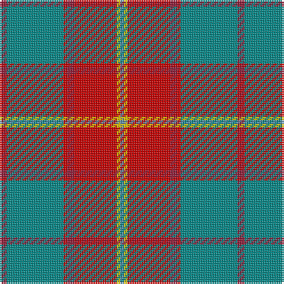

This page is one **sett** — a single exact thread-count. It belongs to the [tartan](/tartans/ri2g16r1ri2r12ly1t1/)
(the same proportion at any scale), whose colour order is pattern [BYRRRGR](/stripes/byrrrgr/).

Sourced from tartans-authority.  It is a [7 stripe tartan](/stripes/stripes7/).

Original link http://www.tartansauthority.com/tartan-ferret/display/10162/

## Register references

External register numbers recorded for this tartan.

- Scottish Register of Tartans: [10162](https://www.tartanregister.gov.uk/tartanDetails?ref=10162)
- Scottish Tartans Authority (ITI): 10162

## Thread count
DR/4 Ba32 R2 DR4 R24 Y2 B/2

## Palette

Palette: <strong>Tartan Register</strong>
<table><thead><tr><th>Colour</th><th>Threads</th><th>Shade</th><th>Base</th><th>OKLCh</th></tr></thead><tbody><tr><td>DR/</td><td style="text-align:right;font-variant-numeric:tabular-nums">4</td><td><code style="background-color:#901C38;">#901C38</code> <small style="color:#888">#901C38</small></td><td>R <code style="background-color:#CC0000;">#CC0000</code></td><td><small style="color:#888">oklch(43.2% 0.150 13.1)</small></td></tr><tr><td>Ba</td><td style="text-align:right;font-variant-numeric:tabular-nums">32</td><td><code style="background-color:#048888;">#048888</code> <small style="color:#888">#048888</small></td><td>G <code style="background-color:#006100;">#006100</code></td><td><small style="color:#888">oklch(56.8% 0.096 194.8)</small></td></tr><tr><td>R</td><td style="text-align:right;font-variant-numeric:tabular-nums">2</td><td><code style="background-color:#C80000;">#C80000</code> <small style="color:#888">#C80000</small></td><td>R <code style="background-color:#CC0000;">#CC0000</code></td><td><small style="color:#888">oklch(52.3% 0.215 29.2)</small></td></tr><tr><td>DR</td><td style="text-align:right;font-variant-numeric:tabular-nums">4</td><td><code style="background-color:#901C38;">#901C38</code> <small style="color:#888">#901C38</small></td><td>R <code style="background-color:#CC0000;">#CC0000</code></td><td><small style="color:#888">oklch(43.2% 0.150 13.1)</small></td></tr><tr><td>R</td><td style="text-align:right;font-variant-numeric:tabular-nums">24</td><td><code style="background-color:#C80000;">#C80000</code> <small style="color:#888">#C80000</small></td><td>R <code style="background-color:#CC0000;">#CC0000</code></td><td><small style="color:#888">oklch(52.3% 0.215 29.2)</small></td></tr><tr><td>Y</td><td style="text-align:right;font-variant-numeric:tabular-nums">2</td><td><code style="background-color:#E8C000;">#E8C000</code> <small style="color:#888">#E8C000</small></td><td>Y <code style="background-color:#F2BF00;">#F2BF00</code></td><td><small style="color:#888">oklch(81.9% 0.168 93.7)</small></td></tr><tr><td>B/</td><td style="text-align:right;font-variant-numeric:tabular-nums">2</td><td><code style="background-color:#5C8CA8;">#5C8CA8</code> <small style="color:#888">#5C8CA8</small></td><td>B <code style="background-color:#2A418A;">#2A418A</code></td><td><small style="color:#888">oklch(61.7% 0.067 235.0)</small></td></tr></tbody></table>

# Sample pattern

## Nearest tartans

The nearest existing variants by ΔTartan distance, with this tartan at the top so the swatches line up against it.

ΔTartan

Tartan

Sett

—

<a href="/ttd/edit/#slug=ri2g16r1ri2r12ly1t1~x2">Spragg (Name)</a> <a class="nn-out" href="/setts/s7/ri2g16r1ri2r12ly1t1~x2/" title="open its dictionary page">↗</a>

0.79

<a href="/ttd/edit/#slug=ri2dg16r1ri2r12ly1y1~x2">Spragg, Andrew</a> <a class="nn-out" href="/setts/s7/ri2dg16r1ri2r12ly1y1~x2/" title="open its dictionary page">↗</a>

0.81

<a href="/ttd/edit/#slug=y47w6r24w3dp5lo3~x2">Duminiak (Trevose, Pennsylvania)</a> <a class="nn-out" href="/setts/s6/y47w6r24w3dp5lo3~x2/" title="open its dictionary page">↗</a>

0.93

<a href="/ttd/edit/#slug=o47w6r24w3dt5lo3~x2">Duminiak (Personal)</a> <a class="nn-out" href="/setts/s6/o47w6r24w3dt5lo3~x2/" title="open its dictionary page">↗</a>

0.98

<a href="/ttd/edit/#slug=n2r10n10o3r2lr24w2~x2">Un-named Dutch</a> <a class="nn-out" href="/setts/s7/n2r10n10o3r2lr24w2~x2/" title="open its dictionary page">↗</a>

1.02

<a href="/ttd/edit/#slug=db4dr2db2w2dr9o27r4~x3">Unidentified 35</a> <a class="nn-out" href="/setts/s7/db4dr2db2w2dr9o27r4~x3/" title="open its dictionary page">↗</a>

1.19

<a href="/ttd/edit/#slug=g24b2r25ly2k3~x2">Bronte</a> <a class="nn-out" href="/setts/s5/g24b2r25ly2k3~x2/" title="open its dictionary page">↗</a>

1.23

<a href="/ttd/edit/#slug=ly3n8w3n34r34g4r4w2~x2">Manitoba Masonic</a> <a class="nn-out" href="/setts/s8/ly3n8w3n34r34g4r4w2~x2/" title="open its dictionary page">↗</a>

1.27

<a href="/ttd/edit/#slug=w15lo98do72r25do8lg15">Afternoon Tea / Milk Tea</a> <a class="nn-out" href="/setts/s6/w15lo98do72r25do8lg15/" title="open its dictionary page">↗</a>

1.27

<a href="/ttd/edit/#slug=lr6o5k2y18r28w2~x2">Dundhuin</a> <a class="nn-out" href="/setts/s6/lr6o5k2y18r28w2~x2/" title="open its dictionary page">↗</a>

1.28

<a href="/ttd/edit/#slug=r6b22r6g20ly2r45b2w5~x2">Elbrick Dress (Personal)</a> <a class="nn-out" href="/setts/s8/r6b22r6g20ly2r45b2w5~x2/" title="open its dictionary page">↗</a>

## Neighbour map

Every grey dot is one of 14359 variants placed by the first two principal components of the ΔTartan feature space (44% of its variance). Red is this tartan; blue dots are its nearest — click one to open its page.

<svg viewBox="0 0 640 380" role="img" style="max-width:100%;height:auto;border:1px solid #e0e0e0;border-radius:4px;display:block" xmlns="http://www.w3.org/2000/svg"><image href="/nn/cloud.v1.png" width="640" height="380"/><a href="/setts/s7/ri2dg16r1ri2r12ly1y1~x2/"><circle cx="301.8" cy="154.6" r="4" fill="#3465a4"><title>Spragg, Andrew</title></circle></a><a href="/setts/s6/y47w6r24w3dp5lo3~x2/"><circle cx="334.6" cy="167.2" r="4" fill="#3465a4"><title>Duminiak (Trevose, Pennsylvania)</title></circle></a><a href="/setts/s6/o47w6r24w3dt5lo3~x2/"><circle cx="324.6" cy="158.9" r="4" fill="#3465a4"><title>Duminiak (Personal)</title></circle></a><a href="/setts/s7/n2r10n10o3r2lr24w2~x2/"><circle cx="250.7" cy="170.5" r="4" fill="#3465a4"><title>Un-named Dutch</title></circle></a><a href="/setts/s7/db4dr2db2w2dr9o27r4~x3/"><circle cx="323.9" cy="161.1" r="4" fill="#3465a4"><title>Unidentified 35</title></circle></a><a href="/setts/s5/g24b2r25ly2k3~x2/"><circle cx="283.1" cy="183.3" r="4" fill="#3465a4"><title>Bronte</title></circle></a><a href="/setts/s8/ly3n8w3n34r34g4r4w2~x2/"><circle cx="288.1" cy="130.8" r="4" fill="#3465a4"><title>Manitoba Masonic</title></circle></a><a href="/setts/s6/w15lo98do72r25do8lg15/"><circle cx="227.2" cy="182.2" r="4" fill="#3465a4"><title>Afternoon Tea / Milk Tea</title></circle></a><a href="/setts/s6/lr6o5k2y18r28w2~x2/"><circle cx="257.2" cy="163.6" r="4" fill="#3465a4"><title>Dundhuin</title></circle></a><a href="/setts/s8/r6b22r6g20ly2r45b2w5~x2/"><circle cx="307.7" cy="128.7" r="4" fill="#3465a4"><title>Elbrick Dress (Personal)</title></circle></a><circle cx="298.4" cy="152.8" r="5" fill="#c00000"/></svg>

ID: /setts/s7/ri2g16r1ri2r12ly1t1~x2/
