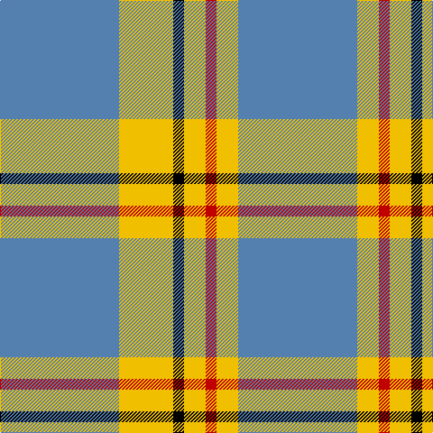

This page is one **sett** — a single exact thread-count. It belongs to the [tartan](/tartans/b11y5k1y2r1y2b11/)
(the same proportion at any scale), whose colour order is pattern [BYKYRYB](/stripes/bykyryb/).

Sourced from weddslist.  It is a [7 stripe tartan](/stripes/stripes7/).

Original link http://www.weddslist.com/cgi-bin/tartans/pg.pl?source=sts

2 attestations — the source records this cloth was collapsed from (oldest owns this page)

<ul>
<li>undated — Carlisle (weddslist, <a href="http://www.weddslist.com/cgi-bin/tartans/pg.pl?source=sts">record</a>)</li>
<li>undated — Carlisle Family Tartan Tartan Number: 674. Earliest known date: 1987 Derived from the Coat of Arms. See products available Copyright © Blair Urquhart, Comrie, 2015 (house-of-tartan, <a href="http://www.house-of-tartan.scotland.net/house/TartanViewjs.asp?colr=Def&tnam=674">record</a>)</li>
</ul>

## Thread count
B/132 Y60 K12 Y24 R12 Y24 B/132

## Palette
Each colour and the base-6 reference it is a variant of.

| Colour | Shade | Base |
|---|---|---|
| B | <code style="background-color:#5480B0;">#5480B0</code> `oklch(58.8% 0.089 251.5)` <small>#5480B0</small> | B <code style="background-color:#2A418A;">#2A418A</code> |
| K | <code style="background-color:#000000;">#000000</code> `oklch(0.0% 0.000 0.0)` <small>#000000</small> | K <code style="background-color:#000000;">#000000</code> |
| R | <code style="background-color:#C00000;">#C00000</code> `oklch(50.7% 0.208 29.2)` <small>#C00000</small> | R <code style="background-color:#CC0000;">#CC0000</code> |
| Y | <code style="background-color:#F0C000;">#F0C000</code> `oklch(82.7% 0.169 90.5)` <small>#F0C000</small> | Y <code style="background-color:#F2BF00;">#F2BF00</code> |

# Sample pattern

## Nearest tartans

The nearest existing variants by ΔTartan distance, with this tartan at the top so the swatches line up against it.

ΔTartan

Tartan

Sett

—

<a href="/ttd/edit/#slug=t11ly5k1ly2r1ly2t11~x12">Carlisle</a> <a class="nn-out" href="/setts/s7/t11ly5k1ly2r1ly2t11~x12/" title="open its dictionary page">↗</a>

1.44

<a href="/ttd/edit/#slug=k10t30g3t3g3t3r6~x2">Kinding (Personal)</a> <a class="nn-out" href="/setts/s7/k10t30g3t3g3t3r6~x2/" title="open its dictionary page">↗</a>

1.51

<a href="/ttd/edit/#slug=t11ly2r1ly2r1~x4">Carlisle, Ancient</a> <a class="nn-out" href="/setts/s5/t11ly2r1ly2r1~x4/" title="open its dictionary page">↗</a>

1.51

<a href="/ttd/edit/#slug=b12ly1w16b1w1b14w3b14r2~x4">Orlando Dress, City of (District)</a> <a class="nn-out" href="/setts/s9/b12ly1w16b1w1b14w3b14r2~x4/" title="open its dictionary page">↗</a>

1.52

<a href="/ttd/edit/#slug=k3t10ly5t29k10r6k2~x2">Perkins 2015</a> <a class="nn-out" href="/setts/s7/k3t10ly5t29k10r6k2~x2/" title="open its dictionary page">↗</a>

1.53

<a href="/ttd/edit/#slug=r1o6k1o1k2o1k1o6lo1~x8">Mowdowny (Fashion)</a> <a class="nn-out" href="/setts/s9/r1o6k1o1k2o1k1o6lo1~x8/" title="open its dictionary page">↗</a>

1.61

<a href="/ttd/edit/#slug=w24g2w8db5ly4db5ly4~x2">Clackson Arisaid (Name?)</a> <a class="nn-out" href="/setts/s7/w24g2w8db5ly4db5ly4~x2/" title="open its dictionary page">↗</a>

1.62

<a href="/ttd/edit/#slug=n27lr3n14k3n13k3ly23~x2">Grange School</a> <a class="nn-out" href="/setts/s7/n27lr3n14k3n13k3ly23~x2/" title="open its dictionary page">↗</a>

1.62

<a href="/ttd/edit/#slug=db9lb27db2ly4db2lb10db2w3~x2">Alaska Highlanders P &amp; D (Corporate)</a> <a class="nn-out" href="/setts/s8/db9lb27db2ly4db2lb10db2w3~x2/" title="open its dictionary page">↗</a>

1.65

<a href="/ttd/edit/#slug=lb1lg11k6lg3lb1lg1lb1~x4">Angle, Blue (Fashion)</a> <a class="nn-out" href="/setts/s7/lb1lg11k6lg3lb1lg1lb1~x4/" title="open its dictionary page">↗</a>

1.66

<a href="/ttd/edit/#slug=n62w11k4lg17~x2">Thunderlord (Corporate)</a> <a class="nn-out" href="/setts/s4/n62w11k4lg17~x2/" title="open its dictionary page">↗</a>

## Neighbour map

Every grey dot is one of 14299 variants placed by the first two principal components of the ΔTartan feature space (44% of its variance). Red is this tartan; blue dots are its nearest — click one to open its page.

<svg viewBox="0 0 640 380" role="img" style="max-width:100%;height:auto;border:1px solid #e0e0e0;border-radius:4px;display:block" xmlns="http://www.w3.org/2000/svg"><image href="/nn/cloud.v1.png" width="640" height="380"/><a href="/setts/s7/k10t30g3t3g3t3r6~x2/"><circle cx="340.0" cy="185.4" r="4" fill="#3465a4"><title>Kinding (Personal)</title></circle></a><a href="/setts/s5/t11ly2r1ly2r1~x4/"><circle cx="408.1" cy="208.3" r="4" fill="#3465a4"><title>Carlisle, Ancient</title></circle></a><a href="/setts/s9/b12ly1w16b1w1b14w3b14r2~x4/"><circle cx="340.6" cy="160.1" r="4" fill="#3465a4"><title>Orlando Dress, City of (District)</title></circle></a><a href="/setts/s7/k3t10ly5t29k10r6k2~x2/"><circle cx="317.3" cy="176.0" r="4" fill="#3465a4"><title>Perkins 2015</title></circle></a><a href="/setts/s9/r1o6k1o1k2o1k1o6lo1~x8/"><circle cx="369.9" cy="204.1" r="4" fill="#3465a4"><title>Mowdowny (Fashion)</title></circle></a><a href="/setts/s7/w24g2w8db5ly4db5ly4~x2/"><circle cx="304.5" cy="161.6" r="4" fill="#3465a4"><title>Clackson Arisaid (Name?)</title></circle></a><a href="/setts/s7/n27lr3n14k3n13k3ly23~x2/"><circle cx="334.3" cy="216.3" r="4" fill="#3465a4"><title>Grange School</title></circle></a><a href="/setts/s8/db9lb27db2ly4db2lb10db2w3~x2/"><circle cx="333.6" cy="153.4" r="4" fill="#3465a4"><title>Alaska Highlanders P &amp; D (Corporate)</title></circle></a><a href="/setts/s7/lb1lg11k6lg3lb1lg1lb1~x4/"><circle cx="338.8" cy="191.8" r="4" fill="#3465a4"><title>Angle, Blue (Fashion)</title></circle></a><a href="/setts/s4/n62w11k4lg17~x2/"><circle cx="403.9" cy="210.8" r="4" fill="#3465a4"><title>Thunderlord (Corporate)</title></circle></a><circle cx="367.0" cy="191.1" r="5" fill="#c00000"/></svg>

ID: /setts/s7/t11ly5k1ly2r1ly2t11~x12/
