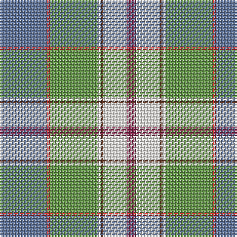

In pattern [BRGWGWR](/stripes/brgwgwr/).

This was sourced from register-of-tartans.  It is a [7 stripe tartan](/stripes/stripes7/).

Original link https://www.tartanregister.gov.uk/tartanDetails.aspx?ref=10570

## Register references

External register numbers recorded for this tartan.

- Scottish Register of Tartans: [10570](https://www.tartanregister.gov.uk/tartanDetails.aspx?ref=10570)

## Thread count
B/32 R2 LG32 W2 T2 W16 DR/6

## Palette
Each colour and the base-6 reference it is a variant of.

| Colour | Shade | Base |
|---|---|---|
| B | <code style="background-color:#5F749C;">#5F749C</code> `oklch(55.8% 0.067 262.9)` <small>#5F749C</small> | B <code style="background-color:#2A418A;">#2A418A</code> |
| DR | <code style="background-color:#86264D;">#86264D</code> `oklch(43.0% 0.135 359.7)` <small>#86264D</small> | R <code style="background-color:#CC0000;">#CC0000</code> |
| LG | <code style="background-color:#649848;">#649848</code> `oklch(62.4% 0.125 135.7)` <small>#649848</small> | G <code style="background-color:#006100;">#006100</code> |
| R | <code style="background-color:#CA2625;">#CA2625</code> `oklch(54.4% 0.199 27.2)` <small>#CA2625</small> | R <code style="background-color:#CC0000;">#CC0000</code> |
| T | <code style="background-color:#5D321F;">#5D321F</code> `oklch(36.8% 0.069 44.0)` <small>#5D321F</small> | G <code style="background-color:#006100;">#006100</code> |
| W | <code style="background-color:#F9F5EF;">#F9F5EF</code> `oklch(97.2% 0.009 78.3)` <small>#F9F5EF</small> | W <code style="background-color:#F7F7F7;">#F7F7F7</code> |

# Sample pattern

## Nearest tartans

The nearest existing variants by ΔTartan distance.

1. [Morgan in Maryland (USA)](/setts/s9/db4k1lg18y2lg11y11lb18k1r4~x2/) — ΔT 1.02
1. [Alexander of Menstry Hunting](/setts/s8/m5g2m2g26k9lr9lb13w5~x2/) — ΔT 1.10
1. [State Seal of Delaware (Fashion)](/setts/s10/lb38dt18lb4ly3g10lo3g4lb3lo17r4~x2/) — ΔT 1.11
1. [Presley of Lonmay](/setts/s7/k2lb25k2b8k2g28ly2~x2/) — ΔT 1.20
1. [Mission (District)](/setts/s8/lo2lb14k1g11k2r2g2k1~x4/) — ΔT 1.23
1. [Mission](/setts/s8/lo2t14k1g11k2w2g2k1~x4/) — ΔT 1.32
1. [Morgan in Maryland (USA) (Name)](/setts/s9/db4k1g18dy2g11dy11lg18k1r4~x2/) — ΔT 1.33
1. [Cossar (Personal)](/setts/s11/w4t5lo3t22ly4k3g16lo7k2lo7ly2~x2/) — ΔT 1.33
1. [O'Rourke (Estimated threadcount)](/setts/s9/t25k1dy6k1lr10w3lr10k1ly3~x4/) — ΔT 1.38
1. [State Seal of New Mexico (Fashion)](/setts/s8/lb5o49lb3dg24r5lo4dy30lb4~x2/) — ΔT 1.40

## Neighbour map

Every grey dot is one of 14299 variants placed by the first two principal components of the ΔTartan feature space (44% of its variance). Red is this tartan; blue dots are its nearest — click one to open its page.

<svg viewBox="0 0 640 380" role="img" style="max-width:100%;height:auto;border:1px solid #e0e0e0;border-radius:4px;display:block" xmlns="http://www.w3.org/2000/svg"><image href="/nn/cloud.v1.png" width="640" height="380"/><a href="/setts/s9/db4k1lg18y2lg11y11lb18k1r4~x2/"><circle cx="171.7" cy="127.3" r="4" fill="#3465a4"><title>Morgan in Maryland (USA)</title></circle></a><a href="/setts/s8/m5g2m2g26k9lr9lb13w5~x2/"><circle cx="132.4" cy="145.8" r="4" fill="#3465a4"><title>Alexander of Menstry Hunting</title></circle></a><a href="/setts/s10/lb38dt18lb4ly3g10lo3g4lb3lo17r4~x2/"><circle cx="176.8" cy="122.3" r="4" fill="#3465a4"><title>State Seal of Delaware (Fashion)</title></circle></a><a href="/setts/s7/k2lb25k2b8k2g28ly2~x2/"><circle cx="217.9" cy="154.0" r="4" fill="#3465a4"><title>Presley of Lonmay</title></circle></a><a href="/setts/s8/lo2lb14k1g11k2r2g2k1~x4/"><circle cx="163.8" cy="123.1" r="4" fill="#3465a4"><title>Mission (District)</title></circle></a><a href="/setts/s8/lo2t14k1g11k2w2g2k1~x4/"><circle cx="181.7" cy="136.8" r="4" fill="#3465a4"><title>Mission</title></circle></a><a href="/setts/s9/db4k1g18dy2g11dy11lg18k1r4~x2/"><circle cx="199.3" cy="146.2" r="4" fill="#3465a4"><title>Morgan in Maryland (USA) (Name)</title></circle></a><a href="/setts/s11/w4t5lo3t22ly4k3g16lo7k2lo7ly2~x2/"><circle cx="123.0" cy="136.5" r="4" fill="#3465a4"><title>Cossar (Personal)</title></circle></a><a href="/setts/s9/t25k1dy6k1lr10w3lr10k1ly3~x4/"><circle cx="238.4" cy="115.6" r="4" fill="#3465a4"><title>O'Rourke (Estimated threadcount)</title></circle></a><a href="/setts/s8/lb5o49lb3dg24r5lo4dy30lb4~x2/"><circle cx="197.1" cy="135.7" r="4" fill="#3465a4"><title>State Seal of New Mexico (Fashion)</title></circle></a><circle cx="171.0" cy="137.6" r="5" fill="#c00000"/></svg>

ID: /setts/s7/t16r1g16w1dy1w8m3~x2/
