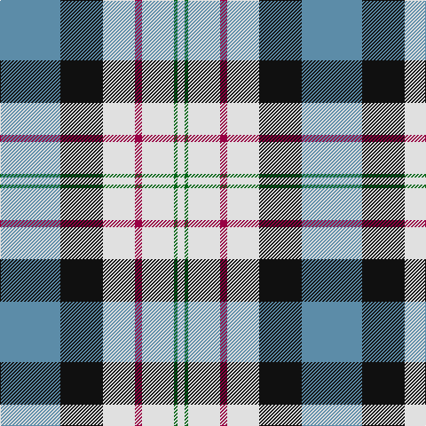

**Bands:** [BKWRWGW](/stripes/bkwrwgw/) · **Stripes:** [T K W M W G W](/stripes/stripes7/) T K W M W G W

This was sourced from register-of-tartans.  It is a [7 band tartan](/bands/bands7/).

Original link https://www.tartanregister.gov.uk/tartanDetails.aspx?ref=1161

## Register references

External register numbers recorded for this tartan.

- Scottish Register of Tartans: [1161](https://www.tartanregister.gov.uk/tartanDetails.aspx?ref=1161)
- Scottish Tartans Authority (ITI): 92
- Scottish Tartans World Register: 92

## Thread count
B/68 K48 LN36 R8 LN36 G4 LN/8

## Palette
Each colour and its ΔE from the base-6 reference it is a variant of.

| Colour | Shade | Base | ΔE (OKLab) |
|---|---|---|---|
| B | <code style="background-color:#5C8CA8;">#5C8CA8</code> `#5C8CA8` | B <code style="background-color:#2A418A;">#2A418A</code> | 0.23 |
| G | <code style="background-color:#006818;">#006818</code> `#006818` | G <code style="background-color:#006100;">#006100</code> | 0.02 |
| K | <code style="background-color:#101010;">#101010</code> `#101010` | K <code style="background-color:#000000;">#000000</code> | 0.17 |
| LN | <code style="background-color:#E0E0E0;">#E0E0E0</code> `#E0E0E0` | W <code style="background-color:#F7F7F7;">#F7F7F7</code> | 0.07 |
| R | <code style="background-color:#980044;">#980044</code> `#980044` | R <code style="background-color:#CC0000;">#CC0000</code> | 0.13 |

# Sample pattern

## Nearest tartans

The nearest existing variants by ΔTartan distance.

1. [Ferguson, dress](/setts/s7/t34db24w18r3w18g2w3~x2/) — ΔT 0.81
1. [Manx, dress](/setts/s6/g4w28p8ly2db17g4~x2/) — ΔT 0.92
1. [Ferguson Dress #2](/setts/s7/db68k42w32r5w32dg4w6/) — ΔT 0.94
1. [Allanton Dress (Fashion)](/setts/s6/g4w28db14ly2t17g4~x2/) — ΔT 0.94
1. [Manx Dress](/setts/s6/g4w28dp8ly2db17g4~x2/) — ΔT 0.95
1. [MacNaughton Dress](/setts/s9/r2db2w26g25k14db13w26db2r2~x2/) — ΔT 1.05
1. [Unidentified 18](/setts/s9/db48r10w2r10g17k3w17k3w34~x2/) — ΔT 1.06
1. [Davidson (Wedding) (Personal)](/setts/s7/r2db14k6g1w12g1w2~x4/) — ΔT 1.07
1. [Alexander Brothers - 2007? (Corp.)](/setts/s8/g5ly2t20w2k20w20k2w5~x2/) — ΔT 1.08
1. [Manx Laxey, dress green](/setts/s6/db2w14p4ly1g8db2~x2/) — ΔT 1.11

## Neighbour map

Every grey dot is one of 14313 variants placed by the first two principal components of the ΔTartan feature space (44% of its variance). Red is this tartan; blue dots are its nearest — click one to open its page.

<svg viewBox="0 0 640 380" role="img" style="max-width:100%;height:auto;border:1px solid #e0e0e0;border-radius:4px;display:block" xmlns="http://www.w3.org/2000/svg"><image href="/nn/cloud.v1.png" width="640" height="380"/><a href="/setts/s7/t34db24w18r3w18g2w3~x2/"><circle cx="159.2" cy="149.8" r="4" fill="#3465a4"><title>Ferguson, dress</title></circle></a><a href="/setts/s6/g4w28p8ly2db17g4~x2/"><circle cx="184.9" cy="151.7" r="4" fill="#3465a4"><title>Manx, dress</title></circle></a><a href="/setts/s7/db68k42w32r5w32dg4w6/"><circle cx="160.3" cy="148.1" r="4" fill="#3465a4"><title>Ferguson Dress #2</title></circle></a><a href="/setts/s6/g4w28db14ly2t17g4~x2/"><circle cx="162.6" cy="164.0" r="4" fill="#3465a4"><title>Allanton Dress (Fashion)</title></circle></a><a href="/setts/s6/g4w28dp8ly2db17g4~x2/"><circle cx="181.7" cy="150.6" r="4" fill="#3465a4"><title>Manx Dress</title></circle></a><a href="/setts/s9/r2db2w26g25k14db13w26db2r2~x2/"><circle cx="169.0" cy="140.5" r="4" fill="#3465a4"><title>MacNaughton Dress</title></circle></a><a href="/setts/s9/db48r10w2r10g17k3w17k3w34~x2/"><circle cx="165.9" cy="112.2" r="4" fill="#3465a4"><title>Unidentified 18</title></circle></a><a href="/setts/s7/r2db14k6g1w12g1w2~x4/"><circle cx="149.5" cy="138.8" r="4" fill="#3465a4"><title>Davidson (Wedding) (Personal)</title></circle></a><a href="/setts/s8/g5ly2t20w2k20w20k2w5~x2/"><circle cx="120.8" cy="153.6" r="4" fill="#3465a4"><title>Alexander Brothers - 2007? (Corp.)</title></circle></a><a href="/setts/s6/db2w14p4ly1g8db2~x2/"><circle cx="187.7" cy="152.4" r="4" fill="#3465a4"><title>Manx Laxey, dress green</title></circle></a><circle cx="156.1" cy="150.7" r="5" fill="#c00000"/></svg>

ID: /setts/s7/t17k12w9m2w9g1w2~x4/
