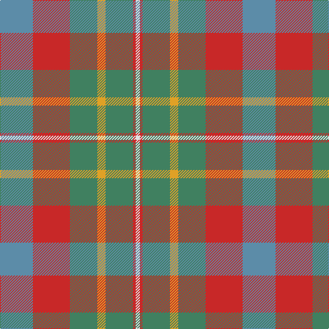

This page is one **sett** — a single exact thread-count. It belongs to the [tartan](/tartans/t24r27g20lo6g20r2w3/)
(the same proportion at any scale), whose colour order is pattern [BRGYGRW](/stripes/brgygrw/).

Sourced from register-of-tartans.  It is a [7 stripe tartan](/stripes/stripes7/).

Original link https://www.tartanregister.gov.uk/tartanDetails.aspx?ref=11328

## Register references

External register numbers recorded for this tartan.

- Scottish Register of Tartans: [11328](https://www.tartanregister.gov.uk/tartanDetails.aspx?ref=11328)

## Thread count
B/48 R54 G40 Y12 G40 R4 LN/6

## Palette

Palette: <strong>Tartan Register</strong>
<table><thead><tr><th>Colour</th><th>Threads</th><th>Shade</th><th>Base</th><th>OKLCh</th></tr></thead><tbody><tr><td>B/</td><td style="text-align:right;font-variant-numeric:tabular-nums">48</td><td><code style="background-color:#5C8CA8;">#5C8CA8</code> <small style="color:#888">#5C8CA8</small></td><td>B <code style="background-color:#2A418A;">#2A418A</code></td><td><small style="color:#888">oklch(61.7% 0.067 235.0)</small></td></tr><tr><td>R</td><td style="text-align:right;font-variant-numeric:tabular-nums">54</td><td><code style="background-color:#C82828;">#C82828</code> <small style="color:#888">#C82828</small></td><td>R <code style="background-color:#CC0000;">#CC0000</code></td><td><small style="color:#888">oklch(54.2% 0.196 26.8)</small></td></tr><tr><td>G</td><td style="text-align:right;font-variant-numeric:tabular-nums">40</td><td><code style="background-color:#408060;">#408060</code> <small style="color:#888">#408060</small></td><td>G <code style="background-color:#006100;">#006100</code></td><td><small style="color:#888">oklch(54.8% 0.084 160.1)</small></td></tr><tr><td>Y</td><td style="text-align:right;font-variant-numeric:tabular-nums">12</td><td><code style="background-color:#E0A126;">#E0A126</code> <small style="color:#888">#E0A126</small></td><td>Y <code style="background-color:#F2BF00;">#F2BF00</code></td><td><small style="color:#888">oklch(75.1% 0.146 78.3)</small></td></tr><tr><td>G</td><td style="text-align:right;font-variant-numeric:tabular-nums">40</td><td><code style="background-color:#408060;">#408060</code> <small style="color:#888">#408060</small></td><td>G <code style="background-color:#006100;">#006100</code></td><td><small style="color:#888">oklch(54.8% 0.084 160.1)</small></td></tr><tr><td>R</td><td style="text-align:right;font-variant-numeric:tabular-nums">4</td><td><code style="background-color:#C82828;">#C82828</code> <small style="color:#888">#C82828</small></td><td>R <code style="background-color:#CC0000;">#CC0000</code></td><td><small style="color:#888">oklch(54.2% 0.196 26.8)</small></td></tr><tr><td>LN/</td><td style="text-align:right;font-variant-numeric:tabular-nums">6</td><td><code style="background-color:#E0E0E0;">#E0E0E0</code> <small style="color:#888">#E0E0E0</small></td><td>W <code style="background-color:#F7F7F7;">#F7F7F7</code></td><td><small style="color:#888">oklch(90.7% 0.000 89.9)</small></td></tr></tbody></table>

# Sample pattern

## Nearest tartans

The nearest existing variants by ΔTartan distance, with this tartan at the top so the swatches line up against it.

ΔTartan

Tartan

Sett

—

<a href="/ttd/edit/#slug=t24r27g20lo6g20r2w3~x2">Buchanhaven Heritage</a> <a class="nn-out" href="/setts/s7/t24r27g20lo6g20r2w3~x2/" title="open its dictionary page">↗</a>

0.85

<a href="/ttd/edit/#slug=r3n20ly2n20o20lb20r3~x2">Brodie Silver Clan Tartan Tartan Number: 1630. Earliest known date: c.1940-50 Probably a trade design based on Hunting Brodie, that has appeared in the last forty years. It is sometimes referred to as muted Brodie. (P.E. MacDonald, STS 1984) See products available Copyright © Blair Urquhart, Comrie, 2015</a> <a class="nn-out" href="/setts/s7/r3n20ly2n20o20lb20r3~x2/" title="open its dictionary page">↗</a>

1.17

<a href="/ttd/edit/#slug=r3n20ly2n20y20lb20r3~x2">Brodie, Silver</a> <a class="nn-out" href="/setts/s7/r3n20ly2n20y20lb20r3~x2/" title="open its dictionary page">↗</a>

1.19

<a href="/ttd/edit/#slug=r3n20k2n20o20lb20r3~x2">Brodie Silver</a> <a class="nn-out" href="/setts/s7/r3n20k2n20o20lb20r3~x2/" title="open its dictionary page">↗</a>

1.19

<a href="/ttd/edit/#slug=y19r3t19r11y19ly2db4~x2">Rotary Corporate Tartan Tartan Number: 2187. Earliest known date: 1995 The tartan was designed by K. Lumsden of the Scottish Tartans Society in conjuntion with the Rotary Club of Glasgow. It was decided to use as a base the City of Glasgow Tartan; the colours being brightened and the gold and the deep blue of the Rotary Wheel added. The actual shades are specific Rotary colours. The tartan is currently available only from Geoffrey (Tailor) Highland Crafts, The Royal Mile, Edinburgh. See products available Copyright © Blair Urquhart, Comrie, 2015</a> <a class="nn-out" href="/setts/s7/y19r3t19r11y19ly2db4~x2/" title="open its dictionary page">↗</a>

1.23

<a href="/ttd/edit/#slug=y15k10n30o11w3y5~x2">McHale (Personal)</a> <a class="nn-out" href="/setts/s6/y15k10n30o11w3y5~x2/" title="open its dictionary page">↗</a>

1.24

<a href="/ttd/edit/#slug=t4r1ly1t12do4y10ly1r3~x4">Hawaii (District)</a> <a class="nn-out" href="/setts/s8/t4r1ly1t12do4y10ly1r3~x4/" title="open its dictionary page">↗</a>

1.41

<a href="/ttd/edit/#slug=db30ly3o11ly3y33r6~x2">Balfour</a> <a class="nn-out" href="/setts/s6/db30ly3o11ly3y33r6~x2/" title="open its dictionary page">↗</a>

1.43

<a href="/ttd/edit/#slug=dg3y16dy11y2lo11y2lo11y2dy11y16w3~x2">Harmony 14</a> <a class="nn-out" href="/setts/s11/dg3y16dy11y2lo11y2lo11y2dy11y16w3~x2/" title="open its dictionary page">↗</a>

1.53

<a href="/ttd/edit/#slug=k1r9n8y8w1~x2">Pople (Name)</a> <a class="nn-out" href="/setts/s5/k1r9n8y8w1~x2/" title="open its dictionary page">↗</a>

1.57

<a href="/ttd/edit/#slug=dt8y4r30g30lo3g4~x2">Hutcheson (Name)</a> <a class="nn-out" href="/setts/s6/dt8y4r30g30lo3g4~x2/" title="open its dictionary page">↗</a>

## Neighbour map

Every grey dot is one of 14299 variants placed by the first two principal components of the ΔTartan feature space (44% of its variance). Red is this tartan; blue dots are its nearest — click one to open its page.

<svg viewBox="0 0 640 380" role="img" style="max-width:100%;height:auto;border:1px solid #e0e0e0;border-radius:4px;display:block" xmlns="http://www.w3.org/2000/svg"><image href="/nn/cloud.v1.png" width="640" height="380"/><a href="/setts/s7/r3n20ly2n20o20lb20r3~x2/"><circle cx="236.6" cy="214.8" r="4" fill="#3465a4"><title>Brodie Silver Clan Tartan Tartan Number: 1630. Earliest known date: c.1940-50 Probably a trade design based on Hunting Brodie, that has appeared in the last forty years. It is sometimes referred to as muted Brodie. (P.E. MacDonald, STS 1984) See products available Copyright © Blair Urquhart, Comrie, 2015</title></circle></a><a href="/setts/s7/r3n20ly2n20y20lb20r3~x2/"><circle cx="221.5" cy="207.7" r="4" fill="#3465a4"><title>Brodie, Silver</title></circle></a><a href="/setts/s7/r3n20k2n20o20lb20r3~x2/"><circle cx="220.1" cy="207.2" r="4" fill="#3465a4"><title>Brodie Silver</title></circle></a><a href="/setts/s7/y19r3t19r11y19ly2db4~x2/"><circle cx="265.4" cy="225.3" r="4" fill="#3465a4"><title>Rotary Corporate Tartan Tartan Number: 2187. Earliest known date: 1995 The tartan was designed by K. Lumsden of the Scottish Tartans Society in conjuntion with the Rotary Club of Glasgow. It was decided to use as a base the City of Glasgow Tartan; the colours being brightened and the gold and the deep blue of the Rotary Wheel added. The actual shades are specific Rotary colours. The tartan is currently available only from Geoffrey (Tailor) Highland Crafts, The Royal Mile, Edinburgh. See products available Copyright © Blair Urquhart, Comrie, 2015</title></circle></a><a href="/setts/s6/y15k10n30o11w3y5~x2/"><circle cx="200.7" cy="218.0" r="4" fill="#3465a4"><title>McHale (Personal)</title></circle></a><a href="/setts/s8/t4r1ly1t12do4y10ly1r3~x4/"><circle cx="249.8" cy="190.8" r="4" fill="#3465a4"><title>Hawaii (District)</title></circle></a><a href="/setts/s6/db30ly3o11ly3y33r6~x2/"><circle cx="229.2" cy="204.1" r="4" fill="#3465a4"><title>Balfour</title></circle></a><a href="/setts/s11/dg3y16dy11y2lo11y2lo11y2dy11y16w3~x2/"><circle cx="205.8" cy="202.4" r="4" fill="#3465a4"><title>Harmony 14</title></circle></a><a href="/setts/s5/k1r9n8y8w1~x2/"><circle cx="201.0" cy="236.6" r="4" fill="#3465a4"><title>Pople (Name)</title></circle></a><a href="/setts/s6/dt8y4r30g30lo3g4~x2/"><circle cx="256.0" cy="199.9" r="4" fill="#3465a4"><title>Hutcheson (Name)</title></circle></a><circle cx="225.6" cy="208.4" r="5" fill="#c00000"/></svg>

ID: /setts/s7/t24r27g20lo6g20r2w3~x2/
