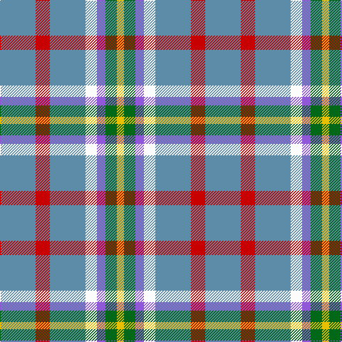

This page is one **sett** — a single exact thread-count. It belongs to the [tartan](/tartans/t25r10t25w8p6g8ly5/)
(the same proportion at any scale), whose colour order is pattern [BRBWBGY](/stripes/brbwbgy/).

Sourced from tartans-authority.  It is a [7 stripe tartan](/stripes/stripes7/).

Original link http://www.tartansauthority.com/tartan-ferret/display/10954/

## Register references

External register numbers recorded for this tartan.

- Scottish Register of Tartans: [10954](https://www.tartanregister.gov.uk/tartanDetails?ref=10954)
- Scottish Tartans Authority (ITI): 10954

## Thread count
B/50 R20 B50 W16 P12 G16 Y/10

## Palette

Palette: <strong>Tartan Register</strong>
<table><thead><tr><th>Colour</th><th>Threads</th><th>Shade</th><th>Base</th><th>OKLCh</th></tr></thead><tbody><tr><td>B/</td><td style="text-align:right;font-variant-numeric:tabular-nums">50</td><td><code style="background-color:#5C8CA8;">#5C8CA8</code> <small style="color:#888">#5C8CA8</small></td><td>B <code style="background-color:#2A418A;">#2A418A</code></td><td><small style="color:#888">oklch(61.7% 0.067 235.0)</small></td></tr><tr><td>R</td><td style="text-align:right;font-variant-numeric:tabular-nums">20</td><td><code style="background-color:#C80000;">#C80000</code> <small style="color:#888">#C80000</small></td><td>R <code style="background-color:#CC0000;">#CC0000</code></td><td><small style="color:#888">oklch(52.3% 0.215 29.2)</small></td></tr><tr><td>B</td><td style="text-align:right;font-variant-numeric:tabular-nums">50</td><td><code style="background-color:#5C8CA8;">#5C8CA8</code> <small style="color:#888">#5C8CA8</small></td><td>B <code style="background-color:#2A418A;">#2A418A</code></td><td><small style="color:#888">oklch(61.7% 0.067 235.0)</small></td></tr><tr><td>W</td><td style="text-align:right;font-variant-numeric:tabular-nums">16</td><td><code style="background-color:#FCFCFC;">#FCFCFC</code> <small style="color:#888">#FCFCFC</small></td><td>W <code style="background-color:#F7F7F7;">#F7F7F7</code></td><td><small style="color:#888">oklch(99.1% 0.000 89.9)</small></td></tr><tr><td>P</td><td style="text-align:right;font-variant-numeric:tabular-nums">12</td><td><code style="background-color:#9058D8;">#9058D8</code> <small style="color:#888">#9058D8</small></td><td>B <code style="background-color:#2A418A;">#2A418A</code></td><td><small style="color:#888">oklch(58.4% 0.190 300.8)</small></td></tr><tr><td>G</td><td style="text-align:right;font-variant-numeric:tabular-nums">16</td><td><code style="background-color:#006818;">#006818</code> <small style="color:#888">#006818</small></td><td>G <code style="background-color:#006100;">#006100</code></td><td><small style="color:#888">oklch(45.0% 0.142 145.0)</small></td></tr><tr><td>Y/</td><td style="text-align:right;font-variant-numeric:tabular-nums">10</td><td><code style="background-color:#E8C000;">#E8C000</code> <small style="color:#888">#E8C000</small></td><td>Y <code style="background-color:#F2BF00;">#F2BF00</code></td><td><small style="color:#888">oklch(81.9% 0.168 93.7)</small></td></tr></tbody></table>

# Sample pattern

## Nearest tartans

The nearest existing variants by ΔTartan distance, with this tartan at the top so the swatches line up against it.

ΔTartan

Tartan

Sett

—

<a href="/ttd/edit/#slug=t25r10t25w8p6g8ly5~x2">Barneys (Scunthorpe) (Personal)</a> <a class="nn-out" href="/setts/s7/t25r10t25w8p6g8ly5~x2/" title="open its dictionary page">↗</a>

0.35

<a href="/ttd/edit/#slug=t25r10t25w8m6g8ly5~x2">Barneys (Scunthorpe) (Personal)</a> <a class="nn-out" href="/setts/s7/t25r10t25w8m6g8ly5~x2/" title="open its dictionary page">↗</a>

1.46

<a href="/ttd/edit/#slug=t31dt4lb4t20dt8ly16r8t14lb4dt4lyi4">Cian Clan Irish Family Tartan Tartan Number: 47. Earliest known date: 1983 Registered with the Chief Herald of Ireland in 1983. Normally woven in ancient colours. Registered with TECA 01 July 1992 by Eli F.J. O'Carroll, chief of Clan Cian of Ely, Stockton, CA, USA. See products available Copyright © Blair Urquhart, Comrie, 2015</a> <a class="nn-out" href="/setts/s11/t31dt4lb4t20dt8ly16r8t14lb4dt4lyi4/" title="open its dictionary page">↗</a>

1.67

<a href="/ttd/edit/#slug=k4ly12n3ly3n3ly4lr17ly15dy4~x2">Cotswolds Distillery</a> <a class="nn-out" href="/setts/s9/k4ly12n3ly3n3ly4lr17ly15dy4~x2/" title="open its dictionary page">↗</a>

1.69

<a href="/ttd/edit/#slug=b9db2lb2b10db4ly8r4b7lb2db2ly2~x4">Healy (Name)</a> <a class="nn-out" href="/setts/s11/b9db2lb2b10db4ly8r4b7lb2db2ly2~x4/" title="open its dictionary page">↗</a>

1.70

<a href="/ttd/edit/#slug=b15k3b19w3b5ly5r3ly5lb3ly5k3~x2">Gouranga</a> <a class="nn-out" href="/setts/s11/b15k3b19w3b5ly5r3ly5lb3ly5k3~x2/" title="open its dictionary page">↗</a>

1.75

<a href="/ttd/edit/#slug=n1lo8dy2lo2db6w1db6lo2dy2lo8r1~x4">MacKessog</a> <a class="nn-out" href="/setts/s11/n1lo8dy2lo2db6w1db6lo2dy2lo8r1~x4/" title="open its dictionary page">↗</a>

1.78

<a href="/ttd/edit/#slug=lg8do2lg13r4lg12t22lg5lo3~x2">Kildare Irish County Tartan Tartan Number: 2262. Earliest known date: 1996 One of a series of Irish District tartans designed by Polly Wittering of the House of Edgar, with colours reminiscent of the Country with soft warm colours dominating. See products available Copyright © Blair Urquhart, Comrie, 2015</a> <a class="nn-out" href="/setts/s8/lg8do2lg13r4lg12t22lg5lo3~x2/" title="open its dictionary page">↗</a>

1.83

<a href="/ttd/edit/#slug=o12g4dp4g4o31dt3db12w4~x2">Yes Scotland (Fashion)</a> <a class="nn-out" href="/setts/s8/o12g4dp4g4o31dt3db12w4~x2/" title="open its dictionary page">↗</a>

1.92

<a href="/ttd/edit/#slug=n10w3lb3g1r1~x10">Bagpipe Shop (Corporate)</a> <a class="nn-out" href="/setts/s5/n10w3lb3g1r1~x10/" title="open its dictionary page">↗</a>

1.94

<a href="/ttd/edit/#slug=lr12dg4m4dg4lr31y3b12w4~x2">Yes Scotland</a> <a class="nn-out" href="/setts/s8/lr12dg4m4dg4lr31y3b12w4~x2/" title="open its dictionary page">↗</a>

## Neighbour map

Every grey dot is one of 14359 variants placed by the first two principal components of the ΔTartan feature space (44% of its variance). Red is this tartan; blue dots are its nearest — click one to open its page.

<svg viewBox="0 0 640 380" role="img" style="max-width:100%;height:auto;border:1px solid #e0e0e0;border-radius:4px;display:block" xmlns="http://www.w3.org/2000/svg"><image href="/nn/cloud.v1.png" width="640" height="380"/><a href="/setts/s7/t25r10t25w8m6g8ly5~x2/"><circle cx="207.3" cy="211.6" r="4" fill="#3465a4"><title>Barneys (Scunthorpe) (Personal)</title></circle></a><a href="/setts/s11/t31dt4lb4t20dt8ly16r8t14lb4dt4lyi4/"><circle cx="233.5" cy="175.9" r="4" fill="#3465a4"><title>Cian Clan Irish Family Tartan Tartan Number: 47. Earliest known date: 1983 Registered with the Chief Herald of Ireland in 1983. Normally woven in ancient colours. Registered with TECA 01 July 1992 by Eli F.J. O'Carroll, chief of Clan Cian of Ely, Stockton, CA, USA. See products available Copyright © Blair Urquhart, Comrie, 2015</title></circle></a><a href="/setts/s9/k4ly12n3ly3n3ly4lr17ly15dy4~x2/"><circle cx="201.8" cy="191.5" r="4" fill="#3465a4"><title>Cotswolds Distillery</title></circle></a><a href="/setts/s11/b9db2lb2b10db4ly8r4b7lb2db2ly2~x4/"><circle cx="162.0" cy="206.4" r="4" fill="#3465a4"><title>Healy (Name)</title></circle></a><a href="/setts/s11/b15k3b19w3b5ly5r3ly5lb3ly5k3~x2/"><circle cx="197.5" cy="158.7" r="4" fill="#3465a4"><title>Gouranga</title></circle></a><a href="/setts/s11/n1lo8dy2lo2db6w1db6lo2dy2lo8r1~x4/"><circle cx="220.8" cy="170.0" r="4" fill="#3465a4"><title>MacKessog</title></circle></a><a href="/setts/s8/lg8do2lg13r4lg12t22lg5lo3~x2/"><circle cx="260.1" cy="183.8" r="4" fill="#3465a4"><title>Kildare Irish County Tartan Tartan Number: 2262. Earliest known date: 1996 One of a series of Irish District tartans designed by Polly Wittering of the House of Edgar, with colours reminiscent of the Country with soft warm colours dominating. See products available Copyright © Blair Urquhart, Comrie, 2015</title></circle></a><a href="/setts/s8/o12g4dp4g4o31dt3db12w4~x2/"><circle cx="265.4" cy="155.9" r="4" fill="#3465a4"><title>Yes Scotland (Fashion)</title></circle></a><a href="/setts/s5/n10w3lb3g1r1~x10/"><circle cx="274.0" cy="188.7" r="4" fill="#3465a4"><title>Bagpipe Shop (Corporate)</title></circle></a><a href="/setts/s8/lr12dg4m4dg4lr31y3b12w4~x2/"><circle cx="243.7" cy="139.9" r="4" fill="#3465a4"><title>Yes Scotland</title></circle></a><circle cx="211.7" cy="212.4" r="5" fill="#c00000"/></svg>

ID: /setts/s7/t25r10t25w8p6g8ly5~x2/
