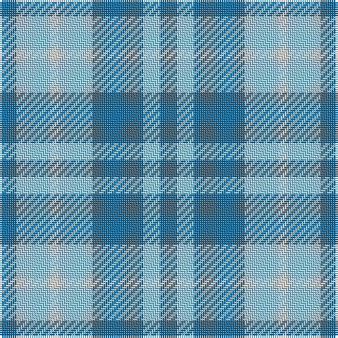

This page is one **sett** — a single exact thread-count. It belongs to the [tartan](/tartans/t2lb4w1lb4t6lb2t2/)
(the same proportion at any scale), whose colour order is pattern [BWBWWWB](/stripes/bwbwwwb/).

Sourced from tartans-authority.  It is a [7 stripe tartan](/stripes/stripes7/).

Original link http://www.tartansauthority.com/tartan-ferret/display/10103/

## Register references

External register numbers recorded for this tartan.

- Scottish Register of Tartans: [10103](https://www.tartanregister.gov.uk/tartanDetails?ref=10103)
- Scottish Tartans Authority (ITI): 10103

## Thread count
B/8 LB16 LN4 LB16 B24 LB8 B/8

## Palette

Palette: <strong>Tartan Register</strong> <small style="color:#888">(2 of 3 colours)</small>
<table><thead><tr><th>Colour</th><th>Threads</th><th>Shade</th><th>Base</th><th>OKLCh</th></tr></thead><tbody><tr><td>B/</td><td style="text-align:right;font-variant-numeric:tabular-nums">8</td><td><code style="background-color:#1C6894;">#1C6894</code> <small style="color:#888">#1C6894</small></td><td>B <code style="background-color:#2A418A;">#2A418A</code></td><td><small style="color:#888">oklch(49.4% 0.100 239.6)</small></td></tr><tr><td>LB</td><td style="text-align:right;font-variant-numeric:tabular-nums">16</td><td><code style="background-color:#98C8E8;">#98C8E8</code> <small style="color:#888">#98C8E8</small></td><td>W <code style="background-color:#F7F7F7;">#F7F7F7</code></td><td><small style="color:#888">oklch(81.0% 0.068 237.9)</small></td></tr><tr><td>LN</td><td style="text-align:right;font-variant-numeric:tabular-nums">4</td><td><code style="background-color:#E0E0E0;">#E0E0E0</code> <small style="color:#888">#E0E0E0</small></td><td>W <code style="background-color:#F7F7F7;">#F7F7F7</code></td><td><small style="color:#888">oklch(90.7% 0.000 89.9)</small></td></tr><tr><td>LB</td><td style="text-align:right;font-variant-numeric:tabular-nums">16</td><td><code style="background-color:#98C8E8;">#98C8E8</code> <small style="color:#888">#98C8E8</small></td><td>W <code style="background-color:#F7F7F7;">#F7F7F7</code></td><td><small style="color:#888">oklch(81.0% 0.068 237.9)</small></td></tr><tr><td>B</td><td style="text-align:right;font-variant-numeric:tabular-nums">24</td><td><code style="background-color:#1C6894;">#1C6894</code> <small style="color:#888">#1C6894</small></td><td>B <code style="background-color:#2A418A;">#2A418A</code></td><td><small style="color:#888">oklch(49.4% 0.100 239.6)</small></td></tr><tr><td>LB</td><td style="text-align:right;font-variant-numeric:tabular-nums">8</td><td><code style="background-color:#98C8E8;">#98C8E8</code> <small style="color:#888">#98C8E8</small></td><td>W <code style="background-color:#F7F7F7;">#F7F7F7</code></td><td><small style="color:#888">oklch(81.0% 0.068 237.9)</small></td></tr><tr><td>B/</td><td style="text-align:right;font-variant-numeric:tabular-nums">8</td><td><code style="background-color:#1C6894;">#1C6894</code> <small style="color:#888">#1C6894</small></td><td>B <code style="background-color:#2A418A;">#2A418A</code></td><td><small style="color:#888">oklch(49.4% 0.100 239.6)</small></td></tr></tbody></table>

# Sample pattern

## Nearest tartans

The nearest existing variants by ΔTartan distance, with this tartan at the top so the swatches line up against it.

ΔTartan

Tartan

Sett

—

<a href="/ttd/edit/#slug=t2lb4w1lb4t6lb2t2~x4">Langdons (Corporate)</a> <a class="nn-out" href="/setts/s7/t2lb4w1lb4t6lb2t2~x4/" title="open its dictionary page">↗</a>

1.38

<a href="/ttd/edit/#slug=db2t4w1t4db6t2db2~x4">Langdons</a> <a class="nn-out" href="/setts/s7/db2t4w1t4db6t2db2~x4/" title="open its dictionary page">↗</a>

1.84

<a href="/ttd/edit/#slug=db5t5w1t5db5t1~x4">Manx Cornaa (Personal)</a> <a class="nn-out" href="/setts/s6/db5t5w1t5db5t1~x4/" title="open its dictionary page">↗</a>

1.87

<a href="/ttd/edit/#slug=b4lb4b8o8b12lb12ly1~x2">von Prondzynski (2016)</a> <a class="nn-out" href="/setts/s7/b4lb4b8o8b12lb12ly1~x2/" title="open its dictionary page">↗</a>

1.88

<a href="/ttd/edit/#slug=lb40w25dt16lb8dt4~x2">Louise Beveridge (Personal)</a> <a class="nn-out" href="/setts/s5/lb40w25dt16lb8dt4~x2/" title="open its dictionary page">↗</a>

1.88

<a href="/ttd/edit/#slug=g6b1g7w1b7r1~x4">Norris (1957)</a> <a class="nn-out" href="/setts/s6/g6b1g7w1b7r1~x4/" title="open its dictionary page">↗</a>

1.99

<a href="/ttd/edit/#slug=b18w4b3lo12~x2">Genesee Community College</a> <a class="nn-out" href="/setts/s4/b18w4b3lo12~x2/" title="open its dictionary page">↗</a>

2.05

<a href="/ttd/edit/#slug=b3k1g4k1b4g9k2~x4">Outdoorsmen (Fashion)</a> <a class="nn-out" href="/setts/s7/b3k1g4k1b4g9k2~x4/" title="open its dictionary page">↗</a>

2.05

<a href="/ttd/edit/#slug=t6k3t10lo5t2lo2t2lo2t7w2~x2">Digital Corporate Tartan Tartan Number: 2140. Earliest known date: 1991 Designed in Company colours. See products available Copyright © Blair Urquhart, Comrie, 2015</a> <a class="nn-out" href="/setts/s10/t6k3t10lo5t2lo2t2lo2t7w2~x2/" title="open its dictionary page">↗</a>

2.06

<a href="/ttd/edit/#slug=t1db5t5w1~x4">Manx Cornaa (Personal)</a> <a class="nn-out" href="/setts/s4/t1db5t5w1~x4/" title="open its dictionary page">↗</a>

2.15

<a href="/ttd/edit/#slug=b1db5b5w1~x4">Manx, Cornaa</a> <a class="nn-out" href="/setts/s4/b1db5b5w1~x4/" title="open its dictionary page">↗</a>

## Neighbour map

Every grey dot is one of 14359 variants placed by the first two principal components of the ΔTartan feature space (44% of its variance). Red is this tartan; blue dots are its nearest — click one to open its page.

<svg viewBox="0 0 640 380" role="img" style="max-width:100%;height:auto;border:1px solid #e0e0e0;border-radius:4px;display:block" xmlns="http://www.w3.org/2000/svg"><image href="/nn/cloud.v1.png" width="640" height="380"/><a href="/setts/s7/db2t4w1t4db6t2db2~x4/"><circle cx="271.1" cy="291.0" r="4" fill="#3465a4"><title>Langdons</title></circle></a><a href="/setts/s6/db5t5w1t5db5t1~x4/"><circle cx="277.6" cy="305.7" r="4" fill="#3465a4"><title>Manx Cornaa (Personal)</title></circle></a><a href="/setts/s7/b4lb4b8o8b12lb12ly1~x2/"><circle cx="240.0" cy="225.3" r="4" fill="#3465a4"><title>von Prondzynski (2016)</title></circle></a><a href="/setts/s5/lb40w25dt16lb8dt4~x2/"><circle cx="261.2" cy="233.3" r="4" fill="#3465a4"><title>Louise Beveridge (Personal)</title></circle></a><a href="/setts/s6/g6b1g7w1b7r1~x4/"><circle cx="311.8" cy="250.5" r="4" fill="#3465a4"><title>Norris (1957)</title></circle></a><a href="/setts/s4/b18w4b3lo12~x2/"><circle cx="288.0" cy="268.7" r="4" fill="#3465a4"><title>Genesee Community College</title></circle></a><a href="/setts/s7/b3k1g4k1b4g9k2~x4/"><circle cx="298.0" cy="246.4" r="4" fill="#3465a4"><title>Outdoorsmen (Fashion)</title></circle></a><a href="/setts/s10/t6k3t10lo5t2lo2t2lo2t7w2~x2/"><circle cx="322.9" cy="248.7" r="4" fill="#3465a4"><title>Digital Corporate Tartan Tartan Number: 2140. Earliest known date: 1991 Designed in Company colours. See products available Copyright © Blair Urquhart, Comrie, 2015</title></circle></a><a href="/setts/s4/t1db5t5w1~x4/"><circle cx="278.1" cy="296.6" r="4" fill="#3465a4"><title>Manx Cornaa (Personal)</title></circle></a><a href="/setts/s4/b1db5b5w1~x4/"><circle cx="294.6" cy="296.4" r="4" fill="#3465a4"><title>Manx, Cornaa</title></circle></a><circle cx="259.0" cy="276.1" r="5" fill="#c00000"/></svg>

ID: /setts/s7/t2lb4w1lb4t6lb2t2~x4/
