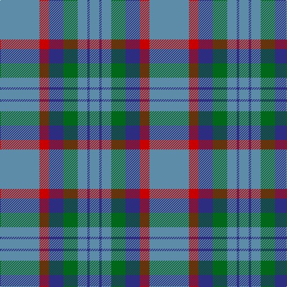

In pattern [BBBGBRB](/stripes/bbbgbrb/).

This was sourced from tartans-authority.  It is a [7 stripe tartan](/stripes/stripes7/).

Original link http://www.tartansauthority.com/tartan-ferret/display/696/

## Also known as

This cloth is also recorded under:

- Bermuda, Plaid

## Attestations

This cloth appears in 4 source records; the oldest owns this page.

- 1947 — Bermuda Plaid (1947) (District) (tartans-authority, [record](http://www.tartansauthority.com/tartan-ferret/display/696/))
- 01/01/1962 — Bermuda Plaid (1962) (register-of-tartans, [record](https://www.tartanregister.gov.uk/tartanDetails.aspx?ref=254))
- undated — Bermuda, Plaid (weddslist, [record](http://www.weddslist.com/cgi-bin/tartans/pg.pl?source=sts))
- undated — Bermuda Plaid District Tartan Tartan Number: 696. Earliest known date: 1962 The original Bermuda Plaid was designed by Peter Macarthur Limited of Hamilton, Scotland in 1962 and was marketed on the island by Trimmingham Bros., Ltd. The colours represent the Sky, the Sea, the Coral and the Cedar trees which grow on the island. Bermuda is a British Dependant Territory. (Source: District Tartans, P Smith and G Teall, 1992) See products available Copyright © Blair Urquhart, Comrie, 2015 (house-of-tartan, [record](http://www.house-of-tartan.scotland.net/house/TartanViewjs.asp?colr=Def&tnam=696))

## Register references

External register numbers recorded for this tartan.

- Scottish Register of Tartans: [254](https://www.tartanregister.gov.uk/tartanDetails.aspx?ref=254)
- Scottish Tartans Authority (ITI): 696
- Scottish Tartans World Register: 696

## Thread count
B/66 R16 DB24 G24 B16 DB4 B/16

## Palette
Each colour and the base-6 reference it is a variant of.

| Colour | Shade | Base |
|---|---|---|
| B | <code style="background-color:#5C8CA8;">#5C8CA8</code> `oklch(61.7% 0.067 235.0)` <small>#5C8CA8</small> | B <code style="background-color:#2A418A;">#2A418A</code> |
| DB | <code style="background-color:#2C2C80;">#2C2C80</code> `oklch(35.0% 0.138 276.6)` <small>#2C2C80</small> | B <code style="background-color:#2A418A;">#2A418A</code> |
| G | <code style="background-color:#006818;">#006818</code> `oklch(45.0% 0.142 145.0)` <small>#006818</small> | G <code style="background-color:#006100;">#006100</code> |
| R | <code style="background-color:#C80000;">#C80000</code> `oklch(52.3% 0.215 29.2)` <small>#C80000</small> | R <code style="background-color:#CC0000;">#CC0000</code> |

# Sample pattern

## Nearest tartans

The nearest existing variants by ΔTartan distance.

1. [Thorburn (Lochcarron)](/setts/s6/dt3t14dt3o16dt34r3~x2/) — ΔT 1.16
1. [Bedford Academy (Corporate)](/setts/s9/o8ly4o35db2t8db2o4db21o4~x2/) — ΔT 1.28
1. [MacHardy](/setts/s8/db3r3g18db16w2db26r3g3~x2/) — ΔT 1.31
1. [Kildare, County (District)](/setts/s8/y8do2y13r4y12db22y5o3~x2/) — ΔT 1.32
1. [Port Authority of NY & NJ](/setts/s6/t9db2t39dt33lo2dt5~x2/) — ΔT 1.37
1. [Cameron Hunting](/setts/s6/do15r5do30b32do4lo3~x2/) — ΔT 1.37
1. [Devlin, Craig (Personal)](/setts/s6/g8w3n6db11n30db5~x2/) — ΔT 1.43
1. [Mortell (Personal)](/setts/s10/n20t2w5r2n10t5n20t2w5r5~x2/) — ΔT 1.45
1. [Hector James](/setts/s5/r2g5db27g11o2~x2/) — ΔT 1.46
1. [Lockhart](/setts/s9/g13k2g34k6b16r2b16k2g13~x2/) — ΔT 1.46

## Neighbour map

Every grey dot is one of 14299 variants placed by the first two principal components of the ΔTartan feature space (44% of its variance). Red is this tartan; blue dots are its nearest — click one to open its page.

<svg viewBox="0 0 640 380" role="img" style="max-width:100%;height:auto;border:1px solid #e0e0e0;border-radius:4px;display:block" xmlns="http://www.w3.org/2000/svg"><image href="/nn/cloud.v1.png" width="640" height="380"/><a href="/setts/s6/dt3t14dt3o16dt34r3~x2/"><circle cx="333.0" cy="225.4" r="4" fill="#3465a4"><title>Thorburn (Lochcarron)</title></circle></a><a href="/setts/s9/o8ly4o35db2t8db2o4db21o4~x2/"><circle cx="357.7" cy="165.6" r="4" fill="#3465a4"><title>Bedford Academy (Corporate)</title></circle></a><a href="/setts/s8/db3r3g18db16w2db26r3g3~x2/"><circle cx="360.5" cy="198.1" r="4" fill="#3465a4"><title>MacHardy</title></circle></a><a href="/setts/s8/y8do2y13r4y12db22y5o3~x2/"><circle cx="302.8" cy="207.2" r="4" fill="#3465a4"><title>Kildare, County (District)</title></circle></a><a href="/setts/s6/t9db2t39dt33lo2dt5~x2/"><circle cx="381.6" cy="202.7" r="4" fill="#3465a4"><title>Port Authority of NY &amp; NJ</title></circle></a><a href="/setts/s6/do15r5do30b32do4lo3~x2/"><circle cx="349.0" cy="234.3" r="4" fill="#3465a4"><title>Cameron Hunting</title></circle></a><a href="/setts/s6/g8w3n6db11n30db5~x2/"><circle cx="357.6" cy="242.2" r="4" fill="#3465a4"><title>Devlin, Craig (Personal)</title></circle></a><a href="/setts/s10/n20t2w5r2n10t5n20t2w5r5~x2/"><circle cx="375.2" cy="203.0" r="4" fill="#3465a4"><title>Mortell (Personal)</title></circle></a><a href="/setts/s5/r2g5db27g11o2~x2/"><circle cx="379.1" cy="223.9" r="4" fill="#3465a4"><title>Hector James</title></circle></a><a href="/setts/s9/g13k2g34k6b16r2b16k2g13~x2/"><circle cx="373.9" cy="213.3" r="4" fill="#3465a4"><title>Lockhart</title></circle></a><circle cx="347.0" cy="210.5" r="5" fill="#c00000"/></svg>

ID: /setts/s7/t33r8db12g12t8db2t8~x2/
