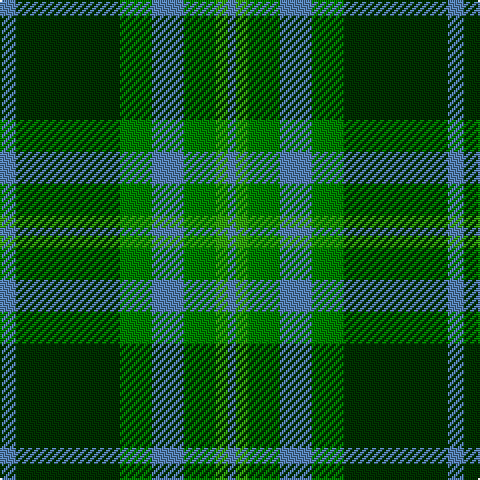

In pattern [BGGBGGB](/stripes/bggbggb/).

This was sourced from weddslist.  It is a [7 stripe tartan](/stripes/stripes7/).

Original link http://www.weddslist.com/cgi-bin/tartans/pg.pl?source=sts

## Also known as

This cloth is also recorded under:

- Valley, of the Green.

## Attestations

This cloth appears in 2 source records; the oldest owns this page.

- undated — Valley, of the Green. (The ) (weddslist, [record](http://www.weddslist.com/cgi-bin/tartans/pg.pl?source=sts))
- undated — Valley of the Green (The ) Canadian Tartan Tartan Number: 148. Earliest known date: 1968 Specimen from Miss K Sinclair 1968 See products available Copyright © Blair Urquhart, Comrie, 2015 (house-of-tartan, [record](http://www.house-of-tartan.scotland.net/house/TartanViewjs.asp?colr=Def&tnam=148))

## Thread count
B/8 DG52 Ga16 B16 Ga16 G6 B/4

## Palette
Each colour and the base-6 reference it is a variant of.

| Colour | Shade | Base |
|---|---|---|
| B | <code style="background-color:#5480B0;">#5480B0</code> `oklch(58.8% 0.089 251.5)` <small>#5480B0</small> | B <code style="background-color:#2A418A;">#2A418A</code> |
| DG | <code style="background-color:#003000;">#003000</code> `oklch(26.8% 0.091 142.5)` <small>#003000</small> | G <code style="background-color:#006100;">#006100</code> |
| G | <code style="background-color:#30A010;">#30A010</code> `oklch(61.9% 0.195 140.5)` <small>#30A010</small> | G <code style="background-color:#006100;">#006100</code> |
| Ga | <code style="background-color:#008000;">#008000</code> `oklch(52.0% 0.177 142.5)` <small>#008000</small> | G <code style="background-color:#006100;">#006100</code> |

# Sample pattern

## Nearest tartans

The nearest existing variants by ΔTartan distance.

1. [Ayrton 1979 No. 2 (Personal)](/setts/s8/b5k1g3k1b3k1g10r3~x2/) — ΔT 1.09
1. [Wcwm 1716](/setts/s6/g6ly3g26dg10dt30lb3~x2/) — ΔT 1.18
1. [John Telfar, Dunbar hunting](/setts/s7/g5k2g28k10o26db4g4~x2/) — ΔT 1.20
1. [New Mexico](/setts/s7/g10db42r5dg42g42ly5g10/) — ΔT 1.26
1. [MacSween Hunting (Lochs, Isle of Lew](/setts/s7/g3r3g31dg18g4k22ly3/) — ΔT 1.27
1. [Dalbraith-Eastern Western Motor Group](/setts/s8/o28g2o4db18g23db2g3o4~x2/) — ΔT 1.30
1. [Dunedin Chapter (Corporate)](/setts/s10/t39g3t3g20k3g20k3g3k20r3~x2/) — ΔT 1.30
1. [Manor (Corporate)](/setts/s8/dg14k1dg2k1dg2k10g14lp2/) — ΔT 1.32
1. [Cork](/setts/s9/g28r12g4db20ly2db3ly2db3g7~x2/) — ΔT 1.36
1. [Abercrombie](/setts/s9/g14w1g7k7db2k2db2k2db7~x4/) — ΔT 1.36

## Neighbour map

Every grey dot is one of 14299 variants placed by the first two principal components of the ΔTartan feature space (44% of its variance). Red is this tartan; blue dots are its nearest — click one to open its page.

<svg viewBox="0 0 640 380" role="img" style="max-width:100%;height:auto;border:1px solid #e0e0e0;border-radius:4px;display:block" xmlns="http://www.w3.org/2000/svg"><image href="/nn/cloud.v1.png" width="640" height="380"/><a href="/setts/s8/b5k1g3k1b3k1g10r3~x2/"><circle cx="258.6" cy="214.9" r="4" fill="#3465a4"><title>Ayrton 1979 No. 2 (Personal)</title></circle></a><a href="/setts/s6/g6ly3g26dg10dt30lb3~x2/"><circle cx="216.4" cy="211.9" r="4" fill="#3465a4"><title>Wcwm 1716</title></circle></a><a href="/setts/s7/g5k2g28k10o26db4g4~x2/"><circle cx="253.5" cy="190.9" r="4" fill="#3465a4"><title>John Telfar, Dunbar hunting</title></circle></a><a href="/setts/s7/g10db42r5dg42g42ly5g10/"><circle cx="187.9" cy="218.1" r="4" fill="#3465a4"><title>New Mexico</title></circle></a><a href="/setts/s7/g3r3g31dg18g4k22ly3/"><circle cx="240.1" cy="207.8" r="4" fill="#3465a4"><title>MacSween Hunting (Lochs, Isle of Lew</title></circle></a><a href="/setts/s8/o28g2o4db18g23db2g3o4~x2/"><circle cx="231.6" cy="188.1" r="4" fill="#3465a4"><title>Dalbraith-Eastern Western Motor Group</title></circle></a><a href="/setts/s10/t39g3t3g20k3g20k3g3k20r3~x2/"><circle cx="231.5" cy="176.8" r="4" fill="#3465a4"><title>Dunedin Chapter (Corporate)</title></circle></a><a href="/setts/s8/dg14k1dg2k1dg2k10g14lp2/"><circle cx="257.6" cy="209.2" r="4" fill="#3465a4"><title>Manor (Corporate)</title></circle></a><a href="/setts/s9/g28r12g4db20ly2db3ly2db3g7~x2/"><circle cx="274.5" cy="177.8" r="4" fill="#3465a4"><title>Cork</title></circle></a><a href="/setts/s9/g14w1g7k7db2k2db2k2db7~x4/"><circle cx="266.8" cy="203.1" r="4" fill="#3465a4"><title>Abercrombie</title></circle></a><circle cx="252.8" cy="210.6" r="5" fill="#c00000"/></svg>

ID: /setts/s7/t4dg26g8t8g8g3t2~x2/
