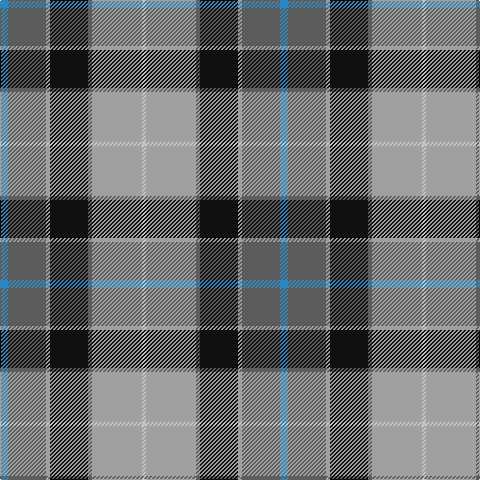

**Bands:** [BBYKBYW](/stripes/bbykbyw/) · **Stripes:** [T N LR K N LR LB](/stripes/stripes7/) T N LR K N LR LB

This was sourced from register-of-tartans.  It is a [7 band tartan](/bands/bands7/).

Original link https://www.tartanregister.gov.uk/tartanDetails.aspx?ref=11424

## Register references

External register numbers recorded for this tartan.

- Scottish Register of Tartans: [11424](https://www.tartanregister.gov.uk/tartanDetails.aspx?ref=11424)

## Thread count
B/8 N38 Na4 K38 N4 Na50 Nb/4

## Palette
Each colour and its ΔE from the base-6 reference it is a variant of.

| Colour | Shade | Base | ΔE (OKLab) |
|---|---|---|---|
| B | <code style="background-color:#2888C4;">#2888C4</code> `#2888C4` | B <code style="background-color:#2A418A;">#2A418A</code> | 0.21 |
| K | <code style="background-color:#101010;">#101010</code> `#101010` | K <code style="background-color:#000000;">#000000</code> | 0.17 |
| N | <code style="background-color:#5C5C5C;">#5C5C5C</code> `#5C5C5C` | B <code style="background-color:#2A418A;">#2A418A</code> | 0.15 |
| Na | <code style="background-color:#A0A0A0;">#A0A0A0</code> `#A0A0A0` | Y <code style="background-color:#F2BF00;">#F2BF00</code> | 0.21 |
| Nb | <code style="background-color:#C4C4C4;">#C4C4C4</code> `#C4C4C4` | W <code style="background-color:#F7F7F7;">#F7F7F7</code> | 0.16 |

# Sample pattern

## Nearest tartans

The nearest existing variants by ΔTartan distance.

1. [Ogilvie Hunting Clan/Family Tartan Tartan Number: 6082. Earliest known date: pre 2000 Samples in STA Dalgety Collection labelled "Restricted, Hunting Ogilvie, Family Only". However, the major weavers have this in their swatch books so the restriction mentioned above seems to have been lifted at some stage. See products available Copyright © Blair Urquhart, Comrie, 2015](/setts/s8/t30ly3t4k25y26k3y3r4~x2/) — ΔT 0.62
1. [Afternoon Tea / Darjeeling](/setts/s6/ly15db8r25db72y98w15/) — ΔT 0.70
1. [Commonwealth Games Council (Corp.)](/setts/s6/m3k17n11m2o20w2~x2/) — ΔT 0.76
1. [Afternoon Tea / Black Tea](/setts/s6/m15dt8y25dt72n98w15/) — ΔT 0.79
1. [Heart of the Highlands](/setts/s9/lr18k3lr4w3lr4k19n20k2m4~x2/) — ΔT 0.85
1. [Ballantyne (Personal) STWR](/setts/s8/db34dy9ly3dy9y30r3y11r5/) — ΔT 0.90
1. [de Franck, Matt (Personal)](/setts/s9/n12k2n2k2n2k12lp12t3w1~x2/) — ΔT 0.90
1. [Royal College of Surgeons of Edinburgh, The](/setts/s9/t4n16k2n2k2n2k13o20w4~x2/) — ΔT 0.91
1. [Heart of the Highlands](/setts/s9/o18k3o4lb3o4k18n20k2m4~x2/) — ΔT 0.92
1. [State Seal of Washington (Fashion)](/setts/s7/b5dy28lb5k20lo5b47lo4~x2/) — ΔT 0.95

## Neighbour map

Every grey dot is one of 14313 variants placed by the first two principal components of the ΔTartan feature space (44% of its variance). Red is this tartan; blue dots are its nearest — click one to open its page.

<svg viewBox="0 0 640 380" role="img" style="max-width:100%;height:auto;border:1px solid #e0e0e0;border-radius:4px;display:block" xmlns="http://www.w3.org/2000/svg"><image href="/nn/cloud.v1.png" width="640" height="380"/><a href="/setts/s8/t30ly3t4k25y26k3y3r4~x2/"><circle cx="159.1" cy="169.1" r="4" fill="#3465a4"><title>Ogilvie Hunting Clan/Family Tartan Tartan Number: 6082. Earliest known date: pre 2000 Samples in STA Dalgety Collection labelled &quot;Restricted, Hunting Ogilvie, Family Only&quot;. However, the major weavers have this in their swatch books so the restriction mentioned above seems to have been lifted at some stage. See products available Copyright © Blair Urquhart, Comrie, 2015</title></circle></a><a href="/setts/s6/ly15db8r25db72y98w15/"><circle cx="203.2" cy="180.3" r="4" fill="#3465a4"><title>Afternoon Tea / Darjeeling</title></circle></a><a href="/setts/s6/m3k17n11m2o20w2~x2/"><circle cx="160.1" cy="191.2" r="4" fill="#3465a4"><title>Commonwealth Games Council (Corp.)</title></circle></a><a href="/setts/s6/m15dt8y25dt72n98w15/"><circle cx="211.7" cy="182.8" r="4" fill="#3465a4"><title>Afternoon Tea / Black Tea</title></circle></a><a href="/setts/s9/lr18k3lr4w3lr4k19n20k2m4~x2/"><circle cx="141.8" cy="163.1" r="4" fill="#3465a4"><title>Heart of the Highlands</title></circle></a><a href="/setts/s8/db34dy9ly3dy9y30r3y11r5/"><circle cx="187.1" cy="174.1" r="4" fill="#3465a4"><title>Ballantyne (Personal) STWR</title></circle></a><a href="/setts/s9/n12k2n2k2n2k12lp12t3w1~x2/"><circle cx="150.3" cy="155.7" r="4" fill="#3465a4"><title>de Franck, Matt (Personal)</title></circle></a><a href="/setts/s9/t4n16k2n2k2n2k13o20w4~x2/"><circle cx="133.9" cy="165.0" r="4" fill="#3465a4"><title>Royal College of Surgeons of Edinburgh, The</title></circle></a><a href="/setts/s9/o18k3o4lb3o4k18n20k2m4~x2/"><circle cx="161.2" cy="174.2" r="4" fill="#3465a4"><title>Heart of the Highlands</title></circle></a><a href="/setts/s7/b5dy28lb5k20lo5b47lo4~x2/"><circle cx="219.1" cy="176.9" r="4" fill="#3465a4"><title>State Seal of Washington (Fashion)</title></circle></a><circle cx="175.7" cy="167.6" r="5" fill="#c00000"/></svg>

ID: /setts/s7/t4n19lr2k19n2lr25lb2~x2/
