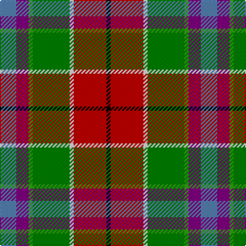

This page is one **sett** — a single exact thread-count. It belongs to the [tartan](/tartans/t4p3gi1g9w1r8k1/)
(the same proportion at any scale), whose colour order is pattern [BBGGWRK](/stripes/bbggwrk/).

Sourced from weddslist.  It is a [7 stripe tartan](/stripes/stripes7/).

Original link http://www.weddslist.com/cgi-bin/tartans/pg.pl?source=sts

## Thread count
B/16 P12 G4 Ga36 LN4 R32 K/4

## Palette

Palette: <strong>Tartan Register</strong> <small style="color:#888">(2 of 7 colours)</small>
<table><thead><tr><th>Colour</th><th>Threads</th><th>Shade</th><th>Base</th><th>OKLCh</th></tr></thead><tbody><tr><td>B/</td><td style="text-align:right;font-variant-numeric:tabular-nums">16</td><td><code style="background-color:#5480B0;">#5480B0</code> <small style="color:#888">#5480B0</small></td><td>B <code style="background-color:#2A418A;">#2A418A</code></td><td><small style="color:#888">oklch(58.8% 0.089 251.5)</small></td></tr><tr><td>P</td><td style="text-align:right;font-variant-numeric:tabular-nums">12</td><td><code style="background-color:#800080;">#800080</code> <small style="color:#888">#800080</small></td><td>B <code style="background-color:#2A418A;">#2A418A</code></td><td><small style="color:#888">oklch(42.1% 0.193 328.4)</small></td></tr><tr><td>G</td><td style="text-align:right;font-variant-numeric:tabular-nums">4</td><td><code style="background-color:#30A010;">#30A010</code> <small style="color:#888">#30A010</small></td><td>G <code style="background-color:#006100;">#006100</code></td><td><small style="color:#888">oklch(61.9% 0.195 140.5)</small></td></tr><tr><td>Ga</td><td style="text-align:right;font-variant-numeric:tabular-nums">36</td><td><code style="background-color:#008000;">#008000</code> <small style="color:#888">#008000</small></td><td>G <code style="background-color:#006100;">#006100</code></td><td><small style="color:#888">oklch(52.0% 0.177 142.5)</small></td></tr><tr><td>LN</td><td style="text-align:right;font-variant-numeric:tabular-nums">4</td><td><code style="background-color:#E0E0E0;">#E0E0E0</code> <small style="color:#888">#E0E0E0</small></td><td>W <code style="background-color:#F7F7F7;">#F7F7F7</code></td><td><small style="color:#888">oklch(90.7% 0.000 89.9)</small></td></tr><tr><td>R</td><td style="text-align:right;font-variant-numeric:tabular-nums">32</td><td><code style="background-color:#C00000;">#C00000</code> <small style="color:#888">#C00000</small></td><td>R <code style="background-color:#CC0000;">#CC0000</code></td><td><small style="color:#888">oklch(50.7% 0.208 29.2)</small></td></tr><tr><td>K/</td><td style="text-align:right;font-variant-numeric:tabular-nums">4</td><td><code style="background-color:#000000;">#000000</code> <small style="color:#888">#000000</small></td><td>K <code style="background-color:#000000;">#000000</code></td><td><small style="color:#888">oklch(0.0% 0.000 0.0)</small></td></tr></tbody></table>

# Sample pattern

## Nearest tartans

The nearest existing variants by ΔTartan distance, with this tartan at the top so the swatches line up against it.

ΔTartan

Tartan

Sett

—

<a href="/ttd/edit/#slug=t4p3gi1g9w1r8k1~x4">Wilson's, No 121</a> <a class="nn-out" href="/setts/s7/t4p3gi1g9w1r8k1~x4/" title="open its dictionary page">↗</a>

0.68

<a href="/ttd/edit/#slug=k3r18w2g21gi2p7t5w2~x2">Wilson's, No 132</a> <a class="nn-out" href="/setts/s8/k3r18w2g21gi2p7t5w2~x2/" title="open its dictionary page">↗</a>

0.89

<a href="/ttd/edit/#slug=t3p10w3k3g19r14t3k2ly3~x2">Wilson's, No 110</a> <a class="nn-out" href="/setts/s9/t3p10w3k3g19r14t3k2ly3~x2/" title="open its dictionary page">↗</a>

1.01

<a href="/ttd/edit/#slug=w3r10dy6ly8t8dg32ri8r10ri6w3~x4">Unidentified Silk scarf</a> <a class="nn-out" href="/setts/s10/w3r10dy6ly8t8dg32ri8r10ri6w3~x4/" title="open its dictionary page">↗</a>

1.04

<a href="/ttd/edit/#slug=w6gi10r22db16g2g4g5~x2">Nicolson of Taransay (Personal)</a> <a class="nn-out" href="/setts/s7/w6gi10r22db16g2g4g5~x2/" title="open its dictionary page">↗</a>

1.05

<a href="/ttd/edit/#slug=k20lo4r4lo20y20lb5y2g2~x2">Hackett Hunting (Personal)</a> <a class="nn-out" href="/setts/s8/k20lo4r4lo20y20lb5y2g2~x2/" title="open its dictionary page">↗</a>

1.07

<a href="/ttd/edit/#slug=r10n3db1lb8db1lo2g5~x4">Porcupine City of</a> <a class="nn-out" href="/setts/s7/r10n3db1lb8db1lo2g5~x4/" title="open its dictionary page">↗</a>

1.07

<a href="/ttd/edit/#slug=t4dy27lr8k4lr8k4lr8r11ly3~x2">Brittany Hunting French Fancy Tartan Tartan Number: 5977. Earliest known date: 2003 For Richard and Anne-Marie Duclos of Le Coudray-Montceaux, France. Based on the Breton National at 3902. The term Randonnée (Walking) is used in the sense of the Scottish category, Hunting. See products available Copyright © Blair Urquhart, Comrie, 2015</a> <a class="nn-out" href="/setts/s9/t4dy27lr8k4lr8k4lr8r11ly3~x2/" title="open its dictionary page">↗</a>

1.08

<a href="/ttd/edit/#slug=r22t6db10ly4r4w4g22db8ly3">Unnamed No 14</a> <a class="nn-out" href="/setts/s9/r22t6db10ly4r4w4g22db8ly3/" title="open its dictionary page">↗</a>

1.13

<a href="/ttd/edit/#slug=k7r22t9dp20lb2g28ly7~x2">Jefferson (Personal)</a> <a class="nn-out" href="/setts/s7/k7r22t9dp20lb2g28ly7~x2/" title="open its dictionary page">↗</a>

1.17

<a href="/ttd/edit/#slug=r22t6db10ly4r4w4dg22db8ly3">Unidentified No 14</a> <a class="nn-out" href="/setts/s9/r22t6db10ly4r4w4dg22db8ly3/" title="open its dictionary page">↗</a>

## Neighbour map

Every grey dot is one of 14359 variants placed by the first two principal components of the ΔTartan feature space (44% of its variance). Red is this tartan; blue dots are its nearest — click one to open its page.

<svg viewBox="0 0 640 380" role="img" style="max-width:100%;height:auto;border:1px solid #e0e0e0;border-radius:4px;display:block" xmlns="http://www.w3.org/2000/svg"><image href="/nn/cloud.v1.png" width="640" height="380"/><a href="/setts/s8/k3r18w2g21gi2p7t5w2~x2/"><circle cx="109.7" cy="124.0" r="4" fill="#3465a4"><title>Wilson's, No 132</title></circle></a><a href="/setts/s9/t3p10w3k3g19r14t3k2ly3~x2/"><circle cx="66.0" cy="124.1" r="4" fill="#3465a4"><title>Wilson's, No 110</title></circle></a><a href="/setts/s10/w3r10dy6ly8t8dg32ri8r10ri6w3~x4/"><circle cx="92.4" cy="124.0" r="4" fill="#3465a4"><title>Unidentified Silk scarf</title></circle></a><a href="/setts/s7/w6gi10r22db16g2g4g5~x2/"><circle cx="105.1" cy="162.2" r="4" fill="#3465a4"><title>Nicolson of Taransay (Personal)</title></circle></a><a href="/setts/s8/k20lo4r4lo20y20lb5y2g2~x2/"><circle cx="117.2" cy="160.0" r="4" fill="#3465a4"><title>Hackett Hunting (Personal)</title></circle></a><a href="/setts/s7/r10n3db1lb8db1lo2g5~x4/"><circle cx="115.9" cy="164.2" r="4" fill="#3465a4"><title>Porcupine City of</title></circle></a><a href="/setts/s9/t4dy27lr8k4lr8k4lr8r11ly3~x2/"><circle cx="118.8" cy="151.3" r="4" fill="#3465a4"><title>Brittany Hunting French Fancy Tartan Tartan Number: 5977. Earliest known date: 2003 For Richard and Anne-Marie Duclos of Le Coudray-Montceaux, France. Based on the Breton National at 3902. The term Randonnée (Walking) is used in the sense of the Scottish category, Hunting. See products available Copyright © Blair Urquhart, Comrie, 2015</title></circle></a><a href="/setts/s9/r22t6db10ly4r4w4g22db8ly3/"><circle cx="89.1" cy="164.6" r="4" fill="#3465a4"><title>Unnamed No 14</title></circle></a><a href="/setts/s7/k7r22t9dp20lb2g28ly7~x2/"><circle cx="74.3" cy="148.9" r="4" fill="#3465a4"><title>Jefferson (Personal)</title></circle></a><a href="/setts/s9/r22t6db10ly4r4w4dg22db8ly3/"><circle cx="87.3" cy="162.3" r="4" fill="#3465a4"><title>Unidentified No 14</title></circle></a><circle cx="96.9" cy="150.9" r="5" fill="#c00000"/></svg>

ID: /setts/s7/t4p3gi1g9w1r8k1~x4/
