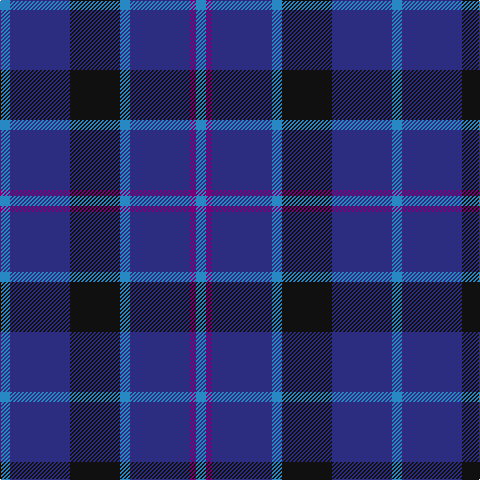

In pattern [BBBBKBB](/stripes/bbbbkbb/).

This was sourced from house-of-tartan.  It is a [7 stripe tartan](/stripes/stripes7/).

Original link http://www.house-of-tartan.scotland.net/house/TartanViewjs.asp?colr=Def&tnam=6717

## Thread count
B/10 DB60 K50 B10 DB60 P6 B/10

## Palette
Each colour and its ΔE from the base-6 reference it is a variant of.

| Colour | Shade | Base | ΔE (OKLab) |
|---|---|---|---|
| B | <code style="background-color:#2888C4;">#2888C4</code> `#2888C4` | B <code style="background-color:#2A418A;">#2A418A</code> | 0.21 |
| DB | <code style="background-color:#2C2C80;">#2C2C80</code> `#2C2C80` | B <code style="background-color:#2A418A;">#2A418A</code> | 0.06 |
| K | <code style="background-color:#101010;">#101010</code> `#101010` | K <code style="background-color:#000000;">#000000</code> | 0.17 |
| P | <code style="background-color:#780078;">#780078</code> `#780078` | B <code style="background-color:#2A418A;">#2A418A</code> | 0.17 |

# Sample pattern

## Nearest tartans

The nearest existing variants by ΔTartan distance.

1. [Van Loo (Personal)](/setts/s7/t5db30k25t5db30dp2t5~x2/) — ΔT 0.62
1. [Daks, Muted blue](/setts/s8/o5db12db4o4db22db3db4o5/) — ΔT 1.10
1. [Scottish Nuclear](/setts/s6/db9k4lb1k4db9r1~x4/) — ΔT 1.15
1. [Jethart](/setts/s9/k22db16r3db16k3db16g3db3b5~x2/) — ΔT 1.32
1. [Morgan (MacKay Blue) Clan Tartan Tartan Number: 264. Earliest known date: 1842 The design comes from the Vestiarium Scoticum (1842). The authors, the Sobieski Stuart brothers, enjoyed a popular following among the Scottish gentry in the early Victorian era, and in the spirit of the times, added mystery, romance and some spurious historical documentation to the subject of tartan. Of the better known tartans, the book offers some minor variation, but in other cases it provides the only recorded version of many tartans in use today. See products available Copyright © Blair Urquhart, Comrie, 2015](/setts/s6/db1k3db1k3db8r1~x4/) — ΔT 1.37
1. [Royal Scotsman Train (Corporate)](/setts/s6/db5k2db14k14db2lr2~x2/) — ΔT 1.38
1. [Oban](/setts/s8/k6db10k10b1k1b1k10b6~x4/) — ΔT 1.41
1. [Auckland (Fashion)](/setts/s8/dg3k3db2k16db2k2db24lb2~x2/) — ΔT 1.44
1. [Open Championship, The](/setts/s5/dg1db2db5db11ly1~x4/) — ΔT 1.45
1. [Mercer, Charles](/setts/s8/db9b2db2ly1b7db2r1b4~x4/) — ΔT 1.46

## Neighbour map

Every grey dot is one of 14299 variants placed by the first two principal components of the ΔTartan feature space (44% of its variance). Red is this tartan; blue dots are its nearest — click one to open its page.

<svg viewBox="0 0 640 380" role="img" style="max-width:100%;height:auto;border:1px solid #e0e0e0;border-radius:4px;display:block" xmlns="http://www.w3.org/2000/svg"><image href="/nn/cloud.v1.png" width="640" height="380"/><a href="/setts/s7/t5db30k25t5db30dp2t5~x2/"><circle cx="370.0" cy="224.9" r="4" fill="#3465a4"><title>Van Loo (Personal)</title></circle></a><a href="/setts/s8/o5db12db4o4db22db3db4o5/"><circle cx="281.0" cy="238.9" r="4" fill="#3465a4"><title>Daks, Muted blue</title></circle></a><a href="/setts/s6/db9k4lb1k4db9r1~x4/"><circle cx="382.3" cy="257.2" r="4" fill="#3465a4"><title>Scottish Nuclear</title></circle></a><a href="/setts/s9/k22db16r3db16k3db16g3db3b5~x2/"><circle cx="297.2" cy="221.6" r="4" fill="#3465a4"><title>Jethart</title></circle></a><a href="/setts/s6/db1k3db1k3db8r1~x4/"><circle cx="404.3" cy="271.9" r="4" fill="#3465a4"><title>Morgan (MacKay Blue) Clan Tartan Tartan Number: 264. Earliest known date: 1842 The design comes from the Vestiarium Scoticum (1842). The authors, the Sobieski Stuart brothers, enjoyed a popular following among the Scottish gentry in the early Victorian era, and in the spirit of the times, added mystery, romance and some spurious historical documentation to the subject of tartan. Of the better known tartans, the book offers some minor variation, but in other cases it provides the only recorded version of many tartans in use today. See products available Copyright © Blair Urquhart, Comrie, 2015</title></circle></a><a href="/setts/s6/db5k2db14k14db2lr2~x2/"><circle cx="353.1" cy="270.6" r="4" fill="#3465a4"><title>Royal Scotsman Train (Corporate)</title></circle></a><a href="/setts/s8/k6db10k10b1k1b1k10b6~x4/"><circle cx="367.7" cy="263.7" r="4" fill="#3465a4"><title>Oban</title></circle></a><a href="/setts/s8/dg3k3db2k16db2k2db24lb2~x2/"><circle cx="362.1" cy="205.0" r="4" fill="#3465a4"><title>Auckland (Fashion)</title></circle></a><a href="/setts/s5/dg1db2db5db11ly1~x4/"><circle cx="424.4" cy="248.8" r="4" fill="#3465a4"><title>Open Championship, The</title></circle></a><a href="/setts/s8/db9b2db2ly1b7db2r1b4~x4/"><circle cx="305.8" cy="237.8" r="4" fill="#3465a4"><title>Mercer, Charles</title></circle></a><circle cx="349.2" cy="240.3" r="5" fill="#c00000"/></svg>

ID: /setts/s7/t5db30k25t5db30dp3t5~x2/
