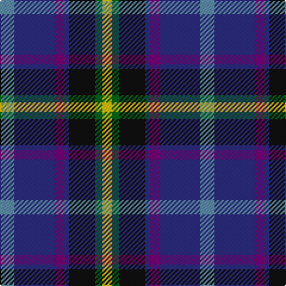

This page is one **sett** — a single exact thread-count. It belongs to the [tartan](/tartans/t6db17dp4db2k11g3ly4/)
(the same proportion at any scale), whose colour order is pattern [BBBBKGY](/stripes/bbbbkgy/).

Sourced from register-of-tartans.  It is a [7 stripe tartan](/stripes/stripes7/).

Original link https://www.tartanregister.gov.uk/tartanDetails.aspx?ref=1068

## Register references

External register numbers recorded for this tartan.

- Scottish Register of Tartans: [1068](https://www.tartanregister.gov.uk/tartanDetails.aspx?ref=1068)
- Scottish Tartans World Register: 2561

## Thread count
B/12 DB34 P8 DB4 K22 G6 Y/8

## Palette

Palette: <strong>Tartan Register</strong>
<table><thead><tr><th>Colour</th><th>Threads</th><th>Shade</th><th>Base</th><th>OKLCh</th></tr></thead><tbody><tr><td>B/</td><td style="text-align:right;font-variant-numeric:tabular-nums">12</td><td><code style="background-color:#5C8CA8;">#5C8CA8</code> <small style="color:#888">#5C8CA8</small></td><td>B <code style="background-color:#2A418A;">#2A418A</code></td><td><small style="color:#888">oklch(61.7% 0.067 235.0)</small></td></tr><tr><td>DB</td><td style="text-align:right;font-variant-numeric:tabular-nums">34</td><td><code style="background-color:#2C2C80;">#2C2C80</code> <small style="color:#888">#2C2C80</small></td><td>B <code style="background-color:#2A418A;">#2A418A</code></td><td><small style="color:#888">oklch(35.0% 0.138 276.6)</small></td></tr><tr><td>P</td><td style="text-align:right;font-variant-numeric:tabular-nums">8</td><td><code style="background-color:#780078;">#780078</code> <small style="color:#888">#780078</small></td><td>B <code style="background-color:#2A418A;">#2A418A</code></td><td><small style="color:#888">oklch(40.2% 0.185 328.4)</small></td></tr><tr><td>DB</td><td style="text-align:right;font-variant-numeric:tabular-nums">4</td><td><code style="background-color:#2C2C80;">#2C2C80</code> <small style="color:#888">#2C2C80</small></td><td>B <code style="background-color:#2A418A;">#2A418A</code></td><td><small style="color:#888">oklch(35.0% 0.138 276.6)</small></td></tr><tr><td>K</td><td style="text-align:right;font-variant-numeric:tabular-nums">22</td><td><code style="background-color:#101010;">#101010</code> <small style="color:#888">#101010</small></td><td>K <code style="background-color:#000000;">#000000</code></td><td><small style="color:#888">oklch(17.3% 0.000 89.9)</small></td></tr><tr><td>G</td><td style="text-align:right;font-variant-numeric:tabular-nums">6</td><td><code style="background-color:#006818;">#006818</code> <small style="color:#888">#006818</small></td><td>G <code style="background-color:#006100;">#006100</code></td><td><small style="color:#888">oklch(45.0% 0.142 145.0)</small></td></tr><tr><td>Y/</td><td style="text-align:right;font-variant-numeric:tabular-nums">8</td><td><code style="background-color:#E8C000;">#E8C000</code> <small style="color:#888">#E8C000</small></td><td>Y <code style="background-color:#F2BF00;">#F2BF00</code></td><td><small style="color:#888">oklch(81.9% 0.168 93.7)</small></td></tr></tbody></table>

# Sample pattern

## Nearest tartans

The nearest existing variants by ΔTartan distance, with this tartan at the top so the swatches line up against it.

ΔTartan

Tartan

Sett

—

<a href="/ttd/edit/#slug=t6db17dp4db2k11g3ly4~x2">East Lothian</a> <a class="nn-out" href="/setts/s7/t6db17dp4db2k11g3ly4~x2/" title="open its dictionary page">↗</a>

0.61

<a href="/ttd/edit/#slug=m4db2t7db20k7g10ly4~x2">Renfrewshire District Tartan Tartan Number: 2560. Earliest known date: 1998 Designed for anyone residing in the County of Renfrewshire See products available Copyright © Blair Urquhart, Comrie, 2015</a> <a class="nn-out" href="/setts/s7/m4db2t7db20k7g10ly4~x2/" title="open its dictionary page">↗</a>

0.85

<a href="/ttd/edit/#slug=dp4db2t8db25k8g13ly4~x2">Renfrewshire</a> <a class="nn-out" href="/setts/s7/dp4db2t8db25k8g13ly4~x2/" title="open its dictionary page">↗</a>

0.96

<a href="/ttd/edit/#slug=w8db5db30lr4db13lr13g5lo5~x2">Waterford County Crest (Fashion)</a> <a class="nn-out" href="/setts/s8/w8db5db30lr4db13lr13g5lo5~x2/" title="open its dictionary page">↗</a>

0.99

<a href="/ttd/edit/#slug=ly5db24k8db18ly6dy3">Cala Homes (Corporate)</a> <a class="nn-out" href="/setts/s6/ly5db24k8db18ly6dy3/" title="open its dictionary page">↗</a>

1.04

<a href="/ttd/edit/#slug=k37r4db30n7k10w5n10y7~x2">Yates</a> <a class="nn-out" href="/setts/s8/k37r4db30n7k10w5n10y7~x2/" title="open its dictionary page">↗</a>

1.05

<a href="/ttd/edit/#slug=p4db2t8db25k8g13ly4~x2">Renfrewshire Tartan</a> <a class="nn-out" href="/setts/s7/p4db2t8db25k8g13ly4~x2/" title="open its dictionary page">↗</a>

1.06

<a href="/ttd/edit/#slug=dp2g4k8lo1k1db4lb1db1lb2~x8">Scottish Cultural Society (Corporate</a> <a class="nn-out" href="/setts/s9/dp2g4k8lo1k1db4lb1db1lb2~x8/" title="open its dictionary page">↗</a>

1.07

<a href="/ttd/edit/#slug=k29r3dt24n6k8w4n8o6~x2">Yates (Personal)</a> <a class="nn-out" href="/setts/s8/k29r3dt24n6k8w4n8o6~x2/" title="open its dictionary page">↗</a>

1.08

<a href="/ttd/edit/#slug=g4t2g9k4g2r6db12w2~x2">Cherokee</a> <a class="nn-out" href="/setts/s8/g4t2g9k4g2r6db12w2~x2/" title="open its dictionary page">↗</a>

1.12

<a href="/ttd/edit/#slug=t26db13k13w2g8k5r3t3~x2">Moran (Coilessan) (Personal)</a> <a class="nn-out" href="/setts/s8/t26db13k13w2g8k5r3t3~x2/" title="open its dictionary page">↗</a>

## Neighbour map

Every grey dot is one of 14299 variants placed by the first two principal components of the ΔTartan feature space (44% of its variance). Red is this tartan; blue dots are its nearest — click one to open its page.

<svg viewBox="0 0 640 380" role="img" style="max-width:100%;height:auto;border:1px solid #e0e0e0;border-radius:4px;display:block" xmlns="http://www.w3.org/2000/svg"><image href="/nn/cloud.v1.png" width="640" height="380"/><a href="/setts/s7/m4db2t7db20k7g10ly4~x2/"><circle cx="139.2" cy="183.8" r="4" fill="#3465a4"><title>Renfrewshire District Tartan Tartan Number: 2560. Earliest known date: 1998 Designed for anyone residing in the County of Renfrewshire See products available Copyright © Blair Urquhart, Comrie, 2015</title></circle></a><a href="/setts/s7/dp4db2t8db25k8g13ly4~x2/"><circle cx="168.2" cy="173.8" r="4" fill="#3465a4"><title>Renfrewshire</title></circle></a><a href="/setts/s8/w8db5db30lr4db13lr13g5lo5~x2/"><circle cx="99.5" cy="171.8" r="4" fill="#3465a4"><title>Waterford County Crest (Fashion)</title></circle></a><a href="/setts/s6/ly5db24k8db18ly6dy3/"><circle cx="142.8" cy="211.7" r="4" fill="#3465a4"><title>Cala Homes (Corporate)</title></circle></a><a href="/setts/s8/k37r4db30n7k10w5n10y7~x2/"><circle cx="174.6" cy="178.7" r="4" fill="#3465a4"><title>Yates</title></circle></a><a href="/setts/s7/p4db2t8db25k8g13ly4~x2/"><circle cx="149.3" cy="164.6" r="4" fill="#3465a4"><title>Renfrewshire Tartan</title></circle></a><a href="/setts/s9/dp2g4k8lo1k1db4lb1db1lb2~x8/"><circle cx="108.7" cy="165.8" r="4" fill="#3465a4"><title>Scottish Cultural Society (Corporate</title></circle></a><a href="/setts/s8/k29r3dt24n6k8w4n8o6~x2/"><circle cx="174.7" cy="178.6" r="4" fill="#3465a4"><title>Yates (Personal)</title></circle></a><a href="/setts/s8/g4t2g9k4g2r6db12w2~x2/"><circle cx="90.5" cy="190.9" r="4" fill="#3465a4"><title>Cherokee</title></circle></a><a href="/setts/s8/t26db13k13w2g8k5r3t3~x2/"><circle cx="150.9" cy="159.3" r="4" fill="#3465a4"><title>Moran (Coilessan) (Personal)</title></circle></a><circle cx="135.7" cy="186.2" r="5" fill="#c00000"/></svg>

ID: /setts/s7/t6db17dp4db2k11g3ly4~x2/
