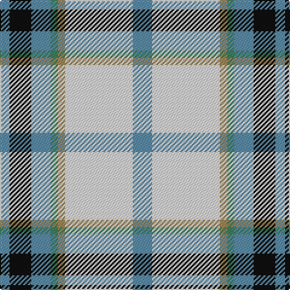

This page is one **sett** — a single exact thread-count. It belongs to the [tartan](/tartans/b8ln28lt3g3b8k9b4/)
(the same proportion at any scale), whose colour order is pattern [BKBGYWB](/stripes/bkbgywb/).

Sourced from tartans-authority.  It is a [7 stripe tartan](/stripes/stripes7/).

Original link http://www.tartansauthority.com/tartan-ferret/display/10731/

## Thread count
B/16 LN56 LT6 G6 B16 K18 B/8

## Palette
Each colour and the base-6 reference it is a variant of.

| Colour | Shade | Base |
|---|---|---|
| B | <code style="background-color:#5C8CA8;">#5C8CA8</code> `oklch(61.7% 0.067 235.0)` <small>#5C8CA8</small> | B <code style="background-color:#2A418A;">#2A418A</code> |
| G | <code style="background-color:#408060;">#408060</code> `oklch(54.8% 0.084 160.1)` <small>#408060</small> | G <code style="background-color:#006100;">#006100</code> |
| K | <code style="background-color:#101010;">#101010</code> `oklch(17.3% 0.000 89.9)` <small>#101010</small> | K <code style="background-color:#000000;">#000000</code> |
| LN | <code style="background-color:#E0E0E0;">#E0E0E0</code> `oklch(90.7% 0.000 89.9)` <small>#E0E0E0</small> | W <code style="background-color:#F7F7F7;">#F7F7F7</code> |
| LT | <code style="background-color:#A08858;">#A08858</code> `oklch(63.7% 0.071 84.0)` <small>#A08858</small> | Y <code style="background-color:#F2BF00;">#F2BF00</code> |

# Sample pattern

## Nearest tartans

The nearest existing variants by ΔTartan distance, with this tartan at the top so the swatches line up against it.

ΔTartan

Tartan

Sett

—

<a href="/ttd/edit/#slug=t8w28lo3g3t8k9t4~x2">MacTavish of Dunardry (Clan)</a> <a class="nn-out" href="/setts/s7/t8w28lo3g3t8k9t4~x2/" title="open its dictionary page">↗</a>

0.54

<a href="/ttd/edit/#slug=n8w28o3g3n8k9n4~x2">MacTavish of Dunardry Dress</a> <a class="nn-out" href="/setts/s7/n8w28o3g3n8k9n4~x2/" title="open its dictionary page">↗</a>

0.82

<a href="/ttd/edit/#slug=db2w14p4ly1g8db2~x2">Manx Laxey, dress green</a> <a class="nn-out" href="/setts/s6/db2w14p4ly1g8db2~x2/" title="open its dictionary page">↗</a>

0.85

<a href="/ttd/edit/#slug=w8g5dp10t24w30g2lp2~x2">Shiel, Purple V2 (Dance)</a> <a class="nn-out" href="/setts/s7/w8g5dp10t24w30g2lp2~x2/" title="open its dictionary page">↗</a>

0.89

<a href="/ttd/edit/#slug=g4w28p8ly2db17g4~x2">Manx, dress</a> <a class="nn-out" href="/setts/s6/g4w28p8ly2db17g4~x2/" title="open its dictionary page">↗</a>

0.98

<a href="/ttd/edit/#slug=g4w28db14ly2t17g4~x2">Allanton Dress (Fashion)</a> <a class="nn-out" href="/setts/s6/g4w28db14ly2t17g4~x2/" title="open its dictionary page">↗</a>

1.02

<a href="/ttd/edit/#slug=r2db2w26g25k14db13w26db2r2~x2">MacNaughton Dress</a> <a class="nn-out" href="/setts/s9/r2db2w26g25k14db13w26db2r2~x2/" title="open its dictionary page">↗</a>

1.11

<a href="/ttd/edit/#slug=w14dp4ly1g8db2~x2">Manx Laxey Dress Green</a> <a class="nn-out" href="/setts/s5/w14dp4ly1g8db2~x2/" title="open its dictionary page">↗</a>

1.12

<a href="/ttd/edit/#slug=g4w28dp8ly2db17g4~x2">Manx Dress</a> <a class="nn-out" href="/setts/s6/g4w28dp8ly2db17g4~x2/" title="open its dictionary page">↗</a>

1.13

<a href="/ttd/edit/#slug=r2ly1b8r1lg7ly1r2~x6">Cercle de Fermières de Saint-Élie d'Orford</a> <a class="nn-out" href="/setts/s7/r2ly1b8r1lg7ly1r2~x6/" title="open its dictionary page">↗</a>

1.14

<a href="/ttd/edit/#slug=w8t30g5w3db8r5">Roseberry</a> <a class="nn-out" href="/setts/s6/w8t30g5w3db8r5/" title="open its dictionary page">↗</a>

## Neighbour map

Every grey dot is one of 14299 variants placed by the first two principal components of the ΔTartan feature space (44% of its variance). Red is this tartan; blue dots are its nearest — click one to open its page.

<svg viewBox="0 0 640 380" role="img" style="max-width:100%;height:auto;border:1px solid #e0e0e0;border-radius:4px;display:block" xmlns="http://www.w3.org/2000/svg"><image href="/nn/cloud.v1.png" width="640" height="380"/><a href="/setts/s7/n8w28o3g3n8k9n4~x2/"><circle cx="163.8" cy="152.1" r="4" fill="#3465a4"><title>MacTavish of Dunardry Dress</title></circle></a><a href="/setts/s6/db2w14p4ly1g8db2~x2/"><circle cx="187.5" cy="152.3" r="4" fill="#3465a4"><title>Manx Laxey, dress green</title></circle></a><a href="/setts/s7/w8g5dp10t24w30g2lp2~x2/"><circle cx="208.7" cy="144.4" r="4" fill="#3465a4"><title>Shiel, Purple V2 (Dance)</title></circle></a><a href="/setts/s6/g4w28p8ly2db17g4~x2/"><circle cx="184.6" cy="151.6" r="4" fill="#3465a4"><title>Manx, dress</title></circle></a><a href="/setts/s6/g4w28db14ly2t17g4~x2/"><circle cx="162.5" cy="163.9" r="4" fill="#3465a4"><title>Allanton Dress (Fashion)</title></circle></a><a href="/setts/s9/r2db2w26g25k14db13w26db2r2~x2/"><circle cx="168.8" cy="140.4" r="4" fill="#3465a4"><title>MacNaughton Dress</title></circle></a><a href="/setts/s5/w14dp4ly1g8db2~x2/"><circle cx="204.4" cy="164.1" r="4" fill="#3465a4"><title>Manx Laxey Dress Green</title></circle></a><a href="/setts/s6/g4w28dp8ly2db17g4~x2/"><circle cx="181.6" cy="150.5" r="4" fill="#3465a4"><title>Manx Dress</title></circle></a><a href="/setts/s7/r2ly1b8r1lg7ly1r2~x6/"><circle cx="150.7" cy="182.5" r="4" fill="#3465a4"><title>Cercle de Fermières de Saint-Élie d'Orford</title></circle></a><a href="/setts/s6/w8t30g5w3db8r5/"><circle cx="216.8" cy="172.7" r="4" fill="#3465a4"><title>Roseberry</title></circle></a><circle cx="177.0" cy="161.3" r="5" fill="#c00000"/></svg>

ID: /setts/s7/t8w28lo3g3t8k9t4~x2/
