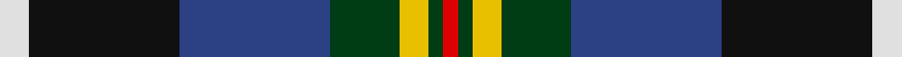
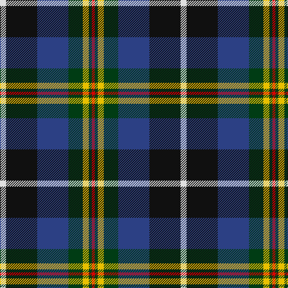

In pattern [RGYGBKW](/stripes/rgygbkw/).

This was sourced from register-of-tartans.  It is a [7 stripe tartan](/stripes/stripes7/).

Original link https://www.tartanregister.gov.uk/tartanDetails.aspx?ref=5961

## Register references

External register numbers recorded for this tartan.

- Scottish Register of Tartans: [5961](https://www.tartanregister.gov.uk/tartanDetails.aspx?ref=5961)
- Scottish Tartans World Register: 3239

## Thread count
LN/10 K52 B52 DG24 Y10 DG5 R/5

## Palette
Each colour and its ΔE from the base-6 reference it is a variant of.

| Colour | Shade | Base | ΔE (OKLab) |
|---|---|---|---|
| B | <code style="background-color:#2C4084;">#2C4084</code> `#2C4084` | B <code style="background-color:#2A418A;">#2A418A</code> | 0.01 |
| DG | <code style="background-color:#003C14;">#003C14</code> `#003C14` | G <code style="background-color:#006100;">#006100</code> | 0.13 |
| K | <code style="background-color:#101010;">#101010</code> `#101010` | K <code style="background-color:#000000;">#000000</code> | 0.17 |
| LN | <code style="background-color:#E0E0E0;">#E0E0E0</code> `#E0E0E0` | W <code style="background-color:#F7F7F7;">#F7F7F7</code> | 0.07 |
| R | <code style="background-color:#DC0000;">#DC0000</code> `#DC0000` | R <code style="background-color:#CC0000;">#CC0000</code> | 0.03 |
| Y | <code style="background-color:#E8C000;">#E8C000</code> `#E8C000` | Y <code style="background-color:#F2BF00;">#F2BF00</code> | 0.02 |

# Sample pattern

## Nearest tartans

The nearest existing variants by ΔTartan distance.

1. [Morris of Eddergoll (Personal)](/setts/s6/w2db20r3k10g20lo2~x2/) — ΔT 0.55
1. [Unidentified (ex Tony Murray)](/setts/s7/r2ly2db9dy1dg9r1w1~x2/) — ΔT 0.74
1. [Leung (Personal)](/setts/s9/m4k7m2db25k19w2g13k2ly3~x2/) — ΔT 0.78
1. [Loch Awe](/setts/s9/ly3k2r3db20k24g20r3k2lb3~x2/) — ΔT 0.82
1. [Scottish Cultural Society (Corporate](/setts/s9/dp2g4k8lo1k1db4lb1db1lb2~x8/) — ΔT 0.83
1. [Souza Nery (Personal)](/setts/s7/ly4g22r3k17r3db37w3~x2/) — ΔT 0.87
1. [Blairmore](/setts/s8/db34w5db5r5db5dr26g33o6~x2/) — ΔT 0.87
1. [Sey (Name)](/setts/s8/r2k8ly1k8g13db13lo1r2~x2/) — ΔT 0.88
1. [McCuaig (2010) (Name)](/setts/s9/k10ly3k2b20k10g15k2r3w3~x2/) — ΔT 0.92
1. [Morris of Balgonie (Personal)](/setts/s6/w2dp20r3k10g20lo2~x2/) — ΔT 0.92

## Neighbour map

Every grey dot is one of 14299 variants placed by the first two principal components of the ΔTartan feature space (44% of its variance). Red is this tartan; blue dots are its nearest — click one to open its page.

<svg viewBox="0 0 640 380" role="img" style="max-width:100%;height:auto;border:1px solid #e0e0e0;border-radius:4px;display:block" xmlns="http://www.w3.org/2000/svg"><image href="/nn/cloud.v1.png" width="640" height="380"/><a href="/setts/s6/w2db20r3k10g20lo2~x2/"><circle cx="138.9" cy="181.3" r="4" fill="#3465a4"><title>Morris of Eddergoll (Personal)</title></circle></a><a href="/setts/s7/r2ly2db9dy1dg9r1w1~x2/"><circle cx="148.6" cy="162.0" r="4" fill="#3465a4"><title>Unidentified (ex Tony Murray)</title></circle></a><a href="/setts/s9/m4k7m2db25k19w2g13k2ly3~x2/"><circle cx="152.4" cy="147.8" r="4" fill="#3465a4"><title>Leung (Personal)</title></circle></a><a href="/setts/s9/ly3k2r3db20k24g20r3k2lb3~x2/"><circle cx="145.2" cy="144.4" r="4" fill="#3465a4"><title>Loch Awe</title></circle></a><a href="/setts/s9/dp2g4k8lo1k1db4lb1db1lb2~x8/"><circle cx="108.7" cy="165.8" r="4" fill="#3465a4"><title>Scottish Cultural Society (Corporate</title></circle></a><a href="/setts/s7/ly4g22r3k17r3db37w3~x2/"><circle cx="176.3" cy="155.4" r="4" fill="#3465a4"><title>Souza Nery (Personal)</title></circle></a><a href="/setts/s8/db34w5db5r5db5dr26g33o6~x2/"><circle cx="119.3" cy="179.1" r="4" fill="#3465a4"><title>Blairmore</title></circle></a><a href="/setts/s8/r2k8ly1k8g13db13lo1r2~x2/"><circle cx="148.0" cy="169.1" r="4" fill="#3465a4"><title>Sey (Name)</title></circle></a><a href="/setts/s9/k10ly3k2b20k10g15k2r3w3~x2/"><circle cx="115.4" cy="159.5" r="4" fill="#3465a4"><title>McCuaig (2010) (Name)</title></circle></a><a href="/setts/s6/w2dp20r3k10g20lo2~x2/"><circle cx="151.6" cy="178.9" r="4" fill="#3465a4"><title>Morris of Balgonie (Personal)</title></circle></a><circle cx="123.6" cy="167.4" r="5" fill="#c00000"/></svg>

ID: /setts/s7/w10k52db52dg24ly10dg5r5/
