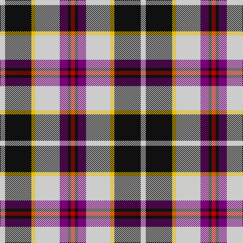

In pattern [RKBWYKW](/patterns/rkbwykw/).

This was sourced from tartans-authority.  It is a [7 stripes tartan](/stripes/stripes7/).

Original link http://www.tartansauthority.com/tartan-ferret/display/7388/

## Thread count
N/10 K52 Y8 N48 P16 K6 R/8

## Palette
Each colour and its ΔE from the base-6 reference it is a variant of.

| Colour | Shade | Base | ΔE (OKLab) |
|---|---|---|---|
| K | <code style="background-color:#101010;">#101010</code> `#101010` | K <code style="background-color:#000000;">#000000</code> | 0.17 |
| N | <code style="background-color:#CCCCCC;">#CCCCCC</code> `#CCCCCC` | W <code style="background-color:#F4F4F0;">#F4F4F0</code> | 0.12 |
| P | <code style="background-color:#780078;">#780078</code> `#780078` | B <code style="background-color:#2C4084;">#2C4084</code> | 0.16 |
| R | <code style="background-color:#C80000;">#C80000</code> `#C80000` | R <code style="background-color:#C80000;">#C80000</code> | 0.00 |
| Y | <code style="background-color:#E8C000;">#E8C000</code> `#E8C000` | Y <code style="background-color:#E8C000;">#E8C000</code> | 0.00 |

# Sample pattern

## Nearest tartans

The nearest existing variants by ΔTartan distance.

1. [Ailsa, Craig](/setts/s8/r10w4b40y4k32w36k4w10-b304080-k000000-rc00000-we0e0e0-yf0c000/) — ΔT 0.87
1. [Tombow 140th Anniversary, The](/setts/s7/g8y14r18y18b40w4b4-b2c2c80-g006818-rb84c00-wfcfcfc-ye8c000/) — ΔT 0.89
1. [Ailsa Craig Trade Tartan Tartan Number: 1673. Earliest known date: 1972 Nothing See products available Copyright © Blair Urquhart, Comrie, 2015](/setts/s8/r10w4b40y4k32w36k4w10-b2c2c80-k101010-rc80000-we0e0e0-ye8c000/) — ΔT 0.92
1. [Glasgow](/setts/s7/b40r6g6r30w38b6ba4-b002814-ba3c82af-g808080-rdc0000-we0e0e0/) — ΔT 0.94
1. [Thomson Dress (Grey) (Fashion)](/setts/s6/r8ra50k12w24k22y6-k101010-rc80000-ra888888-we0e0e0-ye8c000/) — ΔT 0.94
1. [Pengelly, The Cornish](/setts/s7/w10k52y8wa48b16k6r8-b5a008c-k101010-rdc0000-we0e0e0-wac0c0c0-yfadc00/) — ΔT 0.95
1. [Culloden, dress Ancient](/setts/s8/r12b4ba42w6g38w52g6w10-b304080-ba800080-g003000-rc00000-we0e0e0/) — ΔT 0.97
1. [Jewell of Kernow (Personal)](/setts/s6/w12k58r58b14k6ra6-b600060-k101010-r888888-rac80000-we0e0e0/) — ΔT 0.99
1. [Kile (Red line) (Personal)](/setts/s8/b36w6b6w6r6w6k10y24-b1c0070-k101010-r880000-wfcfcfc-yd8b000/) — ΔT 1.02
1. [MacTavish / Thom(p)son, dress](/setts/s6/r8b56k12w24k24y6-b5480b0-k000000-rc00000-we0e0e0-yf0c000/) — ΔT 1.03

## Neighbour map

Every grey dot is one of 15726 variants placed by the first two principal components of the ΔTartan feature space (44% of its variance). Red is this tartan; blue dots are its nearest — click one to open its page.

<svg viewBox="0 0 640 380" role="img" style="max-width:100%;height:auto;border:1px solid #e0e0e0;border-radius:4px;display:block" xmlns="http://www.w3.org/2000/svg"><image href="/nn/cloud.v1.png" width="640" height="380"/><a href="/setts/s8/r10w4b40y4k32w36k4w10-b304080-k000000-rc00000-we0e0e0-yf0c000/"><circle cx="113.3" cy="155.8" r="4" fill="#3465a4"><title>Ailsa, Craig</title></circle></a><a href="/setts/s7/g8y14r18y18b40w4b4-b2c2c80-g006818-rb84c00-wfcfcfc-ye8c000/"><circle cx="153.9" cy="172.0" r="4" fill="#3465a4"><title>Tombow 140th Anniversary, The</title></circle></a><a href="/setts/s8/r10w4b40y4k32w36k4w10-b2c2c80-k101010-rc80000-we0e0e0-ye8c000/"><circle cx="118.2" cy="156.0" r="4" fill="#3465a4"><title>Ailsa Craig Trade Tartan Tartan Number: 1673. Earliest known date: 1972 Nothing See products available Copyright © Blair Urquhart, Comrie, 2015</title></circle></a><a href="/setts/s7/b40r6g6r30w38b6ba4-b002814-ba3c82af-g808080-rdc0000-we0e0e0/"><circle cx="132.6" cy="160.2" r="4" fill="#3465a4"><title>Glasgow</title></circle></a><a href="/setts/s6/r8ra50k12w24k22y6-k101010-rc80000-ra888888-we0e0e0-ye8c000/"><circle cx="139.3" cy="186.6" r="4" fill="#3465a4"><title>Thomson Dress (Grey) (Fashion)</title></circle></a><a href="/setts/s7/w10k52y8wa48b16k6r8-b5a008c-k101010-rdc0000-we0e0e0-wac0c0c0-yfadc00/"><circle cx="115.3" cy="148.4" r="4" fill="#3465a4"><title>Pengelly, The Cornish</title></circle></a><a href="/setts/s8/r12b4ba42w6g38w52g6w10-b304080-ba800080-g003000-rc00000-we0e0e0/"><circle cx="152.8" cy="142.1" r="4" fill="#3465a4"><title>Culloden, dress Ancient</title></circle></a><a href="/setts/s6/w12k58r58b14k6ra6-b600060-k101010-r888888-rac80000-we0e0e0/"><circle cx="185.9" cy="177.7" r="4" fill="#3465a4"><title>Jewell of Kernow (Personal)</title></circle></a><a href="/setts/s8/b36w6b6w6r6w6k10y24-b1c0070-k101010-r880000-wfcfcfc-yd8b000/"><circle cx="118.5" cy="173.0" r="4" fill="#3465a4"><title>Kile (Red line) (Personal)</title></circle></a><a href="/setts/s6/r8b56k12w24k24y6-b5480b0-k000000-rc00000-we0e0e0-yf0c000/"><circle cx="145.3" cy="179.4" r="4" fill="#3465a4"><title>MacTavish / Thom(p)son, dress</title></circle></a><circle cx="150.1" cy="164.4" r="5" fill="#c00000"/></svg>

ID: /setts/s7/w10k52y8w48b16k6r8-b780078-k101010-rc80000-wcccccc-ye8c000/
