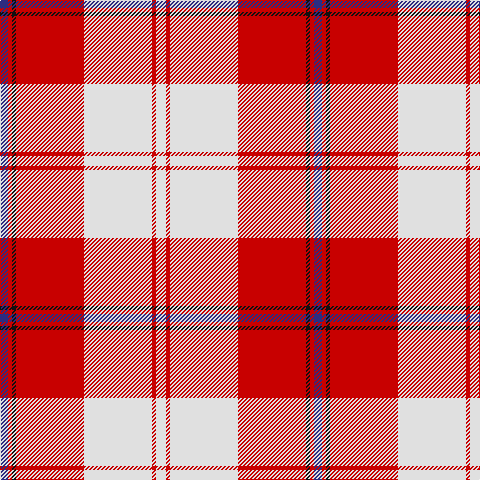

In pattern [BRKRWRW](/patterns/brkrwrw/).

This was sourced from house-of-tartan.  It is a [7 stripes tartan](/stripes/stripes7/).

Original link http://www.house-of-tartan.scotland.net/house/TartanViewjs.asp?colr=Def&tnam=563

## Thread count
DB/8 R4 K4 R68 LN68 R4 LN/10

## Palette
Each colour and its ΔE from the base-6 reference it is a variant of.

| Colour | Shade | Base | ΔE (OKLab) |
|---|---|---|---|
| DB | <code style="background-color:#2C2C80;">#2C2C80</code> `#2C2C80` | B <code style="background-color:#2A418A;">#2A418A</code> | 0.06 |
| K | <code style="background-color:#101010;">#101010</code> `#101010` | K <code style="background-color:#000000;">#000000</code> | 0.17 |
| LN | <code style="background-color:#E0E0E0;">#E0E0E0</code> `#E0E0E0` | W <code style="background-color:#F7F7F7;">#F7F7F7</code> | 0.07 |
| R | <code style="background-color:#C80000;">#C80000</code> `#C80000` | R <code style="background-color:#CC0000;">#CC0000</code> | 0.01 |

# Sample pattern

## Nearest tartans

The nearest existing variants by ΔTartan distance.

1. [Cunningham, dress](/setts/s7/w10r4w68r68k4r4b8-b304080-k000000-rc00000-we0e0e0/) — ΔT 0.15
1. [Cunningham, Burgundy dress](/setts/s7/w10r4w68r68k4r4y8-k000000-rc00000-we0e0e0-yf0c000/) — ΔT 0.30
1. [Cunningham Burgandy Dress Clan Tartan Tartan Number: 1873. Earliest known date: pre 2003 One of a number of dress tartans produced by Hugh Macpherson, a kiltmaker in Edinburgh, intended for dancing and other informal occassions. The 'dress' version of clan tartan is usually created by substituting white for one of the 'ground' colours. See products available Copyright © Blair Urquhart, Comrie, 2015](/setts/s7/w10r4w68r68k4r4y8-k101010-rc80000-we0e0e0-ye8c000/) — ΔT 0.39
1. [Cunningham Dress](/setts/s7/w10r4w68r68k4r4b8-b1c0070-k101010-rc80000-wf8f8f8/) — ΔT 0.44
1. [Torridon, Cherry (Dance)](/setts/s7/r6ra4b4ra60w60b4w6-b1c1c50-r880000-rab80000-wf0e0c8/) — ΔT 0.49
1. [Arduaine, Red (Dance)](/setts/s7/w10k4w60r48w6r16b6-b003c64-k101010-rc8002c-wf0e0c8/) — ΔT 0.66
1. [Torridon, Burgundy (Dance)](/setts/s7/w6y4w60r60b4r4y6-b843470-r800028-wf0e0c8-y58bc60/) — ΔT 0.70
1. [Cunningham Dress Burgundy (Dance)](/setts/s7/w10r4w68r68k4r4y8-k101010-r800028-wf8f8f8-ye8c000/) — ΔT 0.76
1. [MacPherson, Burgundy dress](/setts/s7/w8k4w50r42w6r16y6-k000000-rc00000-we0e0e0-yf0c000/) — ΔT 0.88
1. [MacPherson Dress Burgandy Clan Tartan Tartan Number: 1832. Earliest known date: pre 2003 Examined by D.C.S. 1947 See products available Copyright © Blair Urquhart, Comrie, 2015](/setts/s7/w8k4w50r42w6r16y6-k101010-rc80000-we0e0e0-ye8c000/) — ΔT 0.90

## Neighbour map

Every grey dot is one of 15726 variants placed by the first two principal components of the ΔTartan feature space (44% of its variance). Red is this tartan; blue dots are its nearest — click one to open its page.

<svg viewBox="0 0 640 380" role="img" style="max-width:100%;height:auto;border:1px solid #e0e0e0;border-radius:4px;display:block" xmlns="http://www.w3.org/2000/svg"><image href="/nn/cloud.v1.png" width="640" height="380"/><a href="/setts/s7/w10r4w68r68k4r4b8-b304080-k000000-rc00000-we0e0e0/"><circle cx="296.0" cy="128.1" r="4" fill="#3465a4"><title>Cunningham, dress</title></circle></a><a href="/setts/s7/w10r4w68r68k4r4y8-k000000-rc00000-we0e0e0-yf0c000/"><circle cx="298.2" cy="127.6" r="4" fill="#3465a4"><title>Cunningham, Burgundy dress</title></circle></a><a href="/setts/s7/w10r4w68r68k4r4y8-k101010-rc80000-we0e0e0-ye8c000/"><circle cx="303.4" cy="128.8" r="4" fill="#3465a4"><title>Cunningham Burgandy Dress Clan Tartan Tartan Number: 1873. Earliest known date: pre 2003 One of a number of dress tartans produced by Hugh Macpherson, a kiltmaker in Edinburgh, intended for dancing and other informal occassions. The 'dress' version of clan tartan is usually created by substituting white for one of the 'ground' colours. See products available Copyright © Blair Urquhart, Comrie, 2015</title></circle></a><a href="/setts/s7/w10r4w68r68k4r4b8-b1c0070-k101010-rc80000-wf8f8f8/"><circle cx="287.6" cy="122.5" r="4" fill="#3465a4"><title>Cunningham Dress</title></circle></a><a href="/setts/s7/r6ra4b4ra60w60b4w6-b1c1c50-r880000-rab80000-wf0e0c8/"><circle cx="284.6" cy="130.2" r="4" fill="#3465a4"><title>Torridon, Cherry (Dance)</title></circle></a><a href="/setts/s7/w10k4w60r48w6r16b6-b003c64-k101010-rc8002c-wf0e0c8/"><circle cx="297.4" cy="145.0" r="4" fill="#3465a4"><title>Arduaine, Red (Dance)</title></circle></a><a href="/setts/s7/w6y4w60r60b4r4y6-b843470-r800028-wf0e0c8-y58bc60/"><circle cx="275.4" cy="132.1" r="4" fill="#3465a4"><title>Torridon, Burgundy (Dance)</title></circle></a><a href="/setts/s7/w10r4w68r68k4r4y8-k101010-r800028-wf8f8f8-ye8c000/"><circle cx="280.3" cy="125.0" r="4" fill="#3465a4"><title>Cunningham Dress Burgundy (Dance)</title></circle></a><a href="/setts/s7/w8k4w50r42w6r16y6-k000000-rc00000-we0e0e0-yf0c000/"><circle cx="272.9" cy="154.6" r="4" fill="#3465a4"><title>MacPherson, Burgundy dress</title></circle></a><a href="/setts/s7/w8k4w50r42w6r16y6-k101010-rc80000-we0e0e0-ye8c000/"><circle cx="278.6" cy="156.0" r="4" fill="#3465a4"><title>MacPherson Dress Burgandy Clan Tartan Tartan Number: 1832. Earliest known date: pre 2003 Examined by D.C.S. 1947 See products available Copyright © Blair Urquhart, Comrie, 2015</title></circle></a><circle cx="299.3" cy="128.4" r="5" fill="#c00000"/></svg>

ID: /setts/s7/w10r4w68r68k4r4b8-b2c2c80-k101010-rc80000-we0e0e0/
