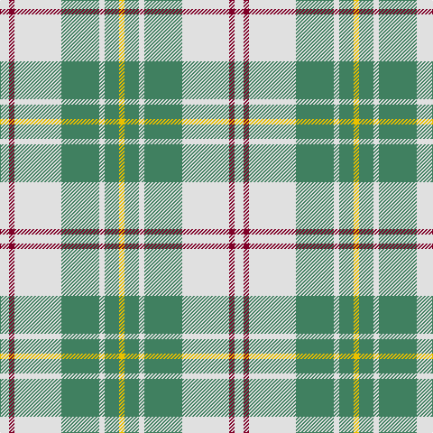

In pattern [WRWGWGY](/patterns/wrwgwgy/).

This was sourced from register-of-tartans.  It is a [7 stripes tartan](/stripes/stripes7/).

Original link https://www.tartanregister.gov.uk/tartanDetails.aspx?ref=2716

## Thread count
LN/10 DR6 LN52 G42 LN6 G16 Y/6

## Palette
Each colour and its ΔE from the base-6 reference it is a variant of.

| Colour | Shade | Base | ΔE (OKLab) |
|---|---|---|---|
| DR | <code style="background-color:#800028;">#800028</code> `#800028` | R <code style="background-color:#C80000;">#C80000</code> | 0.16 |
| G | <code style="background-color:#408060;">#408060</code> `#408060` | G <code style="background-color:#006400;">#006400</code> | 0.13 |
| K | <code style="background-color:#101010;">#101010</code> `#101010` | K <code style="background-color:#000000;">#000000</code> | 0.17 |
| LN | <code style="background-color:#E0E0E0;">#E0E0E0</code> `#E0E0E0` | W <code style="background-color:#F4F4F0;">#F4F4F0</code> | 0.06 |
| Y | <code style="background-color:#E8C000;">#E8C000</code> `#E8C000` | Y <code style="background-color:#E8C000;">#E8C000</code> | 0.00 |

# Sample pattern

## Nearest tartans

The nearest existing variants by ΔTartan distance.

1. [MacPherson Dress Green (Dance)](/setts/s7/w10r6w52g40w6g16y6-g006818-rc80000-we0e0e0-ye8c000/) — ΔT 0.92
1. [MacPherson, dress green](/setts/s7/w10r6w52g40w6g16y6-g008000-rc00000-we0e0e0-yf0c000/) — ΔT 0.95
1. [O'Neill](/setts/s9/w4g2w4r12w20g12w4r2w4-g008000-r806050-we0e0e0/) — ΔT 1.22
1. [Tilburg Hunting (District)](/setts/s7/b12k6b74y82w6y12w6-b1068a4-k101010-we0e0e0-yd8a810/) — ΔT 1.24
1. [Kildare Irish County Tartan Tartan Number: 2262. Earliest known date: 1996 One of a series of Irish District tartans designed by Polly Wittering of the House of Edgar, with colours reminiscent of the Country with soft warm colours dominating. See products available Copyright © Blair Urquhart, Comrie, 2015](/setts/s8/y16b4y26r8y24ba44y10ya6-b4c3428-ba0070a4-ra01824-yb4d0ac-yac48800/) — ΔT 1.37
1. [Beck-McSorley](/setts/s8/r6g6w6wa42g42w6g6w6-g285800-re87878-wc49cd8-wac0c0c0/) — ΔT 1.39
1. [MacDiarmid Dress](/setts/s9/w76r24w74g64k6w8k6g64r8-g006818-k101010-rc80000-we0e0e0/) — ΔT 1.40
1. [MacDiarmid Dress Clan Tartan Tartan Number: 1486. Earliest known date: c.1830 This sett appears in Paton's collection which is housed at the Scottish Tartans Museum, Comrie in Perthshire, Scotland. The samples are undated but the collection is known to have been put together around the 1830's, with some additions during the Victorian period. See products available Copyright © Blair Urquhart, Comrie, 2015](/setts/s9/w38r12w37g32k3w4k3g32r4-g006818-k101010-rc80000-we0e0e0/) — ΔT 1.40
1. [Lennox Turquoise Dress District Tartan Tartan Number: 8190. Earliest known date: pre 2003 Families with the surname 'Lennox' are usually considered related to Clans Stewart or MacFarlane. Some of this surname also choose to wear the distinctive and ancient 'Lennox' tartan. D W Stewart reproduced the sett from a 'lost' portrait of the Countess of Lennox dating from the 16th century./Threadcount and colours aren't 100% original. Generated manually./ See products available Copyright © Blair Urquhart, Comrie, 2015](/setts/s7/b16ba4b48ba10w52k4w16-b5c8ca8-ba2c2c80-k101010-we0e0e0/) — ΔT 1.43
1. [MacDiarmid, dress](/setts/s9/w38r12w37g32k3w4k3g32r4-g008000-k000000-rc00000-we0e0e0/) — ΔT 1.44

## Neighbour map

Every grey dot is one of 15726 variants placed by the first two principal components of the ΔTartan feature space (44% of its variance). Red is this tartan; blue dots are its nearest — click one to open its page.

<svg viewBox="0 0 640 380" role="img" style="max-width:100%;height:auto;border:1px solid #e0e0e0;border-radius:4px;display:block" xmlns="http://www.w3.org/2000/svg"><image href="/nn/cloud.v1.png" width="640" height="380"/><a href="/setts/s7/w10r6w52g40w6g16y6-g006818-rc80000-we0e0e0-ye8c000/"><circle cx="244.7" cy="184.8" r="4" fill="#3465a4"><title>MacPherson Dress Green (Dance)</title></circle></a><a href="/setts/s7/w10r6w52g40w6g16y6-g008000-rc00000-we0e0e0-yf0c000/"><circle cx="251.7" cy="187.8" r="4" fill="#3465a4"><title>MacPherson, dress green</title></circle></a><a href="/setts/s9/w4g2w4r12w20g12w4r2w4-g008000-r806050-we0e0e0/"><circle cx="286.0" cy="192.9" r="4" fill="#3465a4"><title>O'Neill</title></circle></a><a href="/setts/s7/b12k6b74y82w6y12w6-b1068a4-k101010-we0e0e0-yd8a810/"><circle cx="285.9" cy="161.4" r="4" fill="#3465a4"><title>Tilburg Hunting (District)</title></circle></a><a href="/setts/s8/y16b4y26r8y24ba44y10ya6-b4c3428-ba0070a4-ra01824-yb4d0ac-yac48800/"><circle cx="259.1" cy="182.2" r="4" fill="#3465a4"><title>Kildare Irish County Tartan Tartan Number: 2262. Earliest known date: 1996 One of a series of Irish District tartans designed by Polly Wittering of the House of Edgar, with colours reminiscent of the Country with soft warm colours dominating. See products available Copyright © Blair Urquhart, Comrie, 2015</title></circle></a><a href="/setts/s8/r6g6w6wa42g42w6g6w6-g285800-re87878-wc49cd8-wac0c0c0/"><circle cx="222.0" cy="184.5" r="4" fill="#3465a4"><title>Beck-McSorley</title></circle></a><a href="/setts/s9/w76r24w74g64k6w8k6g64r8-g006818-k101010-rc80000-we0e0e0/"><circle cx="224.7" cy="164.1" r="4" fill="#3465a4"><title>MacDiarmid Dress</title></circle></a><a href="/setts/s9/w38r12w37g32k3w4k3g32r4-g006818-k101010-rc80000-we0e0e0/"><circle cx="224.7" cy="164.1" r="4" fill="#3465a4"><title>MacDiarmid Dress Clan Tartan Tartan Number: 1486. Earliest known date: c.1830 This sett appears in Paton's collection which is housed at the Scottish Tartans Museum, Comrie in Perthshire, Scotland. The samples are undated but the collection is known to have been put together around the 1830's, with some additions during the Victorian period. See products available Copyright © Blair Urquhart, Comrie, 2015</title></circle></a><a href="/setts/s7/b16ba4b48ba10w52k4w16-b5c8ca8-ba2c2c80-k101010-we0e0e0/"><circle cx="247.5" cy="177.1" r="4" fill="#3465a4"><title>Lennox Turquoise Dress District Tartan Tartan Number: 8190. Earliest known date: pre 2003 Families with the surname 'Lennox' are usually considered related to Clans Stewart or MacFarlane. Some of this surname also choose to wear the distinctive and ancient 'Lennox' tartan. D W Stewart reproduced the sett from a 'lost' portrait of the Countess of Lennox dating from the 16th century./Threadcount and colours aren't 100% original. Generated manually./ See products available Copyright © Blair Urquhart, Comrie, 2015</title></circle></a><a href="/setts/s9/w38r12w37g32k3w4k3g32r4-g008000-k000000-rc00000-we0e0e0/"><circle cx="223.0" cy="163.9" r="4" fill="#3465a4"><title>MacDiarmid, dress</title></circle></a><circle cx="261.8" cy="190.2" r="5" fill="#c00000"/></svg>

ID: /setts/s7/w10r6w52g42w6g16y6-g408060-r800028-we0e0e0-ye8c000/
