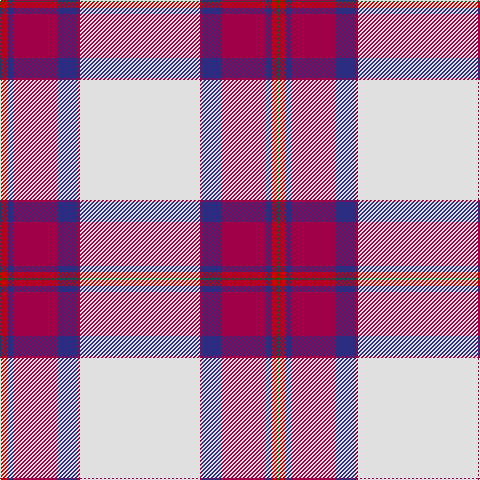

In pattern [GRBRBRW](/patterns/grbrbrw/).

This was sourced from house-of-tartan.  It is a [7 stripes tartan](/stripes/stripes7/).

Original link http://www.house-of-tartan.scotland.net/house/TartanViewjs.asp?colr=Def&tnam=8177

## Thread count
G/2 Ra6 DB6 R44 DB20 R2 LN/120

## Palette
Each colour and its ΔE from the base-6 reference it is a variant of.

| Colour | Shade | Base | ΔE (OKLab) |
|---|---|---|---|
| DB | <code style="background-color:#2C2C80;">#2C2C80</code> `#2C2C80` | B <code style="background-color:#2C4084;">#2C4084</code> | 0.05 |
| G | <code style="background-color:#006818;">#006818</code> `#006818` | G <code style="background-color:#006400;">#006400</code> | 0.02 |
| LN | <code style="background-color:#E0E0E0;">#E0E0E0</code> `#E0E0E0` | W <code style="background-color:#F4F4F0;">#F4F4F0</code> | 0.06 |
| R | <code style="background-color:#A00048;">#A00048</code> `#A00048` | R <code style="background-color:#C80000;">#C80000</code> | 0.11 |
| Ra | <code style="background-color:#C80000;">#C80000</code> `#C80000` | R <code style="background-color:#C80000;">#C80000</code> | 0.00 |

# Sample pattern

## Nearest tartans

The nearest existing variants by ΔTartan distance.

1. [Unidentified Arisaid](/setts/s9/w216k8b24g24w4k4r45w8r12-b002814-g309c18-k101010-r960028-we0e0e0/) — ΔT 1.37
1. [Unidentified, Arisaid](/setts/s9/w216k8g24ga24w4k4r45w8r12-g003000-ga30a010-k000000-r900030-we0e0e0/) — ΔT 1.40
1. [Stewart Dress, Purple (Dance)](/setts/s10/w110b24y4b6w4g20ba18b4ba12w4-b440044-ba780078-g006818-wf8f8f8-ybc8c00/) — ΔT 1.40
1. [Unidentified Blanket](/setts/s8/w100k2r24w2g24r26w2r4-g005020-k101010-rdc0000-we0e0e0/) — ΔT 1.40
1. [Young, Christina](/setts/s6/w108k14r14y12ya8r2-k101010-rc80000-we0e0e0-yd87c00-yae8c000/) — ΔT 1.47
1. [MacGregor Dress Burgundy (Dance)](/setts/s6/w104r44w12r16k2ra6-k000000-r800028-rae87878-wf8f8f8/) — ΔT 1.47
1. [Wilson's Blanket Pattern](/setts/s8/w200k4r56w4g56r56w4r8-g003820-k101010-rc80000-wfcfcfc/) — ΔT 1.49
1. [Unidentified, Blanket](/setts/s8/w100k2r24w2g24r26w2r4-g008000-k000000-rc00000-we0e0e0/) — ΔT 1.50
1. [Grotto Dove (Dance)](/setts/s11/w102b20w4b4w4b4g20r18b3r10w4-b180060-g1c3c00-rfc1060-we0e0e0/) — ΔT 1.51
1. [Bruce of Kinnaird Dress (Dance)](/setts/s10/w90r18k4w16k4y2k20b16ba24w4-b2c2c80-ba780078-k101010-rc80000-wf8f8f8-ye8c000/) — ΔT 1.51

## Neighbour map

Every grey dot is one of 15726 variants placed by the first two principal components of the ΔTartan feature space (44% of its variance). Red is this tartan; blue dots are its nearest — click one to open its page.

<svg viewBox="0 0 640 380" role="img" style="max-width:100%;height:auto;border:1px solid #e0e0e0;border-radius:4px;display:block" xmlns="http://www.w3.org/2000/svg"><image href="/nn/cloud.v1.png" width="640" height="380"/><a href="/setts/s9/w216k8b24g24w4k4r45w8r12-b002814-g309c18-k101010-r960028-we0e0e0/"><circle cx="394.4" cy="45.2" r="4" fill="#3465a4"><title>Unidentified Arisaid</title></circle></a><a href="/setts/s9/w216k8g24ga24w4k4r45w8r12-g003000-ga30a010-k000000-r900030-we0e0e0/"><circle cx="391.2" cy="44.5" r="4" fill="#3465a4"><title>Unidentified, Arisaid</title></circle></a><a href="/setts/s10/w110b24y4b6w4g20ba18b4ba12w4-b440044-ba780078-g006818-wf8f8f8-ybc8c00/"><circle cx="292.4" cy="61.9" r="4" fill="#3465a4"><title>Stewart Dress, Purple (Dance)</title></circle></a><a href="/setts/s8/w100k2r24w2g24r26w2r4-g005020-k101010-rdc0000-we0e0e0/"><circle cx="363.2" cy="77.6" r="4" fill="#3465a4"><title>Unidentified Blanket</title></circle></a><a href="/setts/s6/w108k14r14y12ya8r2-k101010-rc80000-we0e0e0-yd87c00-yae8c000/"><circle cx="415.0" cy="74.9" r="4" fill="#3465a4"><title>Young, Christina</title></circle></a><a href="/setts/s6/w104r44w12r16k2ra6-k000000-r800028-rae87878-wf8f8f8/"><circle cx="396.1" cy="95.7" r="4" fill="#3465a4"><title>MacGregor Dress Burgundy (Dance)</title></circle></a><a href="/setts/s8/w200k4r56w4g56r56w4r8-g003820-k101010-rc80000-wfcfcfc/"><circle cx="328.2" cy="73.7" r="4" fill="#3465a4"><title>Wilson's Blanket Pattern</title></circle></a><a href="/setts/s8/w100k2r24w2g24r26w2r4-g008000-k000000-rc00000-we0e0e0/"><circle cx="362.5" cy="79.2" r="4" fill="#3465a4"><title>Unidentified, Blanket</title></circle></a><a href="/setts/s11/w102b20w4b4w4b4g20r18b3r10w4-b180060-g1c3c00-rfc1060-we0e0e0/"><circle cx="337.6" cy="65.5" r="4" fill="#3465a4"><title>Grotto Dove (Dance)</title></circle></a><a href="/setts/s10/w90r18k4w16k4y2k20b16ba24w4-b2c2c80-ba780078-k101010-rc80000-wf8f8f8-ye8c000/"><circle cx="264.2" cy="39.9" r="4" fill="#3465a4"><title>Bruce of Kinnaird Dress (Dance)</title></circle></a><circle cx="359.6" cy="65.7" r="5" fill="#c00000"/></svg>

ID: /setts/s7/w120r2b20r44b6ra6g2-b2c2c80-g006818-ra00048-rac80000-we0e0e0/
