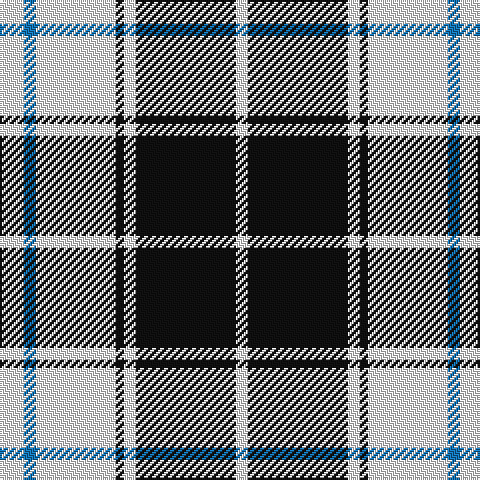

In pattern [WBWKWKW](/patterns/wbwkwkw/).

This was sourced from register-of-tartans.  It is a [7 stripes tartan](/stripes/stripes7/).

Original link https://www.tartanregister.gov.uk/tartanDetails.aspx?ref=1223

## Thread count
W/12 B6 W40 K4 W6 K50 W/6

## Palette
Each colour and its ΔE from the base-6 reference it is a variant of.

| Colour | Shade | Base | ΔE (OKLab) |
|---|---|---|---|
| B | <code style="background-color:#1474B4;">#1474B4</code> `#1474B4` | B <code style="background-color:#2C4084;">#2C4084</code> | 0.15 |
| K | <code style="background-color:#101010;">#101010</code> `#101010` | K <code style="background-color:#000000;">#000000</code> | 0.17 |
| W | <code style="background-color:#FCFCFC;">#FCFCFC</code> `#FCFCFC` | W <code style="background-color:#F4F4F0;">#F4F4F0</code> | 0.03 |

# Sample pattern

## Nearest tartans

The nearest existing variants by ΔTartan distance.

1. [MacPherson of Cluny (Black and White)](/setts/s7/w10r6w70k56w8k22w4-k101010-rc80000-wfcfcfc/) — ΔT 0.59
1. [MacPherson of Cluny Clan Tartan Tartan Number: 1830. Earliest known date: 1948 Also known as MacPherson Dress often woven with purple in place of red See products available Copyright © Blair Urquhart, Comrie, 2015](/setts/s7/w10r6w70k56w8k22w4-k101010-rc80000-we0e0e0/) — ΔT 0.70
1. [MacFie of Colonsay Dress (Fashion?)](/setts/s9/w8k44w8k8w64k8w8k44y8-k101010-wfcfcfc-yd09800/) — ΔT 1.02
1. [MacPherson Dress (1951)](/setts/s7/w6b6w60k40w6k18y6-b940094-k101010-we0e0e0-ye8c000/) — ΔT 1.02
1. [O'Sullivan-Beare (Family)](/setts/s8/w80k6w6k6w6r16k48r16-k101010-r888888-wc0c0c0/) — ΔT 1.03
1. [MacPherson - 1842 (VS) Dress](/setts/s7/w4r8w68k44w8k16y4-k101010-ra00048-we0e0e0-yd8b000/) — ΔT 1.08
1. [Stutterheim](/setts/s6/k4y18b44k3y10k4-b565c76-k101010-yecdc8e/) — ΔT 1.09
1. [MacPherson #10](/setts/s6/r4w56k24w4k12y4-k101010-rdc0000-we0e0e0-ye8c000/) — ΔT 1.16
1. [MacPherson 8](/setts/s6/r4w56k24w4k12y4-k000000-rc00000-we0e0e0-yf0c000/) — ΔT 1.17
1. [Erskine (Black and White)](/setts/s6/k12w6k54w54k6w12-k101010-wfcfcfc/) — ΔT 1.18

## Neighbour map

Every grey dot is one of 15726 variants placed by the first two principal components of the ΔTartan feature space (44% of its variance). Red is this tartan; blue dots are its nearest — click one to open its page.

<svg viewBox="0 0 640 380" role="img" style="max-width:100%;height:auto;border:1px solid #e0e0e0;border-radius:4px;display:block" xmlns="http://www.w3.org/2000/svg"><image href="/nn/cloud.v1.png" width="640" height="380"/><a href="/setts/s7/w10r6w70k56w8k22w4-k101010-rc80000-wfcfcfc/"><circle cx="301.1" cy="161.0" r="4" fill="#3465a4"><title>MacPherson of Cluny (Black and White)</title></circle></a><a href="/setts/s7/w10r6w70k56w8k22w4-k101010-rc80000-we0e0e0/"><circle cx="305.9" cy="164.7" r="4" fill="#3465a4"><title>MacPherson of Cluny Clan Tartan Tartan Number: 1830. Earliest known date: 1948 Also known as MacPherson Dress often woven with purple in place of red See products available Copyright © Blair Urquhart, Comrie, 2015</title></circle></a><a href="/setts/s9/w8k44w8k8w64k8w8k44y8-k101010-wfcfcfc-yd09800/"><circle cx="262.7" cy="185.3" r="4" fill="#3465a4"><title>MacFie of Colonsay Dress (Fashion?)</title></circle></a><a href="/setts/s7/w6b6w60k40w6k18y6-b940094-k101010-we0e0e0-ye8c000/"><circle cx="246.2" cy="166.6" r="4" fill="#3465a4"><title>MacPherson Dress (1951)</title></circle></a><a href="/setts/s8/w80k6w6k6w6r16k48r16-k101010-r888888-wc0c0c0/"><circle cx="271.8" cy="163.1" r="4" fill="#3465a4"><title>O'Sullivan-Beare (Family)</title></circle></a><a href="/setts/s7/w4r8w68k44w8k16y4-k101010-ra00048-we0e0e0-yd8b000/"><circle cx="280.2" cy="142.9" r="4" fill="#3465a4"><title>MacPherson - 1842 (VS) Dress</title></circle></a><a href="/setts/s6/k4y18b44k3y10k4-b565c76-k101010-yecdc8e/"><circle cx="304.6" cy="179.1" r="4" fill="#3465a4"><title>Stutterheim</title></circle></a><a href="/setts/s6/r4w56k24w4k12y4-k101010-rdc0000-we0e0e0-ye8c000/"><circle cx="300.4" cy="153.0" r="4" fill="#3465a4"><title>MacPherson #10</title></circle></a><a href="/setts/s6/r4w56k24w4k12y4-k000000-rc00000-we0e0e0-yf0c000/"><circle cx="297.0" cy="154.4" r="4" fill="#3465a4"><title>MacPherson 8</title></circle></a><a href="/setts/s6/k12w6k54w54k6w12-k101010-wfcfcfc/"><circle cx="294.5" cy="217.3" r="4" fill="#3465a4"><title>Erskine (Black and White)</title></circle></a><circle cx="281.0" cy="173.0" r="5" fill="#c00000"/></svg>

ID: /setts/s7/w12b6w40k4w6k50w6-b1474b4-k101010-wfcfcfc/
