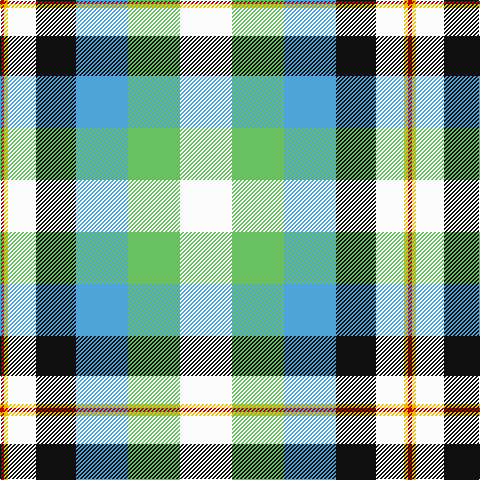

This page is one **sett** — a single exact thread-count. It belongs to the [tartan](/tartans/w13lg13t13k10w7ly1r1/)
(the same proportion at any scale), whose colour order is pattern [RYWKBYW](/stripes/rywkbyw/).

Sourced from register-of-tartans.  It is a [7 stripe tartan](/stripes/stripes7/).

Original link https://www.tartanregister.gov.uk/tartanDetails.aspx?ref=2020

## Also known as

This cloth is also recorded under:

- Lachine Historic

2 attestations — the source records this cloth was collapsed from (oldest owns this page)

<ul>
<li>01/08/2000 — Lachine Historic (register-of-tartans, <a href="https://www.tartanregister.gov.uk/tartanDetails.aspx?ref=2020">record</a>)</li>
<li>pre 2004 — Lachine (Historic) (District) (tartans-authority, <a href="http://www.tartansauthority.com/tartan-ferret/display/6203/">record</a>)</li>
</ul>

## Register references

External register numbers recorded for this tartan.

- Scottish Register of Tartans: [2020](https://www.tartanregister.gov.uk/tartanDetails.aspx?ref=2020)
- Scottish Tartans Authority (ITI): 6203
- Scottish Tartans World Register: 2911

## Thread count
W/52 LG52 B52 K40 W28 Y4 R/4

## Palette

Palette: <strong>Tartan Register</strong> <small style="color:#888">(4 of 6 colours)</small>
<table><thead><tr><th>Colour</th><th>Threads</th><th>Shade</th><th>Base</th><th>OKLCh</th></tr></thead><tbody><tr><td>W/</td><td style="text-align:right;font-variant-numeric:tabular-nums">52</td><td><code style="background-color:#FCFCFC;">#FCFCFC</code> <small style="color:#888">#FCFCFC</small></td><td>W <code style="background-color:#F7F7F7;">#F7F7F7</code></td><td><small style="color:#888">oklch(99.1% 0.000 89.9)</small></td></tr><tr><td>LG</td><td style="text-align:right;font-variant-numeric:tabular-nums">52</td><td><code style="background-color:#68C060;">#68C060</code> <small style="color:#888">#68C060</small></td><td>Y <code style="background-color:#F2BF00;">#F2BF00</code></td><td><small style="color:#888">oklch(73.0% 0.157 142.1)</small></td></tr><tr><td>B</td><td style="text-align:right;font-variant-numeric:tabular-nums">52</td><td><code style="background-color:#4CA4D8;">#4CA4D8</code> <small style="color:#888">#4CA4D8</small></td><td>B <code style="background-color:#2A418A;">#2A418A</code></td><td><small style="color:#888">oklch(68.7% 0.114 237.6)</small></td></tr><tr><td>K</td><td style="text-align:right;font-variant-numeric:tabular-nums">40</td><td><code style="background-color:#101010;">#101010</code> <small style="color:#888">#101010</small></td><td>K <code style="background-color:#000000;">#000000</code></td><td><small style="color:#888">oklch(17.3% 0.000 89.9)</small></td></tr><tr><td>W</td><td style="text-align:right;font-variant-numeric:tabular-nums">28</td><td><code style="background-color:#FCFCFC;">#FCFCFC</code> <small style="color:#888">#FCFCFC</small></td><td>W <code style="background-color:#F7F7F7;">#F7F7F7</code></td><td><small style="color:#888">oklch(99.1% 0.000 89.9)</small></td></tr><tr><td>Y</td><td style="text-align:right;font-variant-numeric:tabular-nums">4</td><td><code style="background-color:#E8C000;">#E8C000</code> <small style="color:#888">#E8C000</small></td><td>Y <code style="background-color:#F2BF00;">#F2BF00</code></td><td><small style="color:#888">oklch(81.9% 0.168 93.7)</small></td></tr><tr><td>R/</td><td style="text-align:right;font-variant-numeric:tabular-nums">4</td><td><code style="background-color:#C80000;">#C80000</code> <small style="color:#888">#C80000</small></td><td>R <code style="background-color:#CC0000;">#CC0000</code></td><td><small style="color:#888">oklch(52.3% 0.215 29.2)</small></td></tr></tbody></table>

# Sample pattern

## Nearest tartans

The nearest existing variants by ΔTartan distance, with this tartan at the top so the swatches line up against it.

ΔTartan

Tartan

Sett

—

<a href="/ttd/edit/#slug=w13lg13t13k10w7ly1r1~x4">Lachine Historic</a> <a class="nn-out" href="/setts/s7/w13lg13t13k10w7ly1r1~x4/" title="open its dictionary page">↗</a>

1.15

<a href="/ttd/edit/#slug=r6w20g12o3g8t20k2t3~x2">Coulter Dress (Personal)</a> <a class="nn-out" href="/setts/s8/r6w20g12o3g8t20k2t3~x2/" title="open its dictionary page">↗</a>

1.28

<a href="/ttd/edit/#slug=ly8k3t2do1w6g12do2~x2">Carmen Lau (Hong Kong) (Personal)</a> <a class="nn-out" href="/setts/s7/ly8k3t2do1w6g12do2~x2/" title="open its dictionary page">↗</a>

1.31

<a href="/ttd/edit/#slug=db2w12k8g8r2g8k1lo2~x2">MacLaren Dress</a> <a class="nn-out" href="/setts/s8/db2w12k8g8r2g8k1lo2~x2/" title="open its dictionary page">↗</a>

1.40

<a href="/ttd/edit/#slug=ly8r3b2db1w6g12db2~x2">Carmen Lau (Hong Kong) (Personal)</a> <a class="nn-out" href="/setts/s7/ly8r3b2db1w6g12db2~x2/" title="open its dictionary page">↗</a>

1.43

<a href="/ttd/edit/#slug=w30lb4dt6m4dt6g6dt12g13lt4~x2">Sound of Iona</a> <a class="nn-out" href="/setts/s9/w30lb4dt6m4dt6g6dt12g13lt4~x2/" title="open its dictionary page">↗</a>

1.47

<a href="/ttd/edit/#slug=db6w10g10r2ly3r1db3~x2">Ainslie, Lake</a> <a class="nn-out" href="/setts/s7/db6w10g10r2ly3r1db3~x2/" title="open its dictionary page">↗</a>

1.52

<a href="/ttd/edit/#slug=r7k2t16ly5t10k13w28dg2w4dg4~x2">Gillies Dress Blue #1 (Dance)</a> <a class="nn-out" href="/setts/s10/r7k2t16ly5t10k13w28dg2w4dg4~x2/" title="open its dictionary page">↗</a>

1.53

<a href="/ttd/edit/#slug=t8ly2g4ly2dp4ly2t8w15lo2~x4">Edmonton, City of</a> <a class="nn-out" href="/setts/s9/t8ly2g4ly2dp4ly2t8w15lo2~x4/" title="open its dictionary page">↗</a>

1.56

<a href="/ttd/edit/#slug=db7w30k13g9r6g16k2ly7~x2">MacLaren dress</a> <a class="nn-out" href="/setts/s8/db7w30k13g9r6g16k2ly7~x2/" title="open its dictionary page">↗</a>

1.58

<a href="/ttd/edit/#slug=w8g14r6g24db30ly10w40ly10db7ly4">John, Hamilton Gray</a> <a class="nn-out" href="/setts/s10/w8g14r6g24db30ly10w40ly10db7ly4/" title="open its dictionary page">↗</a>

## Neighbour map

Every grey dot is one of 14299 variants placed by the first two principal components of the ΔTartan feature space (44% of its variance). Red is this tartan; blue dots are its nearest — click one to open its page.

<svg viewBox="0 0 640 380" role="img" style="max-width:100%;height:auto;border:1px solid #e0e0e0;border-radius:4px;display:block" xmlns="http://www.w3.org/2000/svg"><image href="/nn/cloud.v1.png" width="640" height="380"/><a href="/setts/s8/r6w20g12o3g8t20k2t3~x2/"><circle cx="82.4" cy="153.0" r="4" fill="#3465a4"><title>Coulter Dress (Personal)</title></circle></a><a href="/setts/s7/ly8k3t2do1w6g12do2~x2/"><circle cx="83.4" cy="140.7" r="4" fill="#3465a4"><title>Carmen Lau (Hong Kong) (Personal)</title></circle></a><a href="/setts/s8/db2w12k8g8r2g8k1lo2~x2/"><circle cx="98.0" cy="144.7" r="4" fill="#3465a4"><title>MacLaren Dress</title></circle></a><a href="/setts/s7/ly8r3b2db1w6g12db2~x2/"><circle cx="89.6" cy="144.4" r="4" fill="#3465a4"><title>Carmen Lau (Hong Kong) (Personal)</title></circle></a><a href="/setts/s9/w30lb4dt6m4dt6g6dt12g13lt4~x2/"><circle cx="82.3" cy="146.0" r="4" fill="#3465a4"><title>Sound of Iona</title></circle></a><a href="/setts/s7/db6w10g10r2ly3r1db3~x2/"><circle cx="72.8" cy="171.0" r="4" fill="#3465a4"><title>Ainslie, Lake</title></circle></a><a href="/setts/s10/r7k2t16ly5t10k13w28dg2w4dg4~x2/"><circle cx="93.6" cy="110.4" r="4" fill="#3465a4"><title>Gillies Dress Blue #1 (Dance)</title></circle></a><a href="/setts/s9/t8ly2g4ly2dp4ly2t8w15lo2~x4/"><circle cx="88.5" cy="153.5" r="4" fill="#3465a4"><title>Edmonton, City of</title></circle></a><a href="/setts/s8/db7w30k13g9r6g16k2ly7~x2/"><circle cx="75.9" cy="132.5" r="4" fill="#3465a4"><title>MacLaren dress</title></circle></a><a href="/setts/s10/w8g14r6g24db30ly10w40ly10db7ly4/"><circle cx="89.5" cy="156.2" r="4" fill="#3465a4"><title>John, Hamilton Gray</title></circle></a><circle cx="71.2" cy="153.5" r="5" fill="#c00000"/></svg>

ID: /setts/s7/w13lg13t13k10w7ly1r1~x4/
