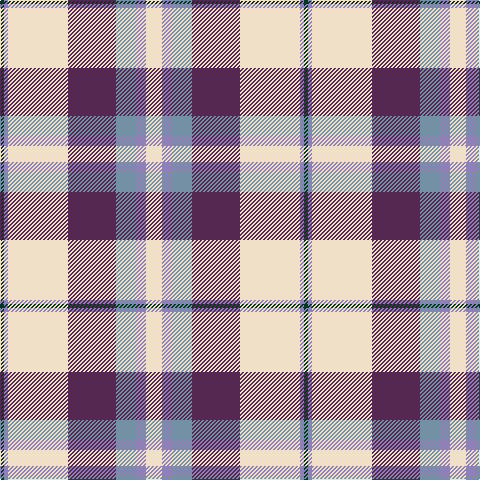

In pattern [GBWBBBW](/patterns/gbwbbbw/).

This was sourced from register-of-tartans.  It is a [7 stripes tartan](/stripes/stripes7/).

Original link https://www.tartanregister.gov.uk/tartanDetails.aspx?ref=5604

## Thread count
DG/4 B4 W60 N48 Ba20 B10 W/16

## Palette
Each colour and its ΔE from the base-6 reference it is a variant of.

| Colour | Shade | Base | ΔE (OKLab) |
|---|---|---|---|
| B | <code style="background-color:#9080B8;">#9080B8</code> `#9080B8` | B <code style="background-color:#2C4084;">#2C4084</code> | 0.25 |
| Ba | <code style="background-color:#7490A4;">#7490A4</code> `#7490A4` | B <code style="background-color:#2C4084;">#2C4084</code> | 0.26 |
| DG | <code style="background-color:#003820;">#003820</code> `#003820` | G <code style="background-color:#006400;">#006400</code> | 0.16 |
| N | <code style="background-color:#542850;">#542850</code> `#542850` | B <code style="background-color:#2C4084;">#2C4084</code> | 0.12 |
| W | <code style="background-color:#F0E0C8;">#F0E0C8</code> `#F0E0C8` | W <code style="background-color:#F4F4F0;">#F4F4F0</code> | 0.06 |

# Sample pattern

ID: /setts/s7/w16b10ba20bb48w60b4g4-b9080b8-ba7490a4-bb542850-g003820-wf0e0c8/
