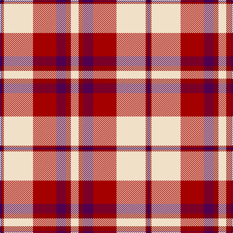

In pattern [BRWRBRW](/patterns/brwrbrw/).

This was sourced from tartans-authority.  It is a [7 stripes tartan](/stripes/stripes7/).

Original link http://www.tartansauthority.com/tartan-ferret/display/7574/

## Attestations

This cloth appears in 2 source records; the oldest owns this page.

- March 2008 — Shiel, Claret (Dance) (tartans-authority, [record](http://www.tartansauthority.com/tartan-ferret/display/7574/))
- undated — Shiel Claret (register-of-tartans, [record](https://www.tartanregister.gov.uk/tartanDetails.aspx?ref=5598))

## Thread count
DB/4 DRa4 W60 DR48 DP20 DRa10 W/16

## Palette
Each colour and its ΔE from the base-6 reference it is a variant of.

| Colour | Shade | Base | ΔE (OKLab) |
|---|---|---|---|
| DB | <code style="background-color:#1C0070;">#1C0070</code> `#1C0070` | B <code style="background-color:#2C4084;">#2C4084</code> | 0.14 |
| DP | <code style="background-color:#500050;">#500050</code> `#500050` | B <code style="background-color:#2C4084;">#2C4084</code> | 0.16 |
| DR | <code style="background-color:#A40000;">#A40000</code> `#A40000` | R <code style="background-color:#C80000;">#C80000</code> | 0.08 |
| DRa | <code style="background-color:#880000;">#880000</code> `#880000` | R <code style="background-color:#C80000;">#C80000</code> | 0.14 |
| W | <code style="background-color:#F0E0C8;">#F0E0C8</code> `#F0E0C8` | W <code style="background-color:#F4F4F0;">#F4F4F0</code> | 0.06 |

# Sample pattern

ID: /setts/s7/w16r10b20ra48w60r4ba4-b500050-ba1c0070-r880000-raa40000-wf0e0c8/
