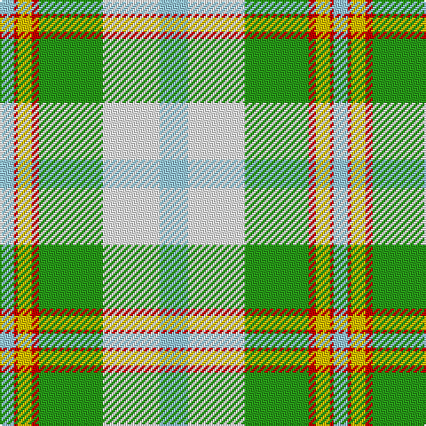

In pattern [WRYRGWW](/patterns/wryrgww/).

This was sourced from register-of-tartans.  It is a [7 stripes tartan](/stripes/stripes7/).

Original link https://www.tartanregister.gov.uk/tartanDetails.aspx?ref=2030

## Thread count
LB/8 R2 Y8 R4 G36 W32 LB/16

## Palette
Each colour and its ΔE from the base-6 reference it is a variant of.

| Colour | Shade | Base | ΔE (OKLab) |
|---|---|---|---|
| G | <code style="background-color:#289C18;">#289C18</code> `#289C18` | G <code style="background-color:#006400;">#006400</code> | 0.18 |
| LB | <code style="background-color:#98C8E8;">#98C8E8</code> `#98C8E8` | W <code style="background-color:#F4F4F0;">#F4F4F0</code> | 0.17 |
| R | <code style="background-color:#C80000;">#C80000</code> `#C80000` | R <code style="background-color:#C80000;">#C80000</code> | 0.00 |
| W | <code style="background-color:#FCFCFC;">#FCFCFC</code> `#FCFCFC` | W <code style="background-color:#F4F4F0;">#F4F4F0</code> | 0.03 |
| Y | <code style="background-color:#E8C000;">#E8C000</code> `#E8C000` | Y <code style="background-color:#E8C000;">#E8C000</code> | 0.00 |

# Sample pattern

## Nearest tartans

The nearest existing variants by ΔTartan distance.

1. [Ainslie, Lake (District)](/setts/s7/w16wa32g36r4y8r2w8-g289c18-rc80000-w98c8e8-wae0e0e0-ye8c000/) — ΔT 0.66
1. [Aviemore, Check](/setts/s8/g4r20g22y8r2w36g4r2-g008000-r806050-we0e0e0-yf0c000/) — ΔT 1.34
1. [Barbie's Plaid](/setts/s6/b4y8ba44y40g38y4-b606090-ba8080d0-g30a010-yffe000/) — ΔT 1.45
1. [Bird Family (Australia) (Name)](/setts/s9/w6b38w2wa34y22g20w2b6w2-b1474b4-g006818-wfcfcfc-wa98c8e8-yfccc00/) — ΔT 1.57
1. [Aviemore Check (Fashion)](/setts/s8/g4ga20g22y8ga2w36g4ga2-g007c1c-ga604000-we0e0e0-ye8c000/) — ΔT 1.63
1. [Alloway Primary School (Ayr)](/setts/s8/y36g20w8b2wa60b2w8g20-b14256b-g798a92-wffffff-wab2e5ff-yebaf01/) — ΔT 1.64
1. [Mission (District)](/setts/s8/y8w56k4g44k8r8ga8k4-g00a424-ga50a47c-k101010-re87878-w98c8e8-yec8048/) — ΔT 1.77
1. [Chambers, Christopher J (Personal)](/setts/s7/b32r2g32w2ba2w16ra6-b5f749c-ba5d321f-g649848-rca2625-ra86264d-wf9f5ef/) — ΔT 1.77
1. [Chambers, Christopher J (Personal)](/setts/s7/b26r2g26w2k2w14k6-b5c8ca8-g288028-k101010-r880000-wfcfcfc/) — ΔT 1.77
1. [Aviemore Check](/setts/s8/g4ga20g22y8ga2w36g4ga2-g006818-ga604000-we0e0e0-ye8c000/) — ΔT 1.78

## Neighbour map

Every grey dot is one of 15726 variants placed by the first two principal components of the ΔTartan feature space (44% of its variance). Red is this tartan; blue dots are its nearest — click one to open its page.

<svg viewBox="0 0 640 380" role="img" style="max-width:100%;height:auto;border:1px solid #e0e0e0;border-radius:4px;display:block" xmlns="http://www.w3.org/2000/svg"><image href="/nn/cloud.v1.png" width="640" height="380"/><a href="/setts/s7/w16wa32g36r4y8r2w8-g289c18-rc80000-w98c8e8-wae0e0e0-ye8c000/"><circle cx="171.1" cy="157.6" r="4" fill="#3465a4"><title>Ainslie, Lake (District)</title></circle></a><a href="/setts/s8/g4r20g22y8r2w36g4r2-g008000-r806050-we0e0e0-yf0c000/"><circle cx="198.7" cy="151.9" r="4" fill="#3465a4"><title>Aviemore, Check</title></circle></a><a href="/setts/s6/b4y8ba44y40g38y4-b606090-ba8080d0-g30a010-yffe000/"><circle cx="184.2" cy="195.2" r="4" fill="#3465a4"><title>Barbie's Plaid</title></circle></a><a href="/setts/s9/w6b38w2wa34y22g20w2b6w2-b1474b4-g006818-wfcfcfc-wa98c8e8-yfccc00/"><circle cx="138.2" cy="131.6" r="4" fill="#3465a4"><title>Bird Family (Australia) (Name)</title></circle></a><a href="/setts/s8/g4ga20g22y8ga2w36g4ga2-g007c1c-ga604000-we0e0e0-ye8c000/"><circle cx="187.3" cy="148.3" r="4" fill="#3465a4"><title>Aviemore Check (Fashion)</title></circle></a><a href="/setts/s8/y36g20w8b2wa60b2w8g20-b14256b-g798a92-wffffff-wab2e5ff-yebaf01/"><circle cx="222.3" cy="122.2" r="4" fill="#3465a4"><title>Alloway Primary School (Ayr)</title></circle></a><a href="/setts/s8/y8w56k4g44k8r8ga8k4-g00a424-ga50a47c-k101010-re87878-w98c8e8-yec8048/"><circle cx="159.0" cy="122.0" r="4" fill="#3465a4"><title>Mission (District)</title></circle></a><a href="/setts/s7/b32r2g32w2ba2w16ra6-b5f749c-ba5d321f-g649848-rca2625-ra86264d-wf9f5ef/"><circle cx="166.7" cy="135.7" r="4" fill="#3465a4"><title>Chambers, Christopher J (Personal)</title></circle></a><a href="/setts/s7/b26r2g26w2k2w14k6-b5c8ca8-g288028-k101010-r880000-wfcfcfc/"><circle cx="134.8" cy="155.8" r="4" fill="#3465a4"><title>Chambers, Christopher J (Personal)</title></circle></a><a href="/setts/s8/g4ga20g22y8ga2w36g4ga2-g006818-ga604000-we0e0e0-ye8c000/"><circle cx="184.9" cy="147.4" r="4" fill="#3465a4"><title>Aviemore Check</title></circle></a><circle cx="152.6" cy="148.0" r="5" fill="#c00000"/></svg>

ID: /setts/s7/w16wa32g36r4y8r2w8-g289c18-rc80000-w98c8e8-wafcfcfc-ye8c000/
