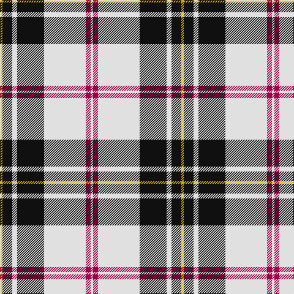

In pattern [WRWKWKY](/stripes/wrwkwky/).

This was sourced from tartans-authority.  It is a [7 stripe tartan](/stripes/stripes7/).

Original link http://www.tartansauthority.com/tartan-ferret/display/1872/

## Thread count
Y/4 K16 LN8 K44 LN68 R8 LN/4

## Palette
Each colour and the base-6 reference it is a variant of.

| Colour | Shade | Base |
|---|---|---|
| K | <code style="background-color:#101010;">#101010</code> `oklch(17.3% 0.000 89.9)` <small>#101010</small> | K <code style="background-color:#000000;">#000000</code> |
| LN | <code style="background-color:#E0E0E0;">#E0E0E0</code> `oklch(90.7% 0.000 89.9)` <small>#E0E0E0</small> | W <code style="background-color:#F7F7F7;">#F7F7F7</code> |
| R | <code style="background-color:#A00048;">#A00048</code> `oklch(45.4% 0.182 5.3)` <small>#A00048</small> | R <code style="background-color:#CC0000;">#CC0000</code> |
| Y | <code style="background-color:#D8B000;">#D8B000</code> `oklch(77.1% 0.158 92.3)` <small>#D8B000</small> | Y <code style="background-color:#F2BF00;">#F2BF00</code> |

# Sample pattern

## Nearest tartans

The nearest existing variants by ΔTartan distance, with this tartan at the top so the swatches line up against it.

ΔTartan

Tartan

Sett

—

<a href="/ttd/edit/#slug=w1m2w17k11w2k4ly1~x4">MacPherson - 1842 (VS) Dress</a> <a class="nn-out" href="/setts/s7/w1m2w17k11w2k4ly1~x4/" title="open its dictionary page">↗</a>

0.74

<a href="/ttd/edit/#slug=r1w14k6w1k3ly1~x4">MacPherson #10</a> <a class="nn-out" href="/setts/s6/r1w14k6w1k3ly1~x4/" title="open its dictionary page">↗</a>

0.80

<a href="/ttd/edit/#slug=r1lb12k1w2k5r1~x4">Rui (Personal)</a> <a class="nn-out" href="/setts/s6/r1lb12k1w2k5r1~x4/" title="open its dictionary page">↗</a>

0.82

<a href="/ttd/edit/#slug=r4w19dg2w8dg2w8k38w4~x2">St. Piran Dress</a> <a class="nn-out" href="/setts/s8/r4w19dg2w8dg2w8k38w4~x2/" title="open its dictionary page">↗</a>

0.84

<a href="/ttd/edit/#slug=w3p3w30k20w3k9ly3~x2">MacPherson Dress (1951)</a> <a class="nn-out" href="/setts/s7/w3p3w30k20w3k9ly3~x2/" title="open its dictionary page">↗</a>

0.91

<a href="/ttd/edit/#slug=r2w30k15lo2k15r2~x2">Brodie (WCWM)</a> <a class="nn-out" href="/setts/s6/r2w30k15lo2k15r2~x2/" title="open its dictionary page">↗</a>

0.95

<a href="/ttd/edit/#slug=w3r1w30k20w3k9ly1~x2">MacPherson Dress (1842)</a> <a class="nn-out" href="/setts/s7/w3r1w30k20w3k9ly1~x2/" title="open its dictionary page">↗</a>

0.96

<a href="/ttd/edit/#slug=w5r3w35k28w4k11w2~x2">MacPherson of Cluny (Black and White)</a> <a class="nn-out" href="/setts/s7/w5r3w35k28w4k11w2~x2/" title="open its dictionary page">↗</a>

0.99

<a href="/ttd/edit/#slug=k9lb4k2lb4k2lb30k9lb4b14lo2~x2">Hannay (Clan)</a> <a class="nn-out" href="/setts/s10/k9lb4k2lb4k2lb30k9lb4b14lo2~x2/" title="open its dictionary page">↗</a>

1.04

<a href="/ttd/edit/#slug=k9w4k2w4k2w30k9w4db14ly2~x2">Hannay</a> <a class="nn-out" href="/setts/s10/k9w4k2w4k2w30k9w4db14ly2~x2/" title="open its dictionary page">↗</a>

1.08

<a href="/ttd/edit/#slug=w6b3w20k2w3k25w3~x2">Forbes Dress (Clans Originaux)</a> <a class="nn-out" href="/setts/s7/w6b3w20k2w3k25w3~x2/" title="open its dictionary page">↗</a>

## Neighbour map

Every grey dot is one of 14299 variants placed by the first two principal components of the ΔTartan feature space (44% of its variance). Red is this tartan; blue dots are its nearest — click one to open its page.

<svg viewBox="0 0 640 380" role="img" style="max-width:100%;height:auto;border:1px solid #e0e0e0;border-radius:4px;display:block" xmlns="http://www.w3.org/2000/svg"><image href="/nn/cloud.v1.png" width="640" height="380"/><a href="/setts/s6/r1w14k6w1k3ly1~x4/"><circle cx="301.4" cy="149.5" r="4" fill="#3465a4"><title>MacPherson #10</title></circle></a><a href="/setts/s6/r1lb12k1w2k5r1~x4/"><circle cx="260.8" cy="152.2" r="4" fill="#3465a4"><title>Rui (Personal)</title></circle></a><a href="/setts/s8/r4w19dg2w8dg2w8k38w4~x2/"><circle cx="257.8" cy="131.7" r="4" fill="#3465a4"><title>St. Piran Dress</title></circle></a><a href="/setts/s7/w3p3w30k20w3k9ly3~x2/"><circle cx="247.6" cy="163.6" r="4" fill="#3465a4"><title>MacPherson Dress (1951)</title></circle></a><a href="/setts/s6/r2w30k15lo2k15r2~x2/"><circle cx="242.9" cy="159.2" r="4" fill="#3465a4"><title>Brodie (WCWM)</title></circle></a><a href="/setts/s7/w3r1w30k20w3k9ly1~x2/"><circle cx="322.5" cy="120.7" r="4" fill="#3465a4"><title>MacPherson Dress (1842)</title></circle></a><a href="/setts/s7/w5r3w35k28w4k11w2~x2/"><circle cx="302.1" cy="157.5" r="4" fill="#3465a4"><title>MacPherson of Cluny (Black and White)</title></circle></a><a href="/setts/s10/k9lb4k2lb4k2lb30k9lb4b14lo2~x2/"><circle cx="252.5" cy="131.2" r="4" fill="#3465a4"><title>Hannay (Clan)</title></circle></a><a href="/setts/s10/k9w4k2w4k2w30k9w4db14ly2~x2/"><circle cx="243.1" cy="130.9" r="4" fill="#3465a4"><title>Hannay</title></circle></a><a href="/setts/s7/w6b3w20k2w3k25w3~x2/"><circle cx="282.1" cy="169.7" r="4" fill="#3465a4"><title>Forbes Dress (Clans Originaux)</title></circle></a><circle cx="281.9" cy="139.9" r="5" fill="#c00000"/></svg>

ID: /setts/s7/w1m2w17k11w2k4ly1~x4/
